burpsuite抓包报告

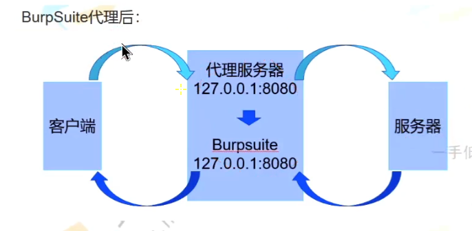

 使用浏览器插件以实现bp代理

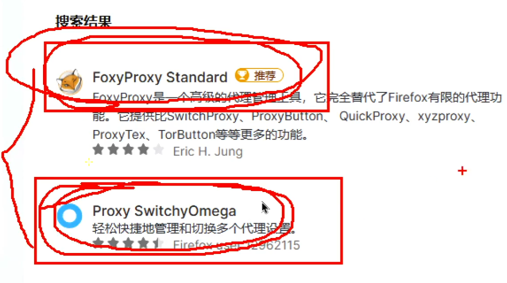

对于https，网页会返回不安全信息，需要安装证书后才能抓包https（ca certificate）

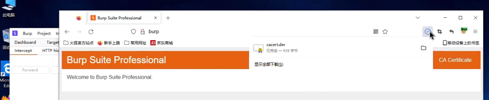

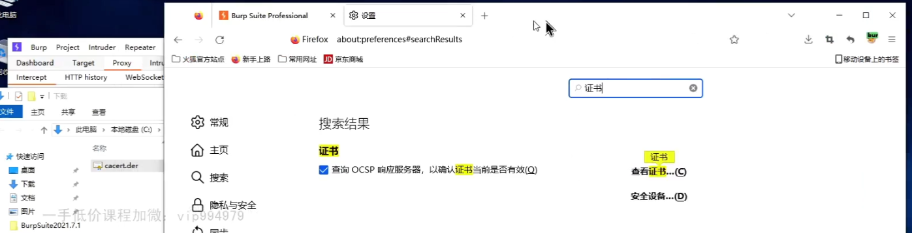

注意安装证书时要关掉抓包

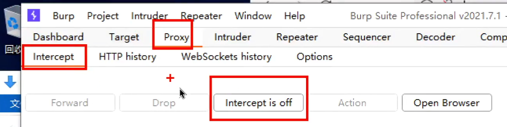

进入浏览器设置，找到安装证书，找到导入

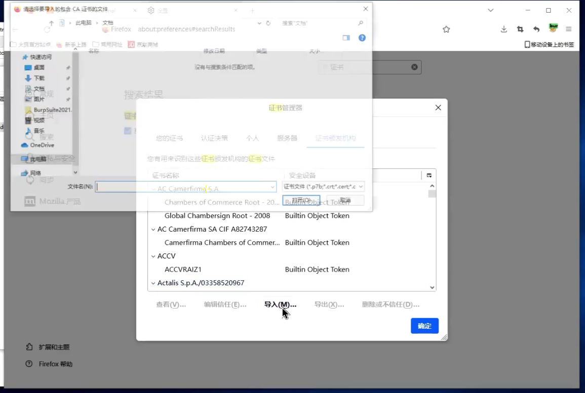

导入之前下载的证书，勾选信任

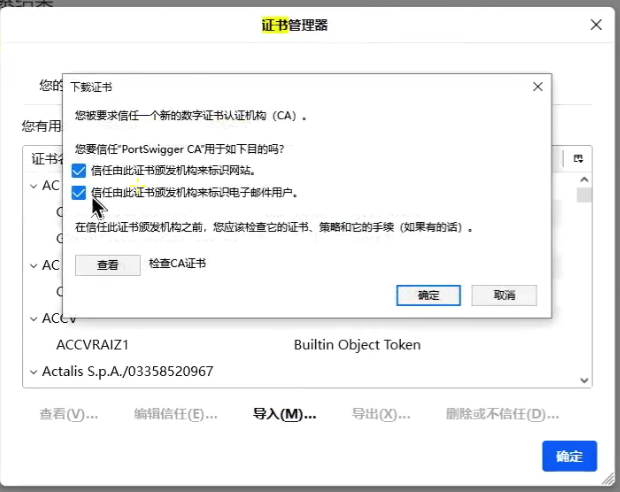

重启浏览器即可生效，正常使用burp抓包

因为burp监听的端口是8080所以配置proxy时也要填127.0.0.1:8080

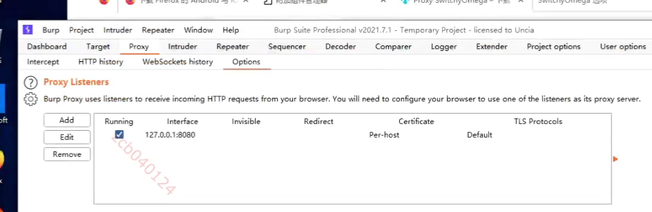

设置switchyomega插件和fox差不多，配置代理服务器和端口。删掉下面的内容，点击应用选项

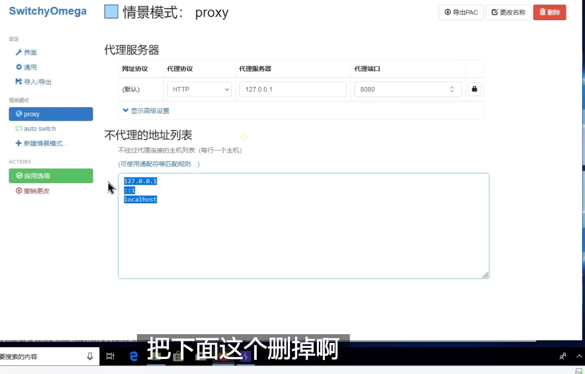

谷歌浏览器设置要选择这个

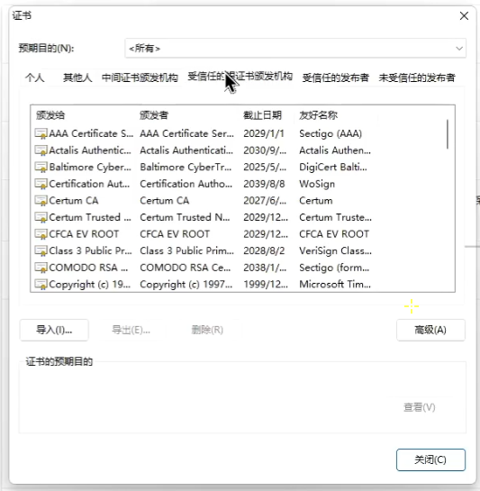

burp设置选项

如果出现中文乱码可以修改语言，或者改成utf-8格式（选项在display或ui里面

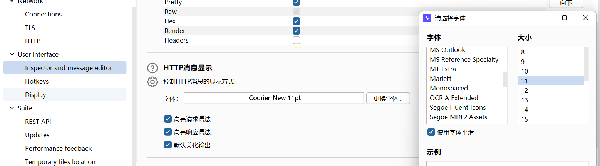

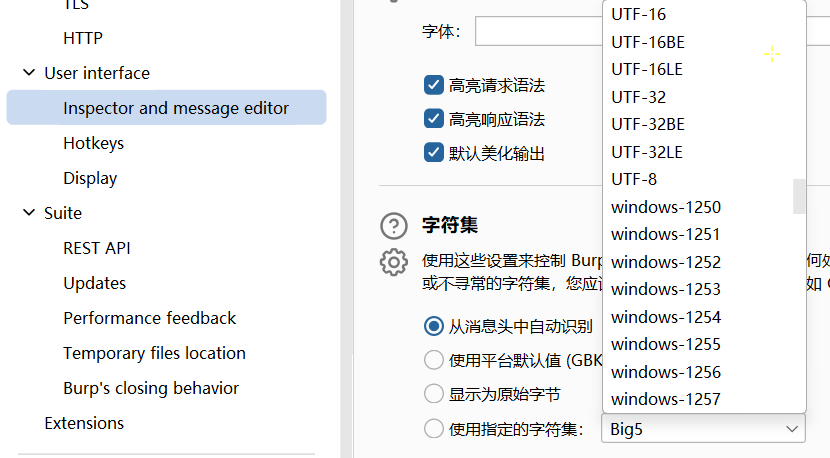

burp爆破字典

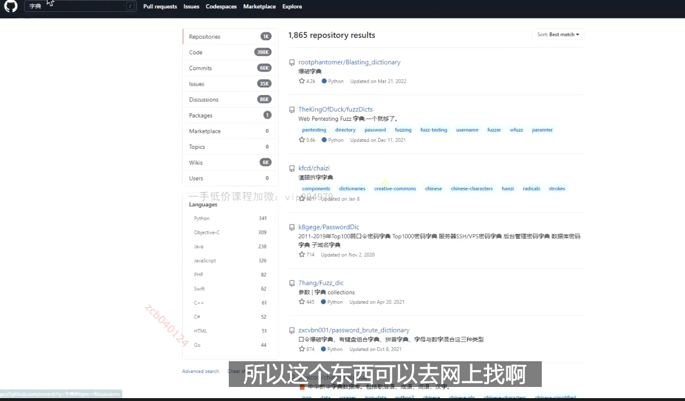

**burp爆破实验报告**

1、输入127.0.0.1打开本地目录，打开dvwa

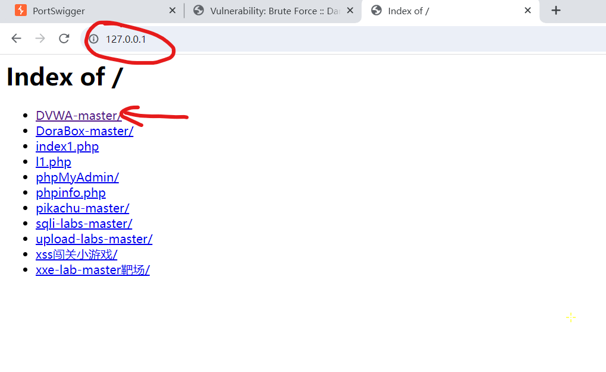

2、选择低难度模式，点击提交

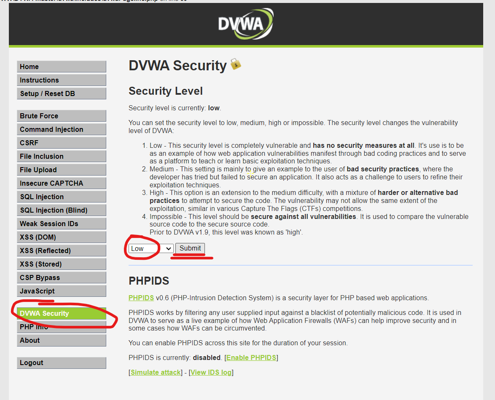

3、进入爆破关，输入用户名aaa密码bbb开启bp拦截，点击登录提交表单

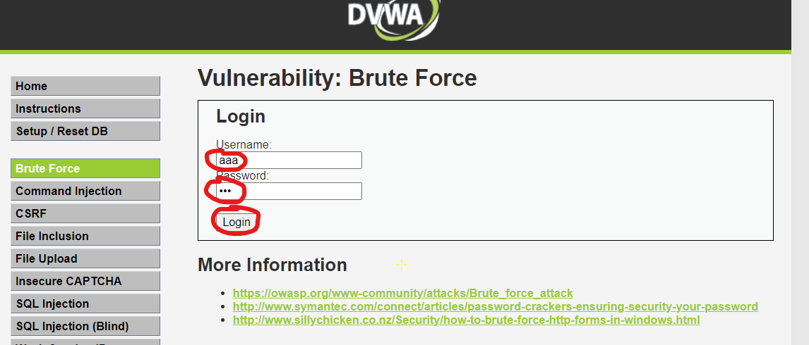

4、bp中抓包成功，发送到爆破模块，将aaa和bbb设置为payload，选择集束炸弹模式

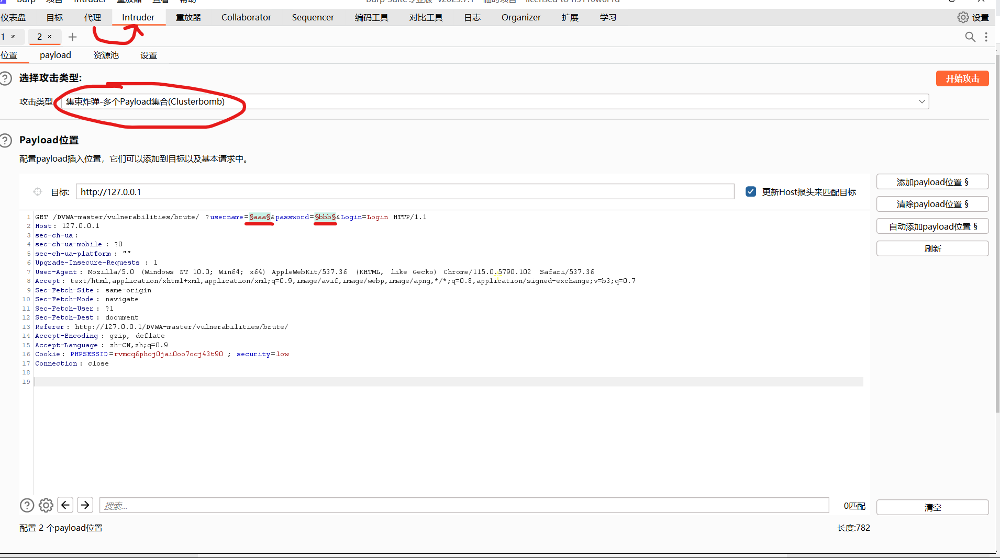

5、设置payload，给1用户名字典，给2密码字典

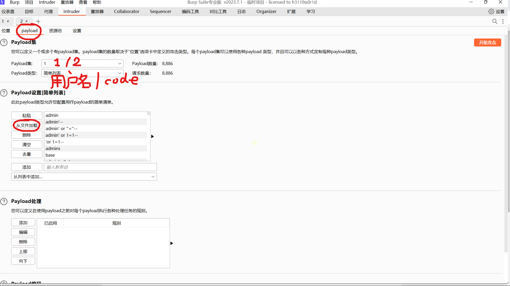

6、启动，看长度识别结果

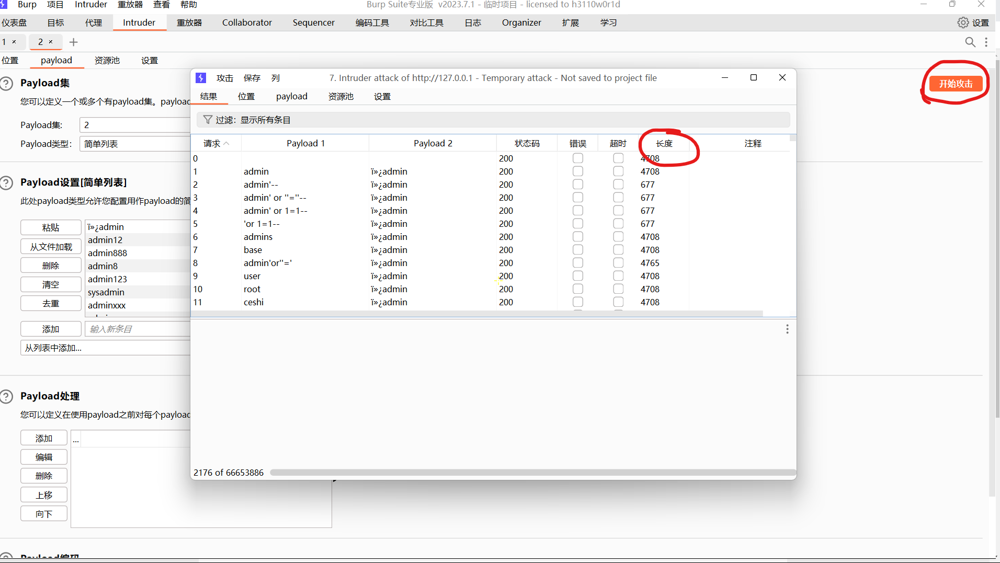

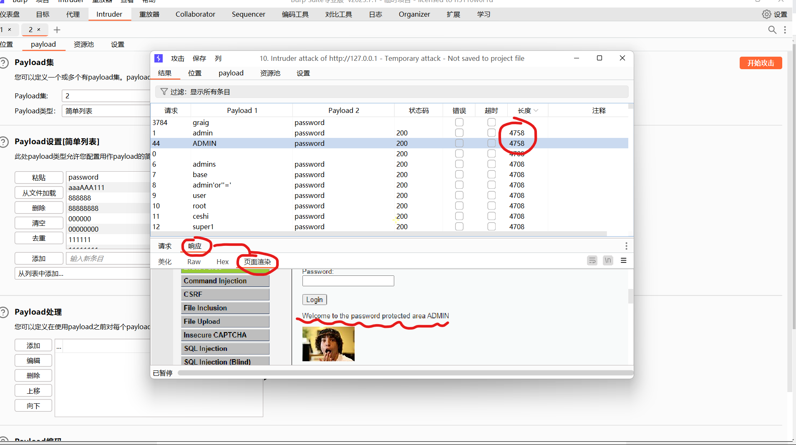

完成

附加：

对于带有验证码的页面，可分为前端校验和后端校验，表面上前端会通过弹窗返回信息后端通过网页内容返回信息，本质上前端不发包无法被抓包工具拦截，后端发包会留下请求包数据。

前端校验在第一次验证码通过后会发包到服务器，使用burp拦截请求包发送到重放/爆破模块可设置payload反复修改发包，直接绕过验证码。

后端校验需要将验证码字段作为payload使用额外的识别工具爆破。