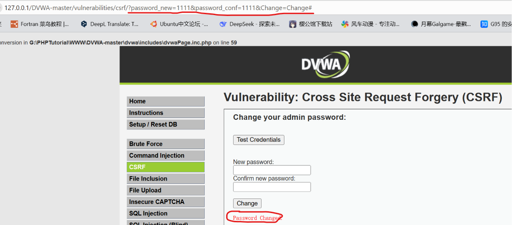
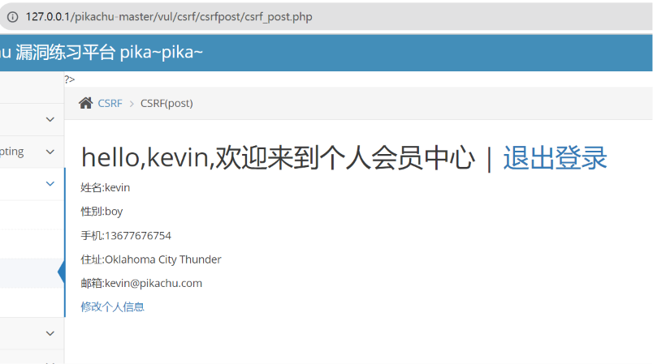
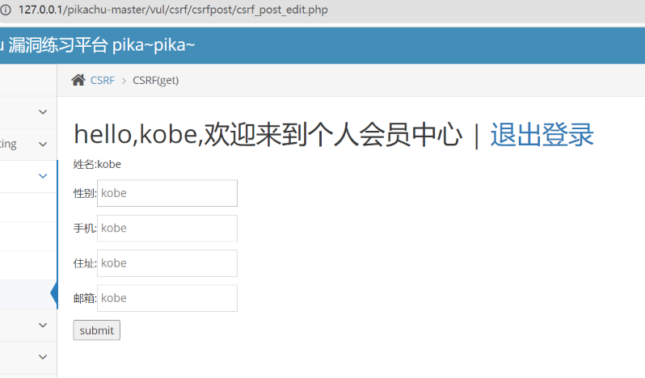
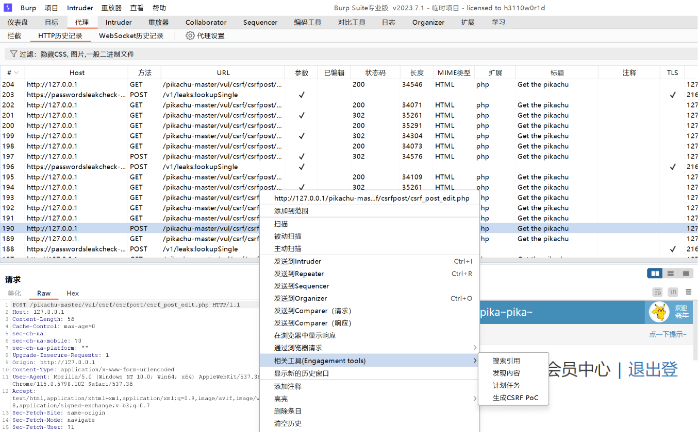
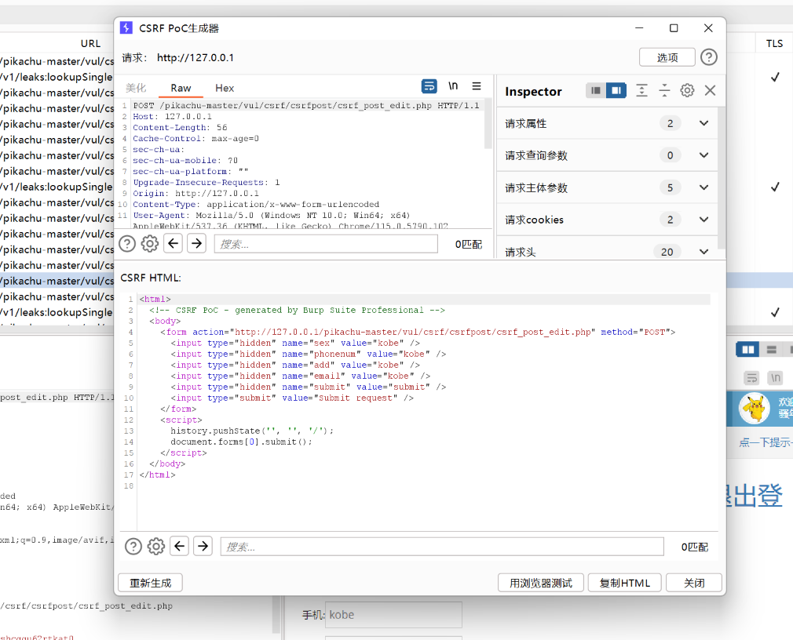
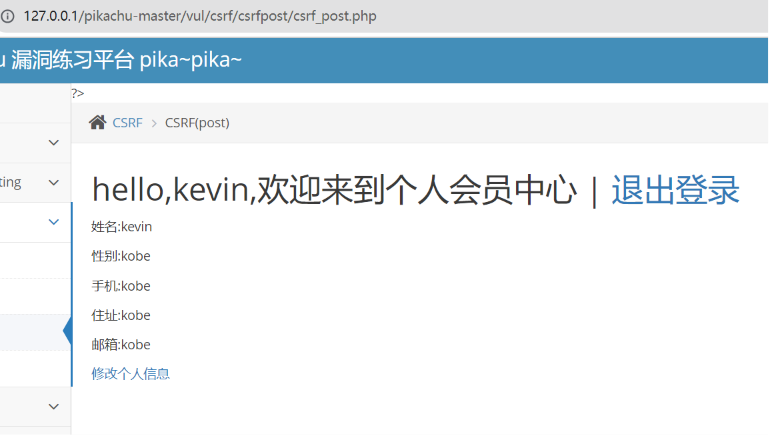

**GET型**

1、获取一个网页操作的GET格式

2、其他用户在登录状态下打开这个url就会执行这个修改密码的操作，将密码修改成1111

**POST型**

以pikachu为例子，找到两个用户，看看一开始是什么样

修改kobe的个人信息

找到修改信息的post包，生成csrf网页

登录kevin用户，使用浏览器打开html文件

服务器以为是kevin提交的post，给他返回了修改后的信息，实际操作中把html文件塞到克隆网站的交互处可以