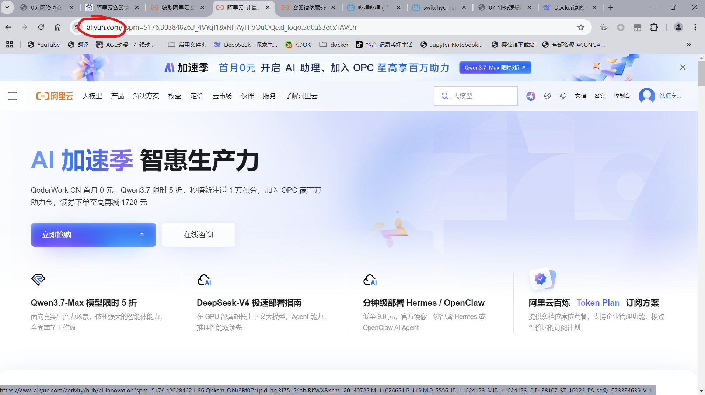
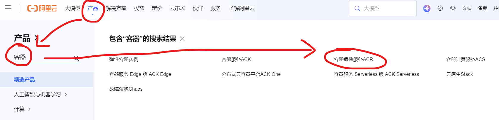
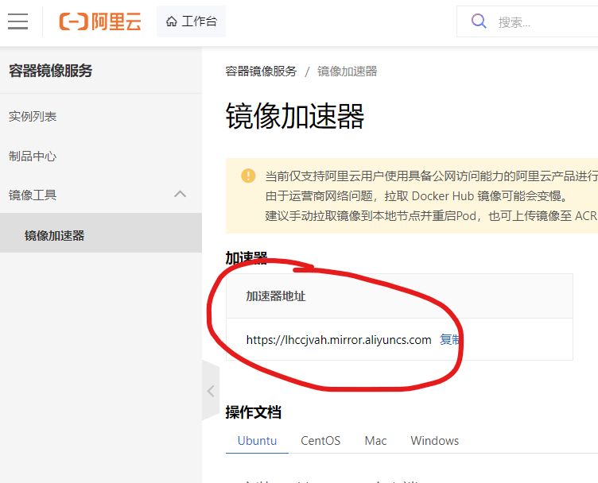
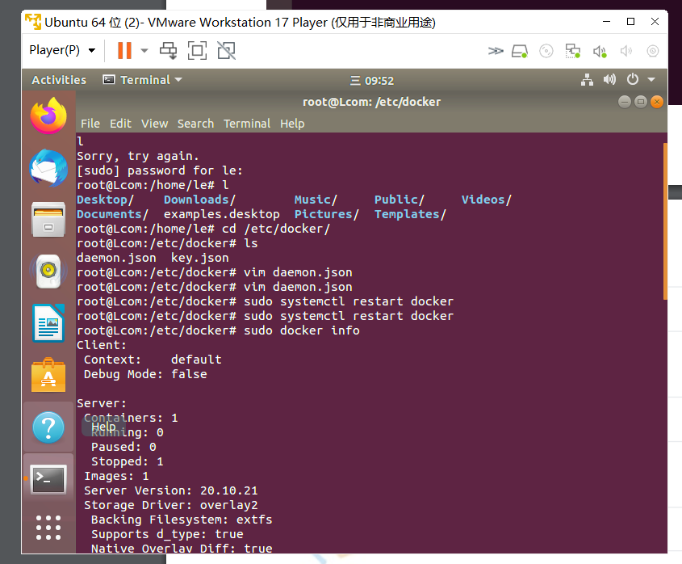

1、打开阿里云官网www.aliyun.com

2、在产品里搜索容器镜像服务

3、找到相关资源，打开控制台

4、找到加速器地址，复制到daemon.json

5、sudo docker pull betsy0/pwdflielogic:latest

​	  sudo docker run -d -p 10001:81 --restart=always betsy0/pwdflielogic:latest

192.168.171.133：10001

完成