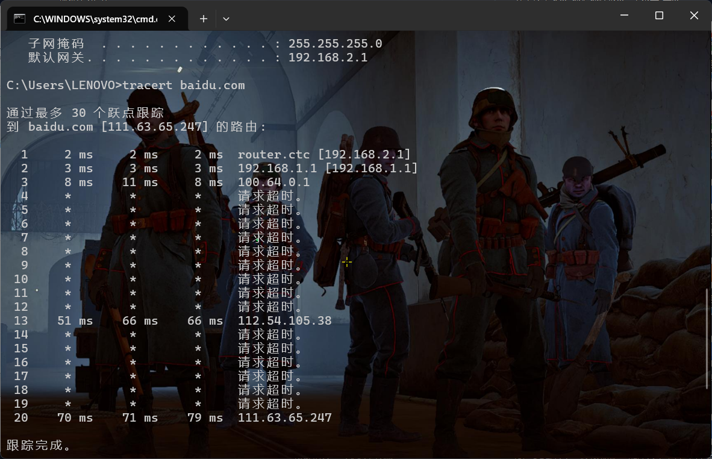
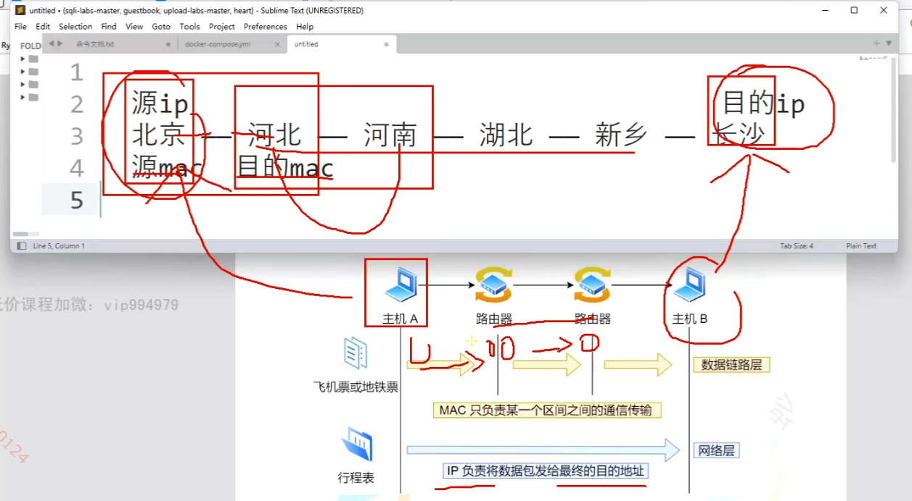
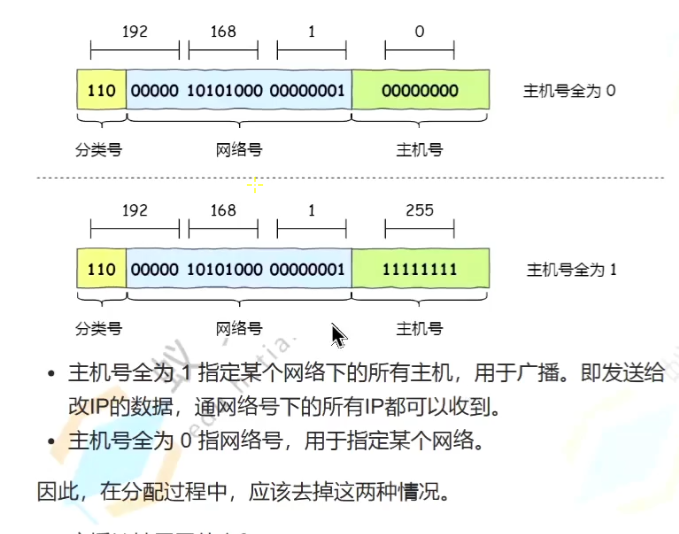
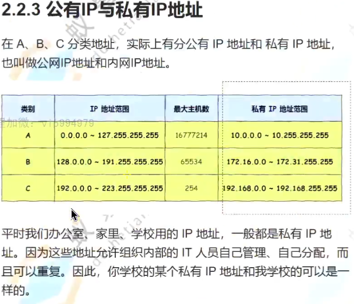
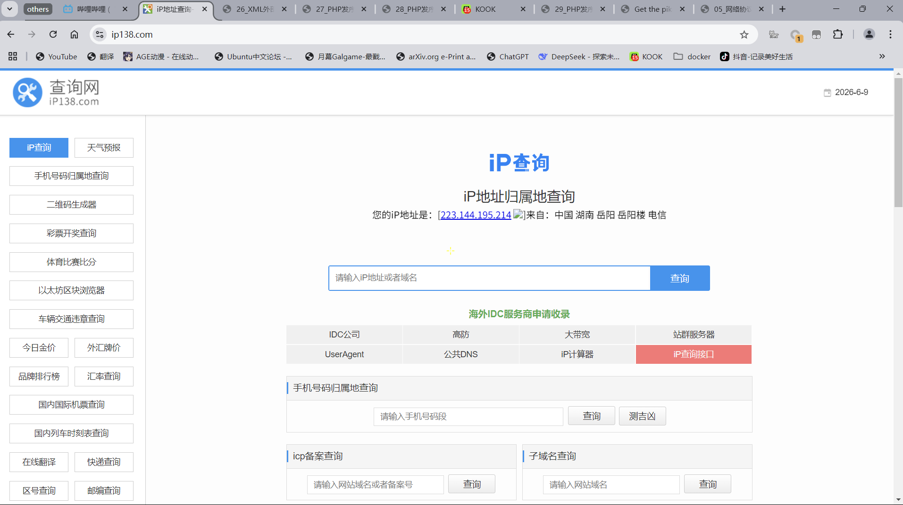
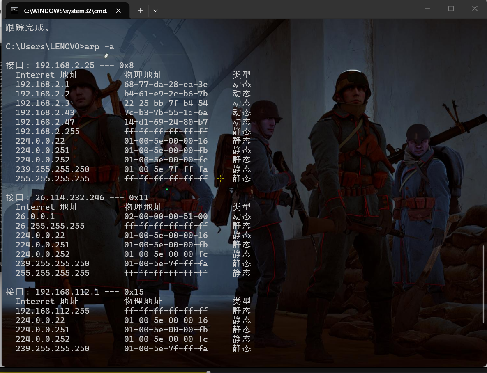
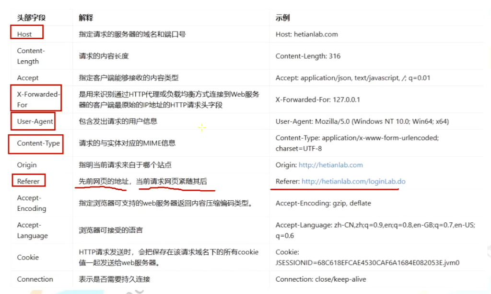

TCP和UDP的区别：

tcp保证不丢包不保证速度，udp保证实时性不保证丢包，http用tcp，直播用udp 

mac地址和ip地址的关系：

使用tracert可以从主机网关出发，一直请求直到请求到当前网址的地址，在图中百度的地址是动态分配的，由于CDN每个人访问到的地址都不一样。

 

通过ip138.com 可以查询ip

使用cmd的命令arp -a可以查看物理地址（mac）

arp欺骗本质发包竞争

而rarp协议是通过mac地址反推ip

以下是需要重点关注的数据请求包内容

