xml和抓包息息相关，是很重要的一环

1、运行靶场

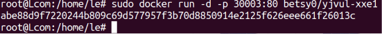

2、抓包

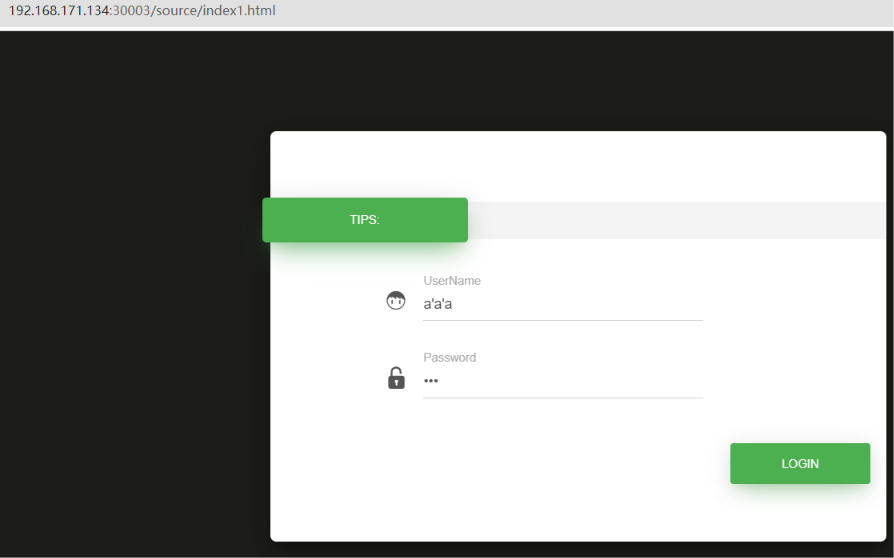

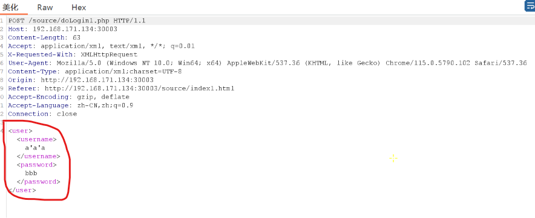

3、写入修改过的xml

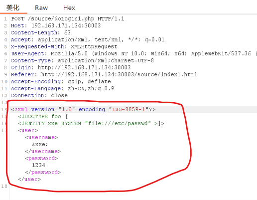

得到回显结果

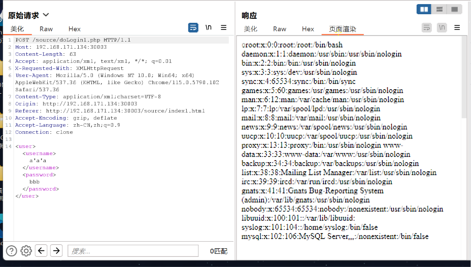

这样看的清楚一点

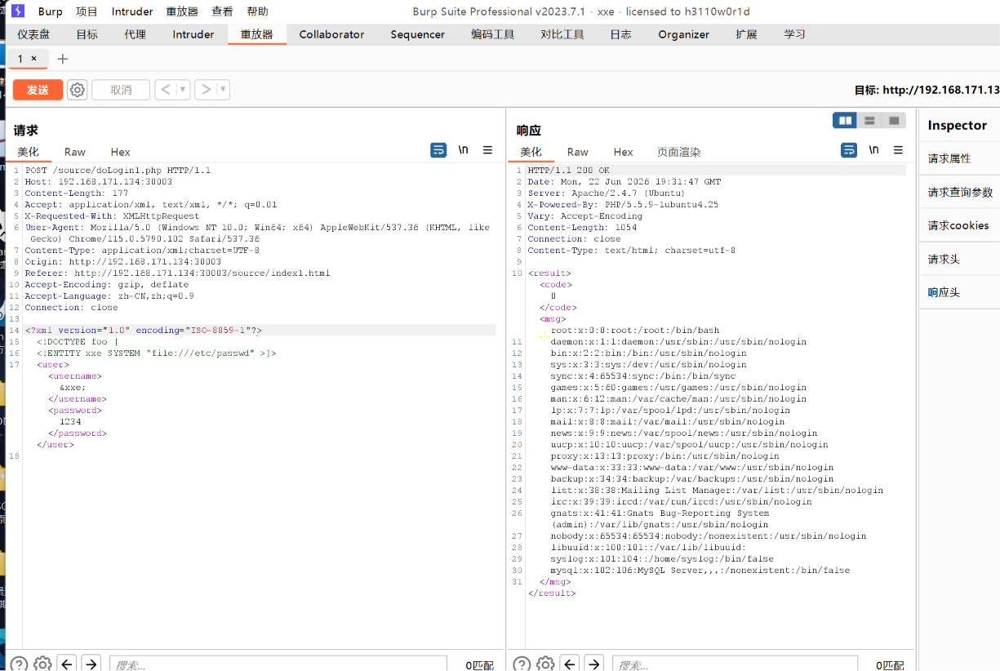

本质是利用了外部实体和引用外部实体的过程

4、无回显的情况下打开端口监听

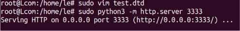

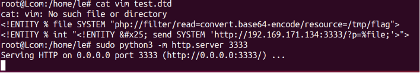

牛魔了，写成了169，难怪出不来。

改回168

5、的确没有回显，使用参数实体

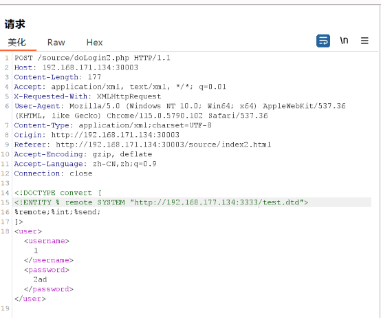

搞了半天原来是dtd写的有问题，把读取的文件改成存在的就好了

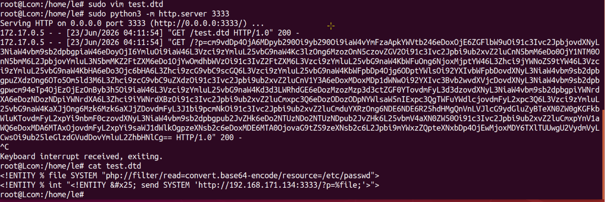

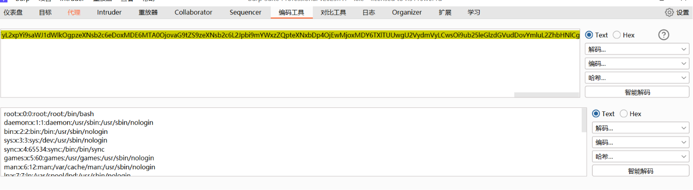

完成

最难的地方可能是学会自己写dtd了

