cobalt strike server启动！

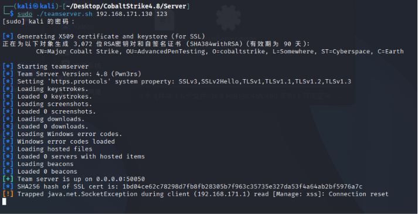

cobaltstrike client启动！

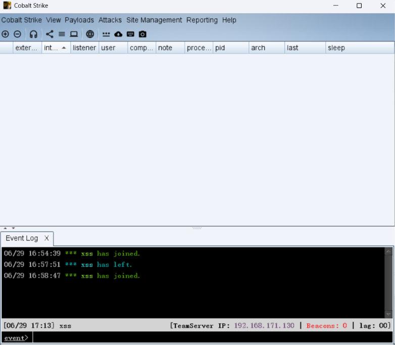

找到克隆网站

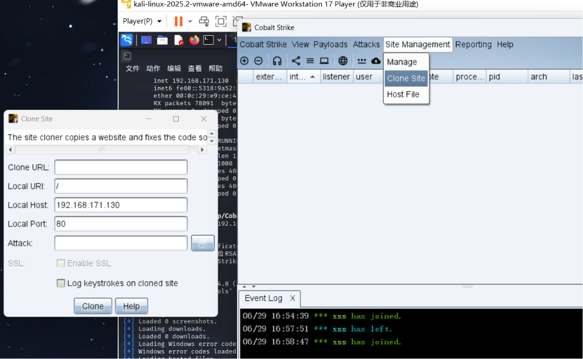

apache启动

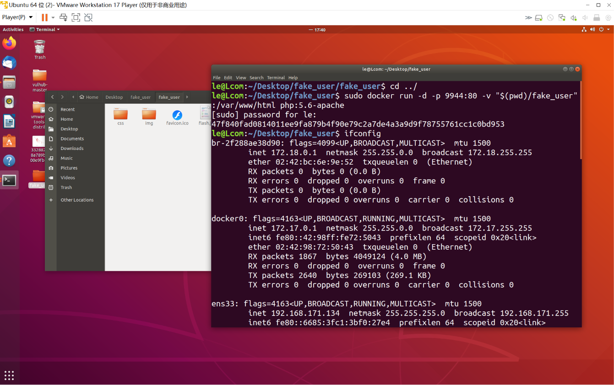

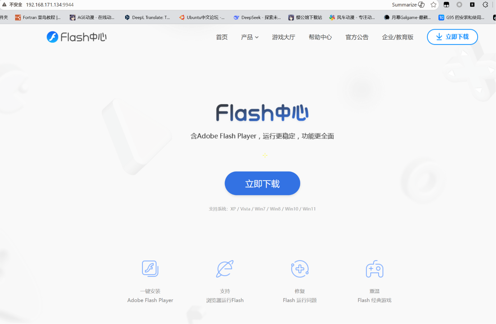

嗯，这里还是用dvwa演示吧

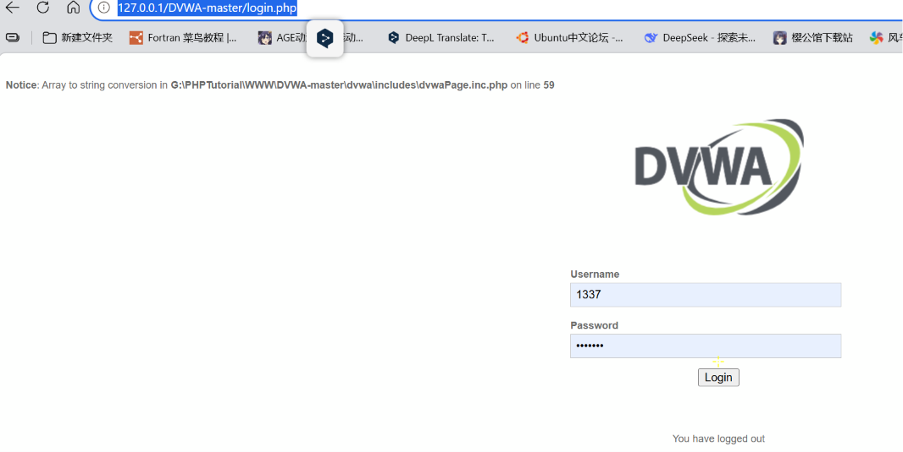

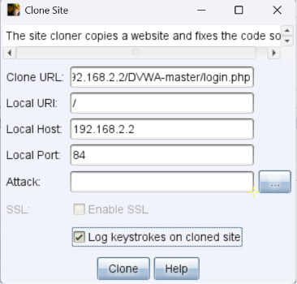

换一个

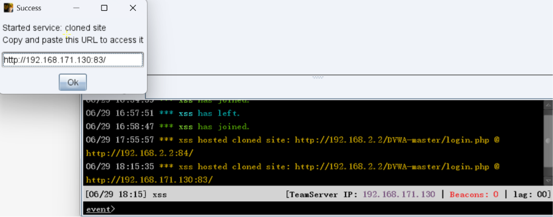

进来了

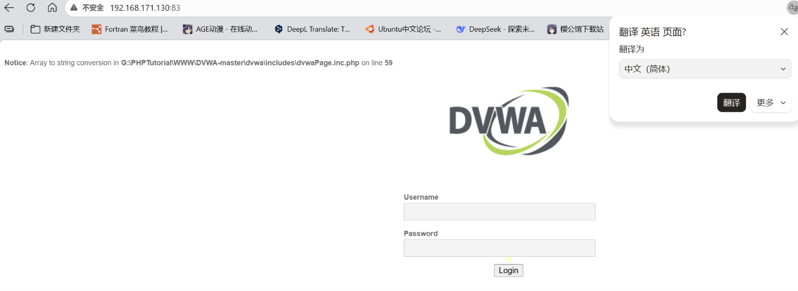

打开web日志

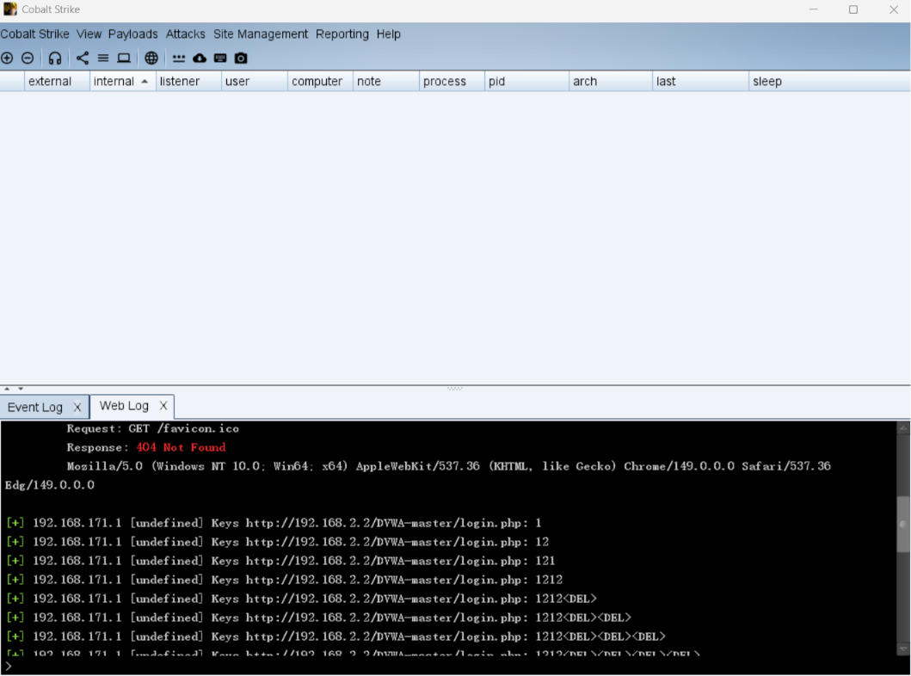

可以看到输入内容

ok从头到尾我顺一遍

1、写一个eval.js弹窗，打开服务器

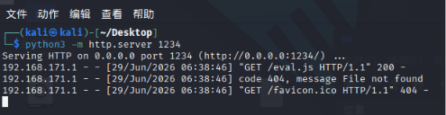

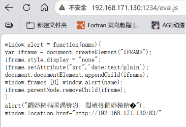

2、打开本地dvwa，在xss处插入代码

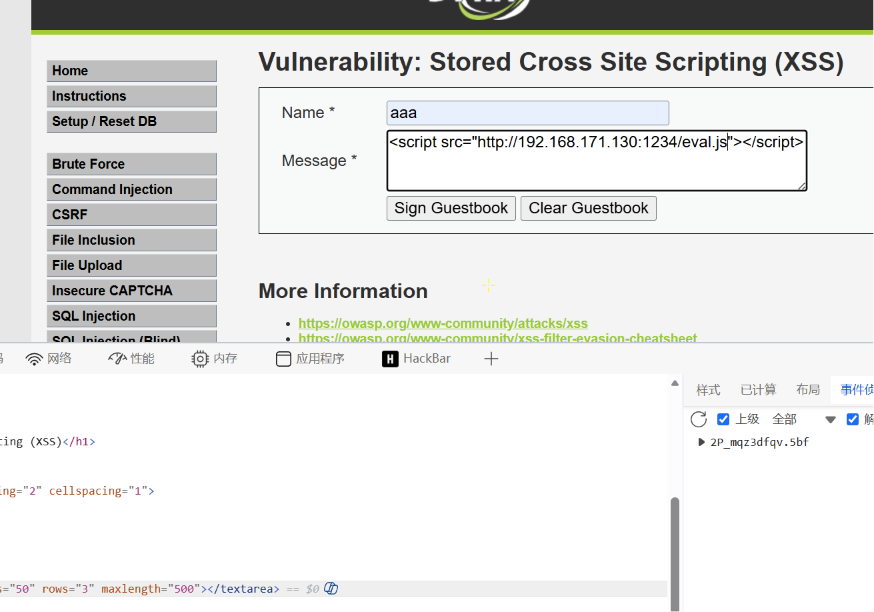

3、发现弹窗，点进去看看

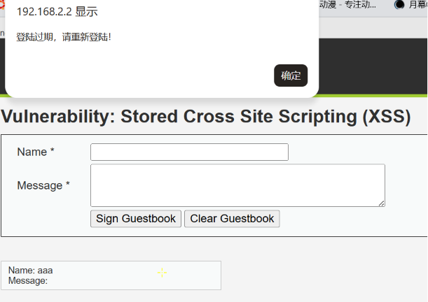

4、发现url变了，此时输入都可在客户端看到

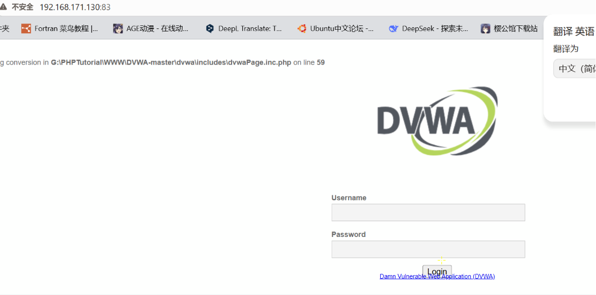

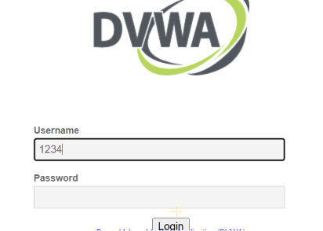

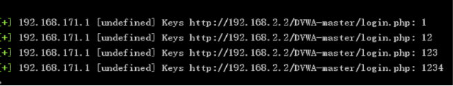

5、存储型注入后从其他地方访问也是一样有用

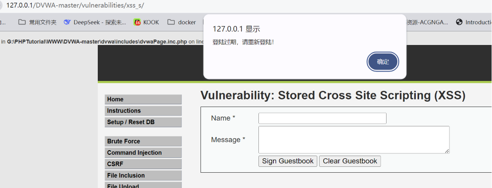

可以看到我啥也没干就弹了这个

**xss的beef**

1、启动beef

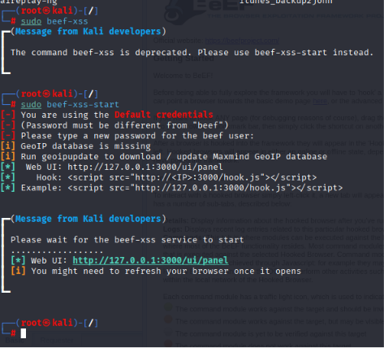

Example: 

2、打开beef控制面板

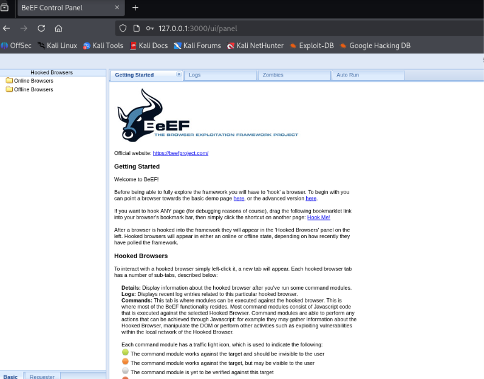

3、注入

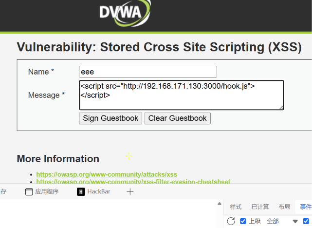

4、再看控制面板

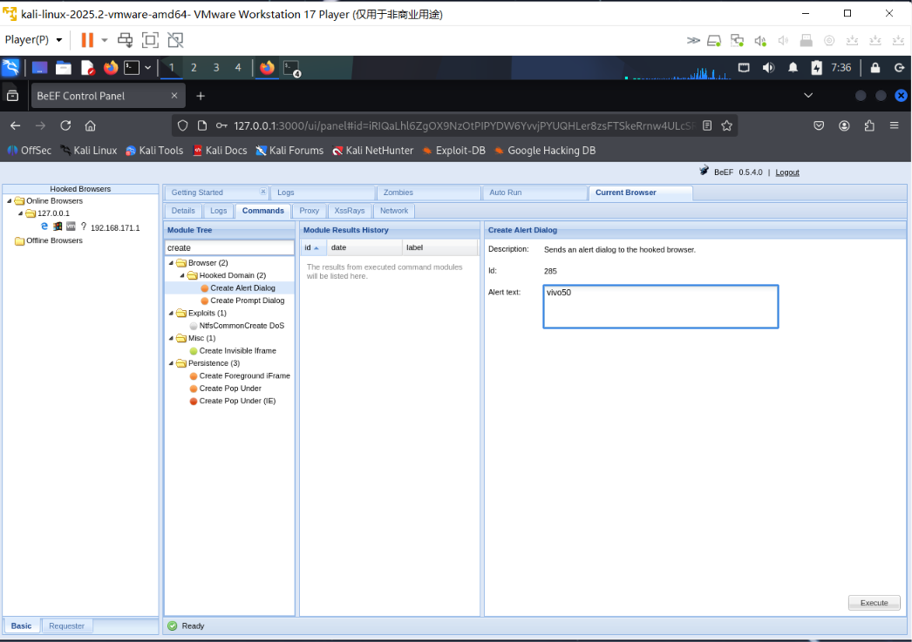

5、execute

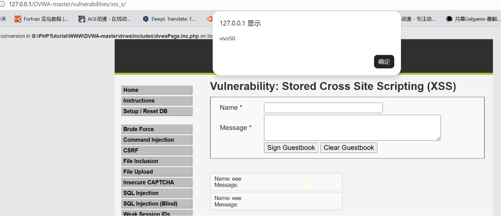

**流量劫持**

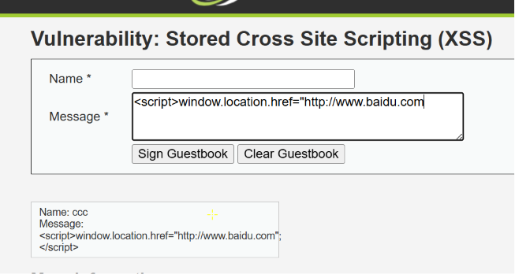

开了困难模式没跳转成功