xss典型代码：

**dom型**

完全在前端进行，先随便点两下试试。

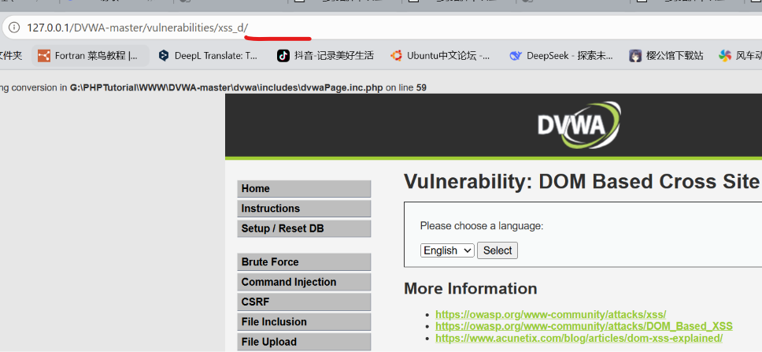

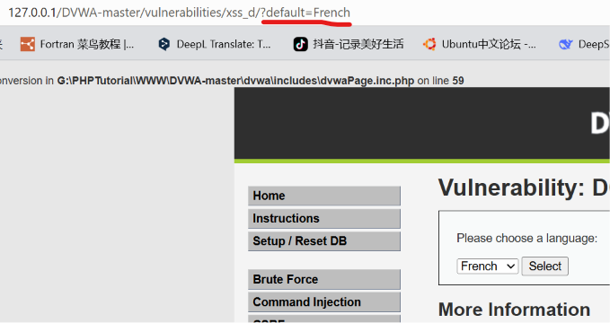

发现传参为default，修改传参，类似sql注入的方式。

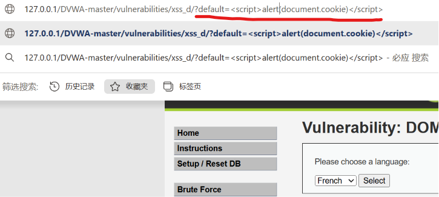

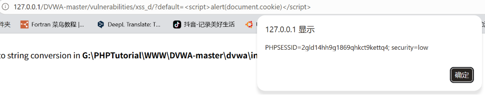

**反射型**

服务器响应，在后端进行

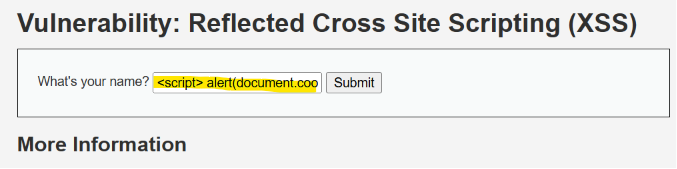

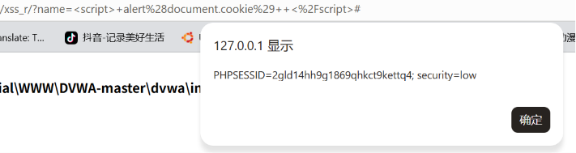

可以看到抓包也有内容

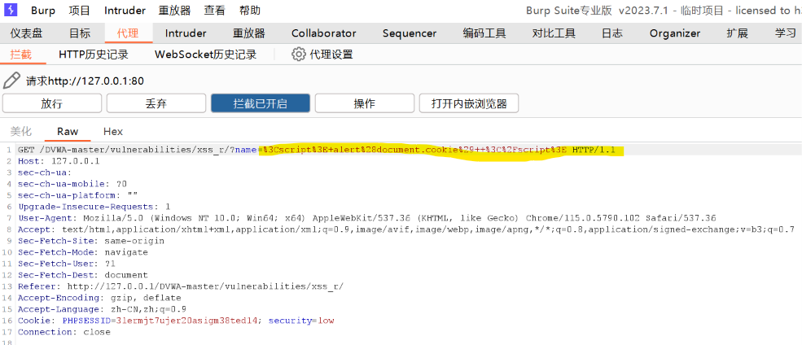

**存储型**

先打开端口监听

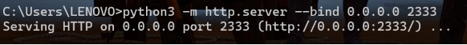

解除字数限制，输入代码

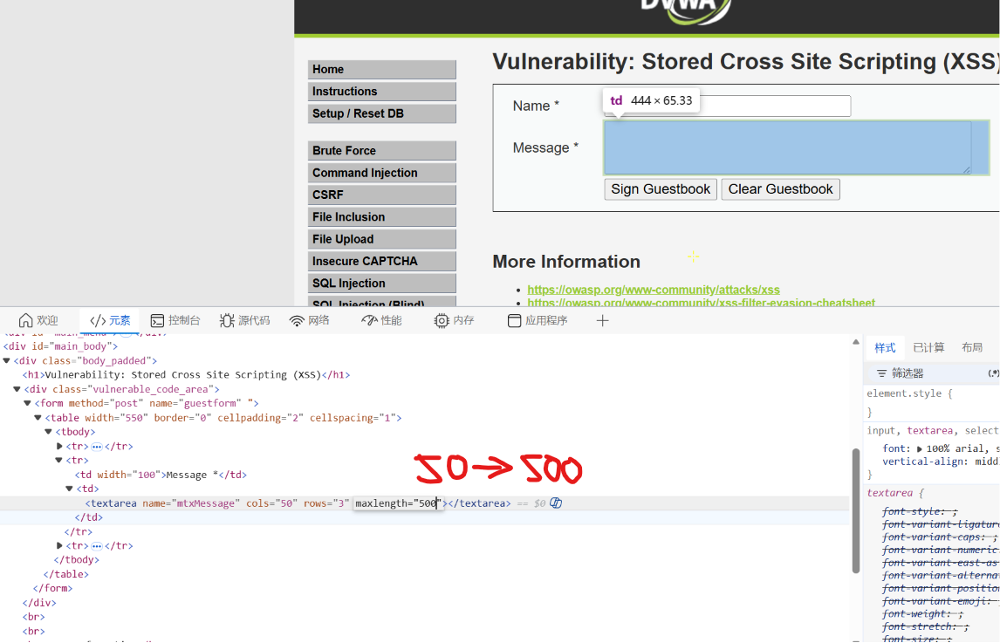

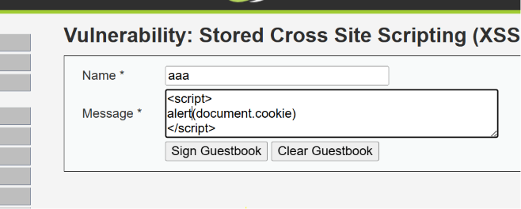

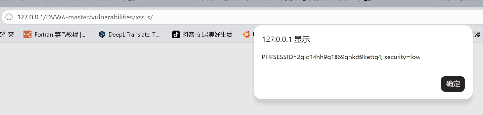

不过alert（）在监听端看不到，使用

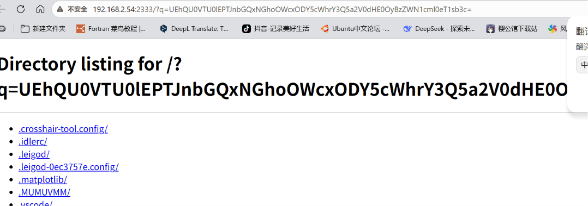

跳转了神秘网页

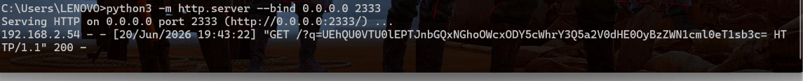

监听端也有反应了，看看是啥

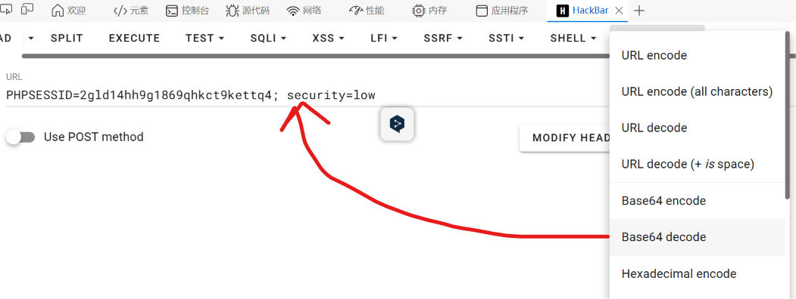

和弹窗内容一样