感觉有点像目录遍历，分为本地包含和远程包含，本地包含就用file://远程包含就用http://

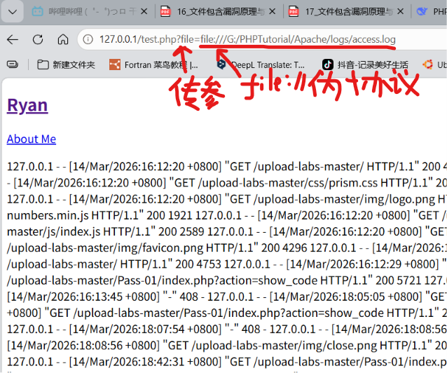

漏洞利用方面

上传一句话木马到log里面，报错就包含error.log，否则包含access.log

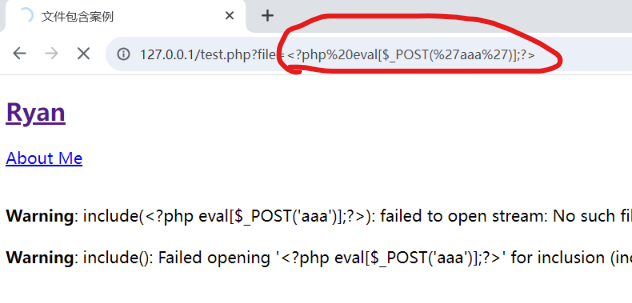

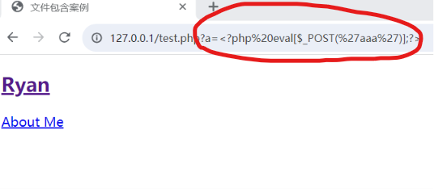

发现写入的内容被转义了，肯定不能用，于是抓包，发现是前端转义，直接修改

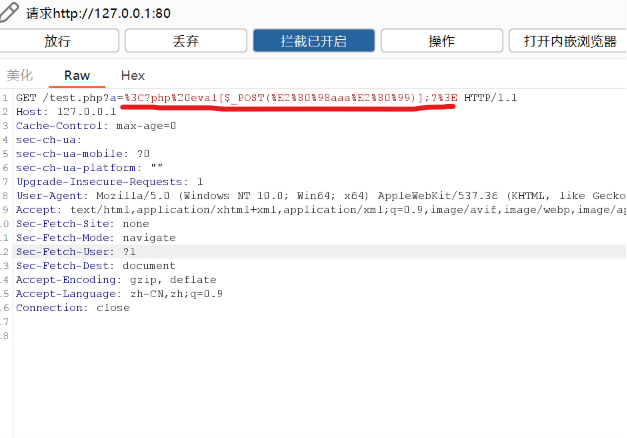

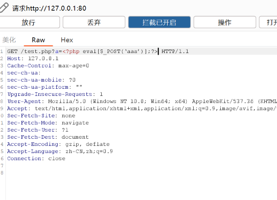

嗯，一句话木马是a=<?php eval($_POST['aaa']);?>，上面的打错了……

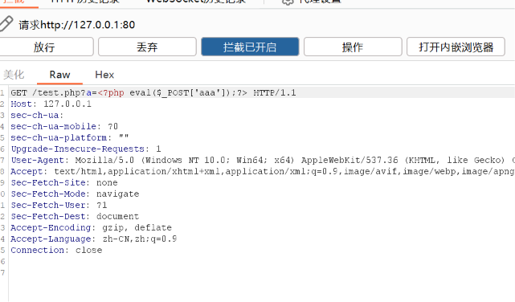

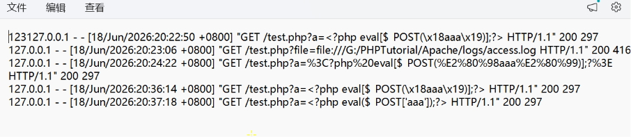

这下应该没问题了，试试file为协议包含

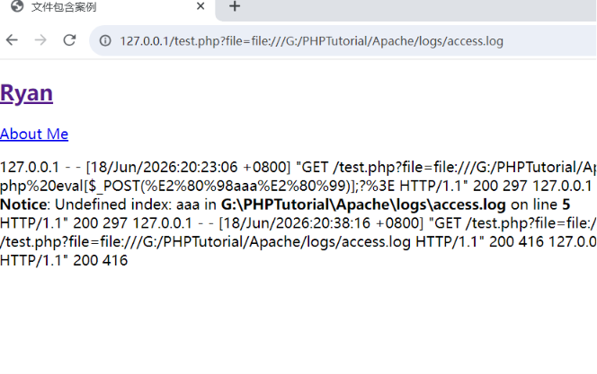

可以看到access.log里面的内容了，试试刚刚放进去的一句话木马aaa

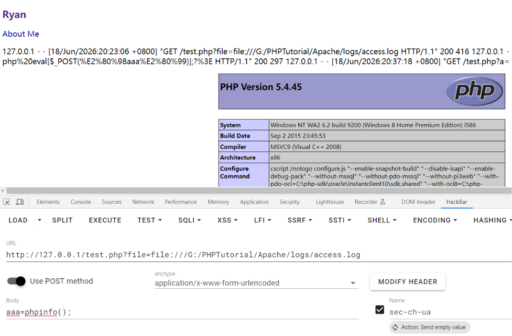

成功执行。

**其他**

1、file读取系统文件（本地包含

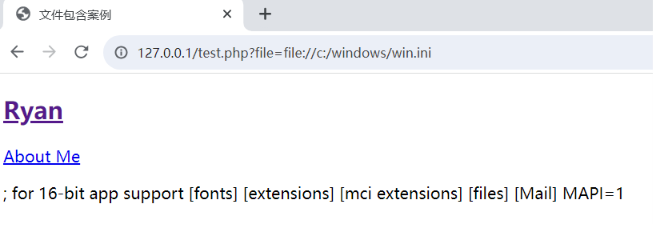

2、http读取服务器文件（远程包含

在此之前得先启动kali的apache服务，先sudo apt update,然后sudo apt install apache2 -y,启动sudo systemctl start apache2,检查是否启动sudo systemctl status apache2

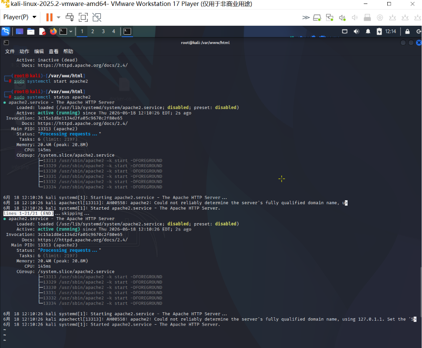

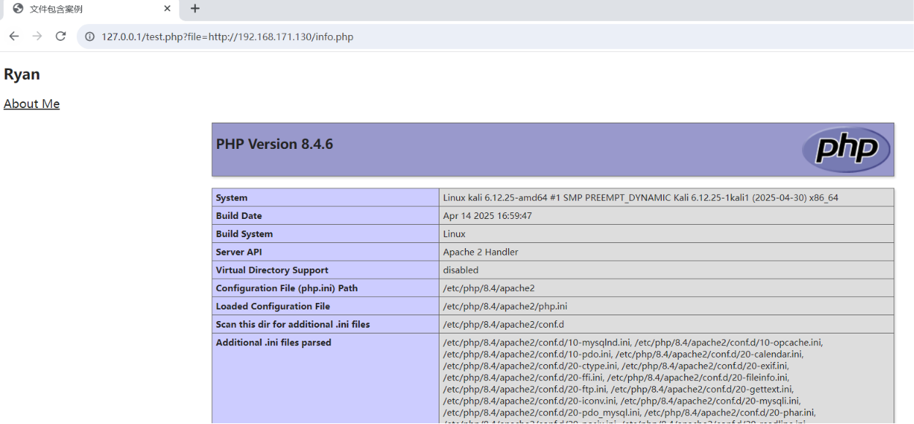

3、php://input

意思是可执行php代码，上传php代码

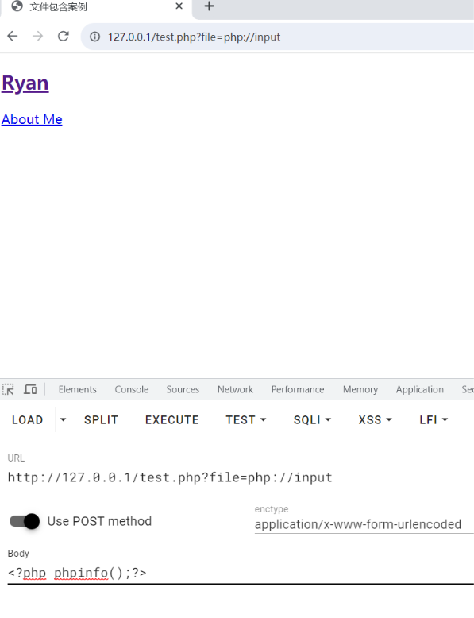

没有反应，使用bp抓包写入代码

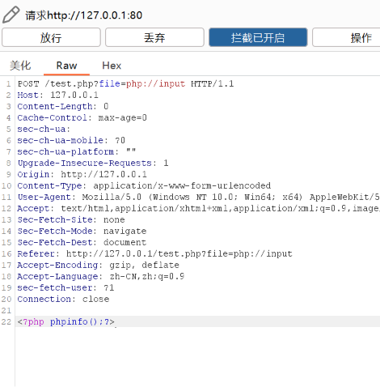

放行后发现代码被执行

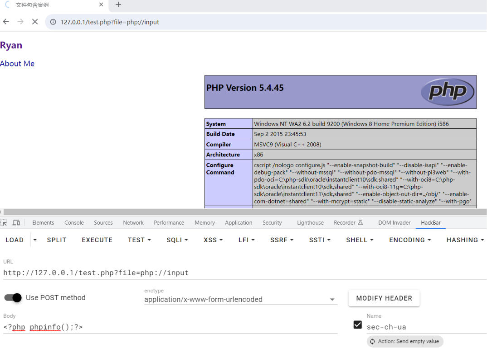

有时候还是抓包比较稳定

使用已建可以方便一点，在图中的位置写木马就可以

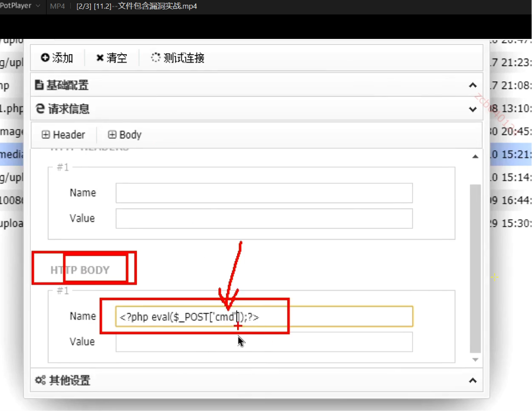

4、php://filter

php://filter/read=convert.base64 encode/resource=*filepath*这里写文件的路径，同目录下只写文件名

eg。http://127.0.0.1/03Web17/include/test.php? file=php://filter/**read**=<u>convert.base64</u> encode/**resource**=<u>about.php</u>

懒得写就这样吧，不知道和file：//有啥区别，只有这个能换编码吗? 

5、phar://

可以读取压缩包里面的东西<u>***？！强强！？***</u>

先创建一个压缩包

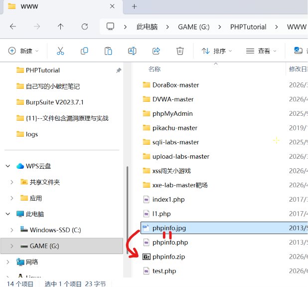

使用phar相对路径（。/当前目录）打开

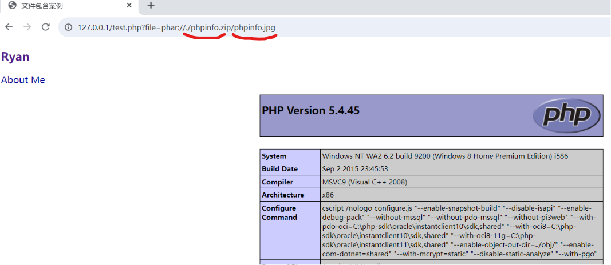

后缀无所谓的，都能执行

6、zip://和上面的phar差不多，但是只能使用绝对路径，却可以将zip后缀改成xxx。

格式相对奇怪，估计zip的mime没有变（头字节

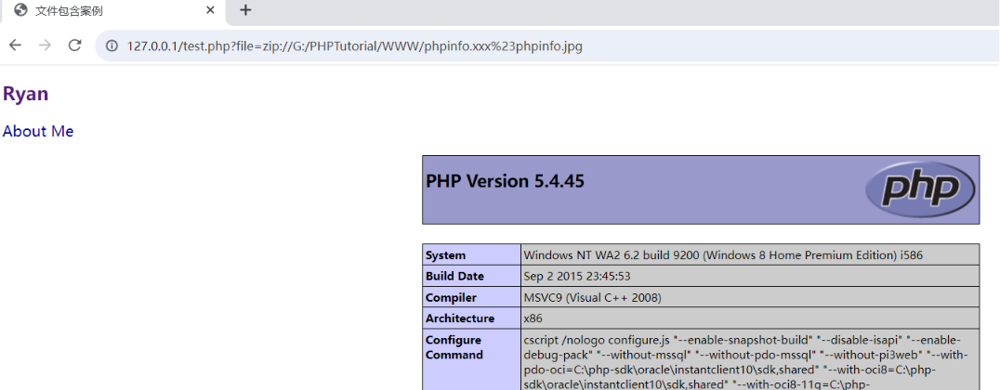

7、http://和https://

自己看

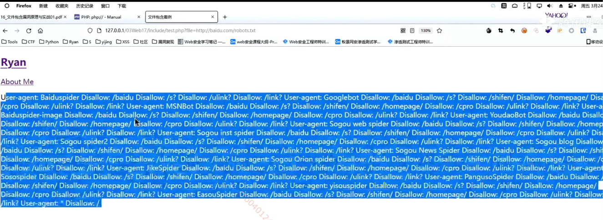

8、data://

直接执行url中的代码

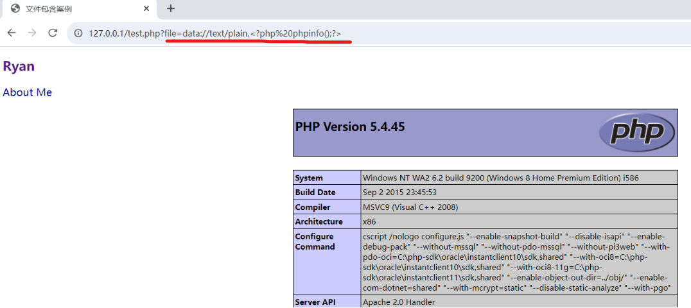

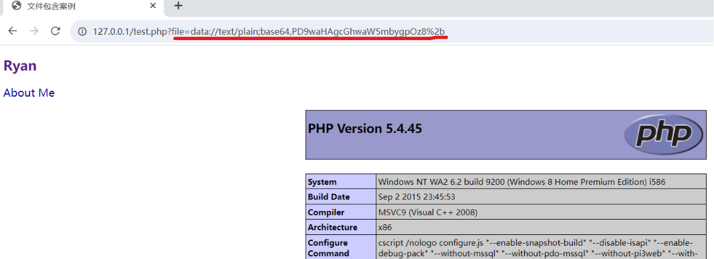

