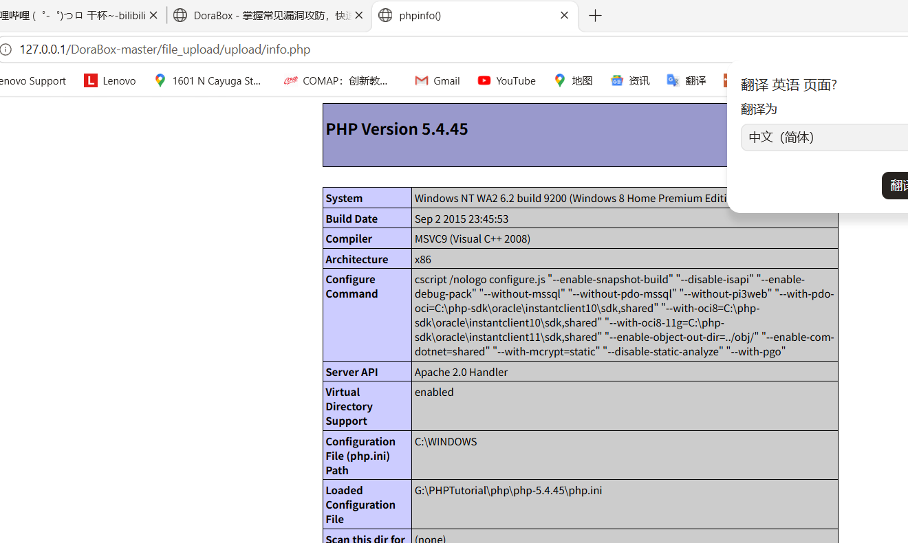
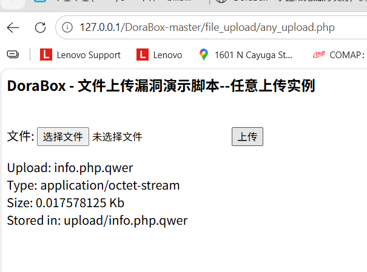
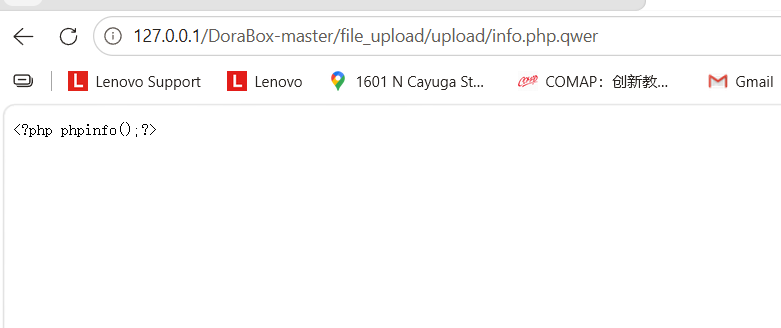
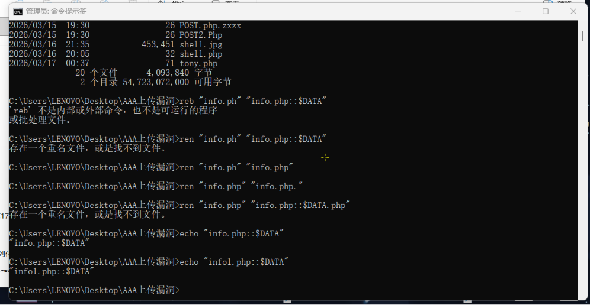
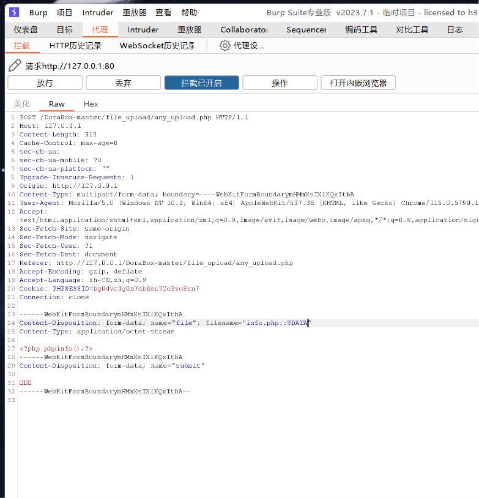
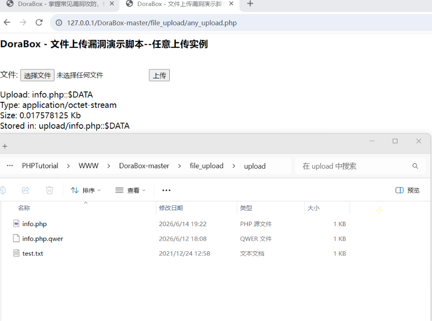
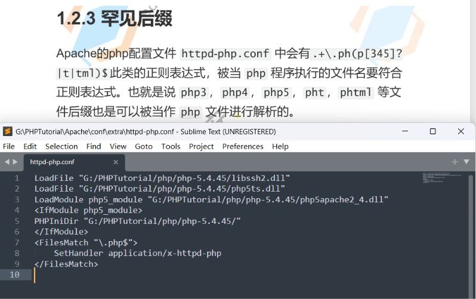
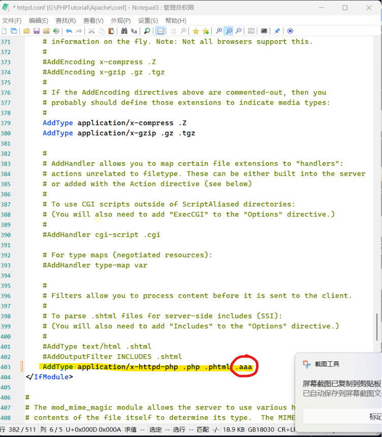
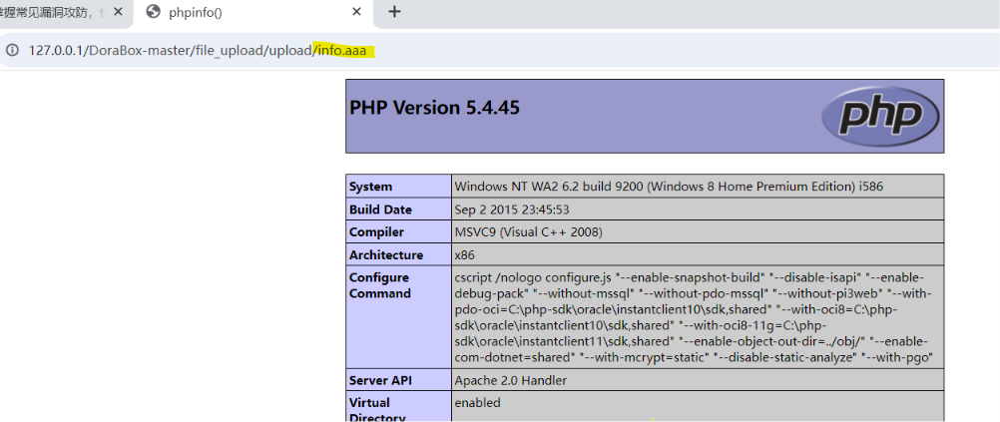

1、修改配置文件

2、罕见后缀（其他可执行后缀）

3、多重后缀

4、::$DATA

5、CGI向前解析

# 操作演示

1、**多重后缀**(在 Apache 2.0.x <= 2.0.59， Apache 2.2.x <= 2.2.17)

写一个文件内容是*<?php phpinfo();?>*的文件，上传后使用目录遍历打开，文件名一个是.php一个是.php.qwer

这个多重后缀仅在一些版本有用，碰到了可以试试看

2、**::$DATA**

修改文件名为info.php::$DATA，但是像我这样做是错的，不可以直接修改本地文件名，应该在上传的时候抓包修改上传的文件名。

直接修改你会发现修改不了…………

直接访问info.php就可以了，同理，info.php. 和 info.php空格 一样的

3、**罕见后缀**

本质配置文件允许此类后缀解析，上传info.php3文件

嗯，不行

原来是配置文件没写 ，但是这个还挺麻烦的，以后再改

4、**修改配置文件**

添加这样一句话

就可以使用.aaa后缀的php内容了

