1、whois查询网站

[站长工具_whois查询工具_爱站网](https://whois.aizhan.com/)

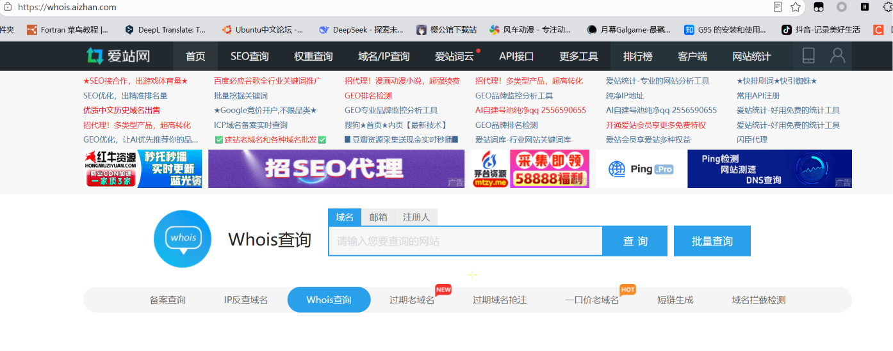

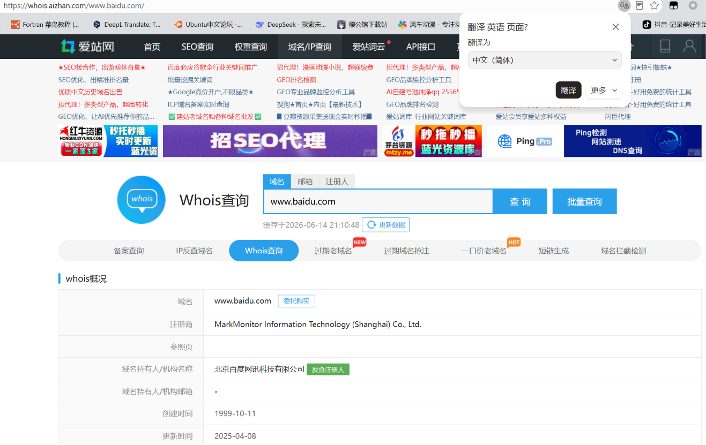

2、icp备案查询

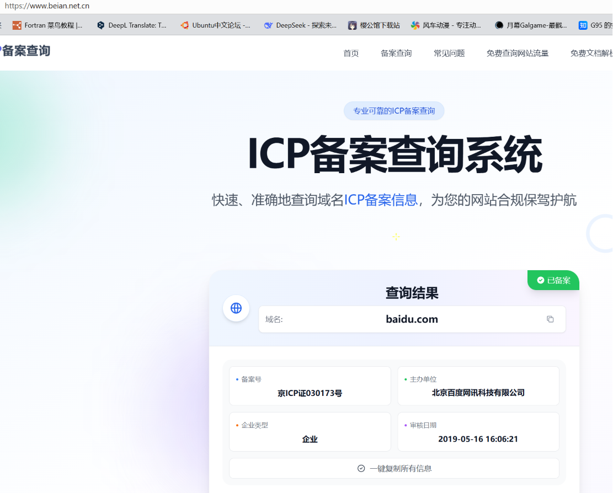

3、[GitHub - Threezh1/JSFinder: JSFinder is a tool for quickly extracting URLs and subdomains from JS files on a website. · GitHub](https://github.com/Threezh1/JSFinder)

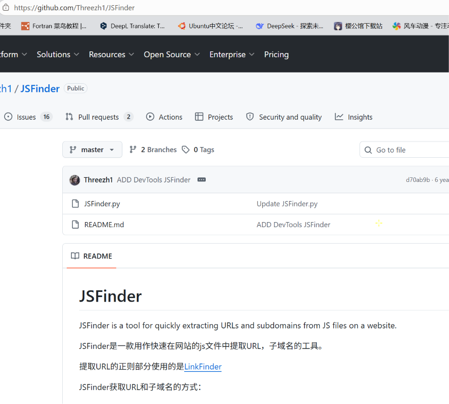

4、[网络空间测绘，网络空间安全搜索引擎，网络空间搜索引擎，安全态势感知 - FOFA网络空间测绘系统](https://fofa.info/)

5、[ZoomEye Search Engine for Internet Asset Discovery](https://www.zoomeye.org/)

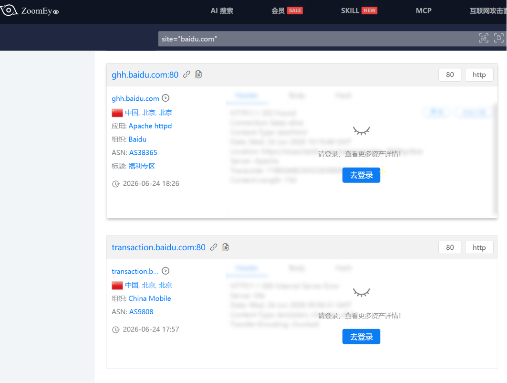

6、还需要注册[360网络空间测绘 — 因为看见，所以安全](https://quake.360.net/quake/#/index)

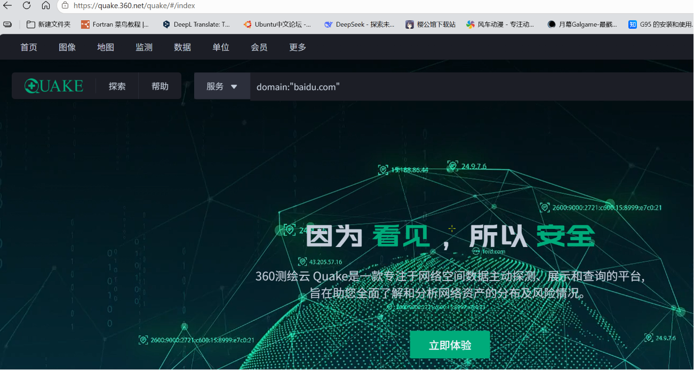

7、[GitHub - shmilylty/OneForAll: OneForAll是一款功能强大的子域收集工具 · GitHub](https://github.com/shmilylty/OneForAll)

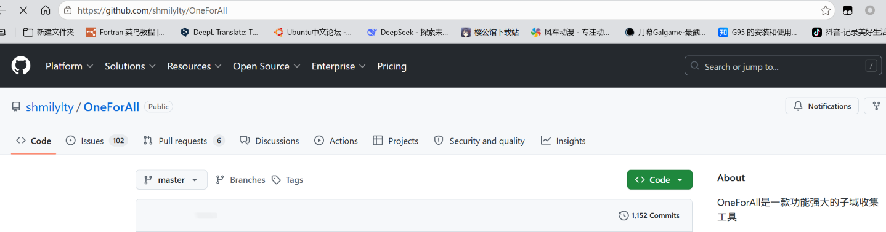

8、[GitHub - lijiejie/subDomainsBrute: A fast sub domain brute tool for pentesters · GitHub](https://github.com/lijiejie/subDomainsBrute)

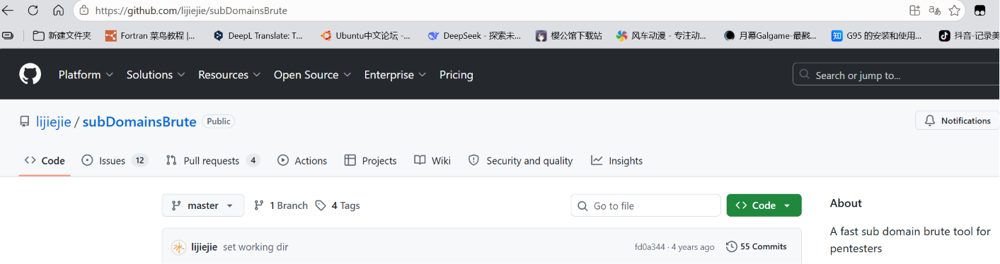

9、[GitHub - aboul3la/Sublist3r: Fast subdomains enumeration tool for penetration testers · GitHub](https://github.com/aboul3la/Sublist3r)

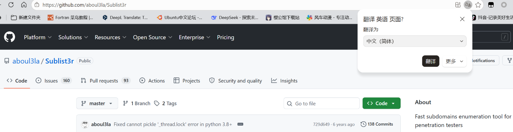

10、[GitHub - FeeiCN/ESD: Enumeration sub domains(枚举子域名) · GitHub](https://github.com/FeeiCN/ESD)

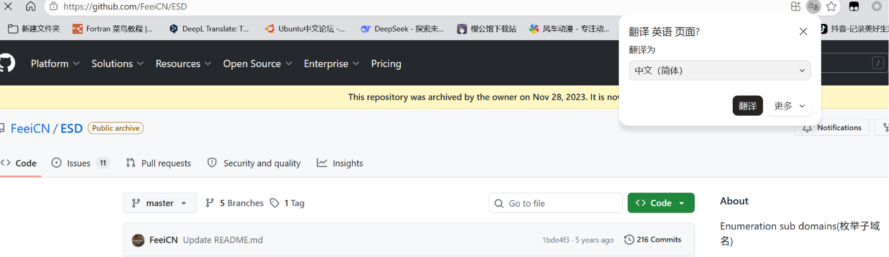

11、[GitHub - chu1337/dnsbrute: a fast domain brute tool · GitHub](https://github.com/chu1337/dnsbrute)

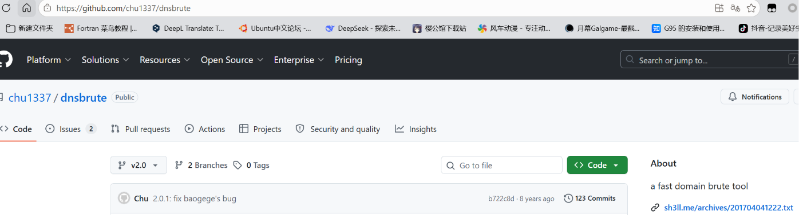

12、[GitHub - jonluca/Anubis: Subdomain enumeration tool · GitHub](https://github.com/jonluca/Anubis)

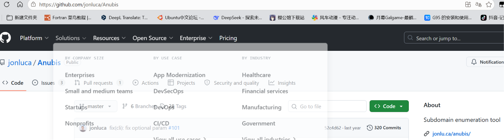

13、[GitHub - yanxiu0614/subdomain3: A new generation of tool for discovering subdomains( ip , cdn and so on) · GitHub](https://github.com/yanxiu0614/subdomain3)

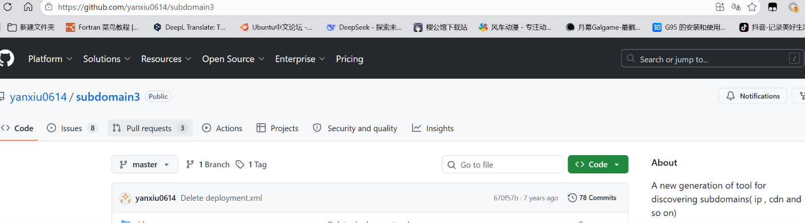

14、[GitHub - bit4woo/teemo: A Domain Name & Email Address Collection Tool · GitHub](https://github.com/bit4woo/teemo)

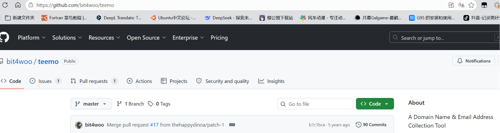

15、[GitHub - screetsec/Sudomy: Sudomy is a subdomain enumeration tool to collect subdomains and analyzing domains performing automated reconnaissance (recon) for bug hunting / pentesting · GitHub](https://github.com/screetsec/Sudomy)

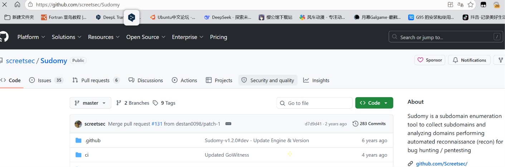

16、[GitHub - LangziFun/LangSrcCurise: SRC子域名资产监控 · GitHub](https://github.com/LangziFun/LangSrcCurise)

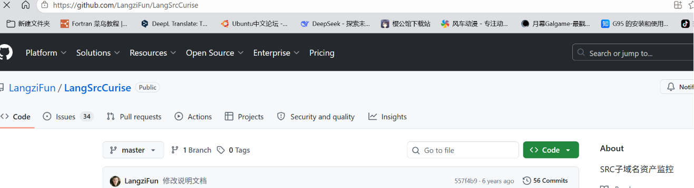

**ip收集**

1、[IP/IPV6查询，服务器地址查询-站长工具](https://ip.tool.chinaz.com/)

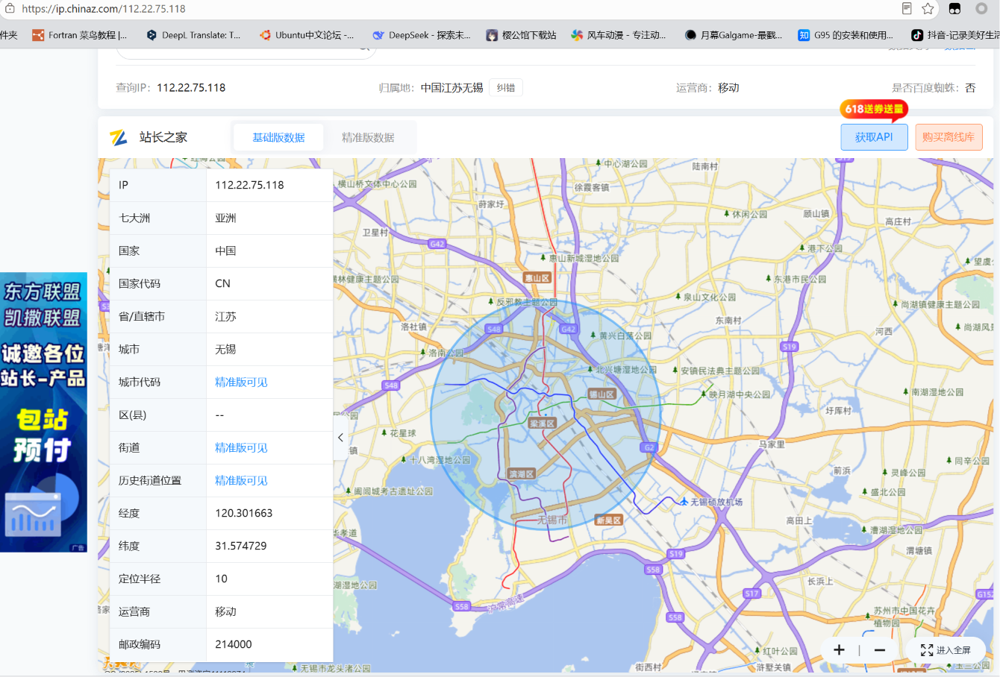

2、[域名查iP 域名解析 iP查询网站 iP反查域名 iP反查网站 同一iP网站 同iP网站域名iP查询](https://site.ip138.com/)

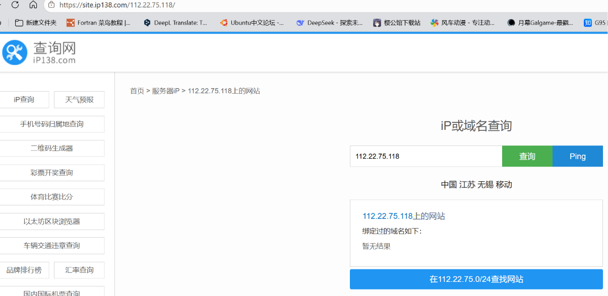

3、[GitHub - se55i0n/Cwebscanner: 快速扫描C段web应用，获取请求状态code、server、title信息 · GitHub](https://github.com/se55i0n/Cwebscanner)

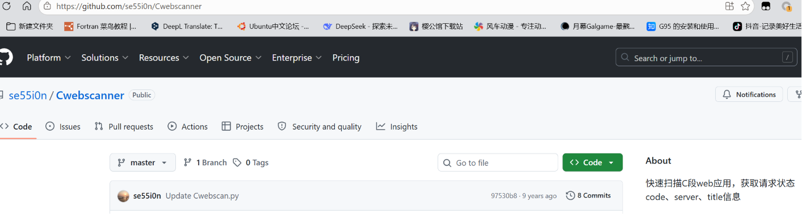

**端口扫描**

1、nmap

2、whatweb

3、wappalyzer

4