1、sudo docker pull php:5.6-apache拉取apache

先不用sudo docker run -d -p 8080:80 php:5.6-apache启动

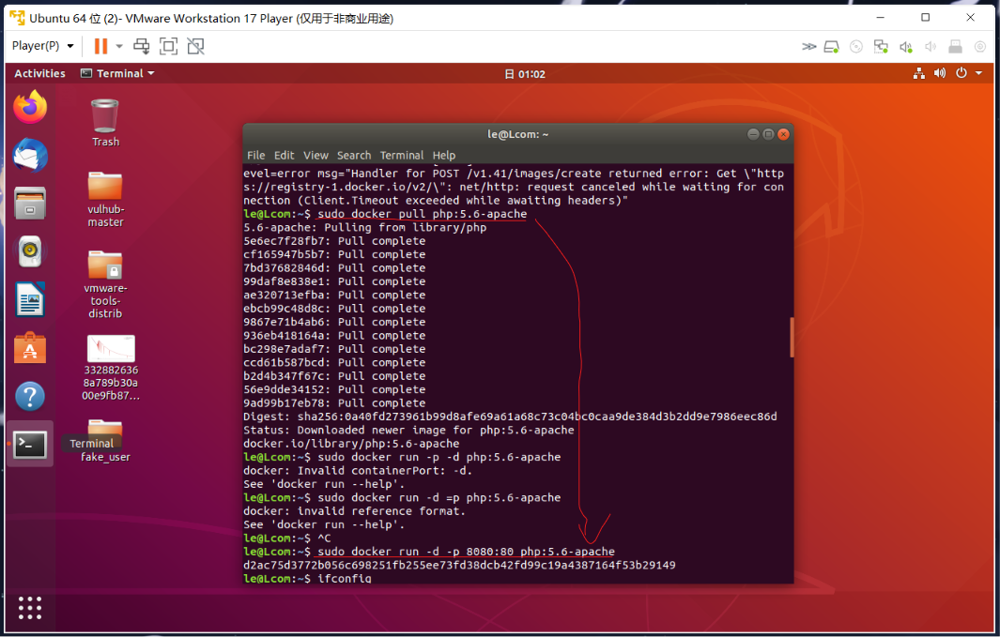

2、下好克隆网站资源，用apache启动

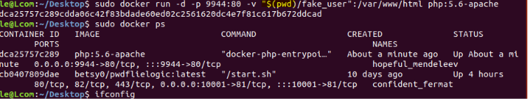

搞错文件夹了，先停止容器，再启动一次

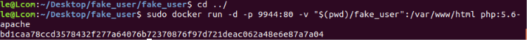

打开网页，对了

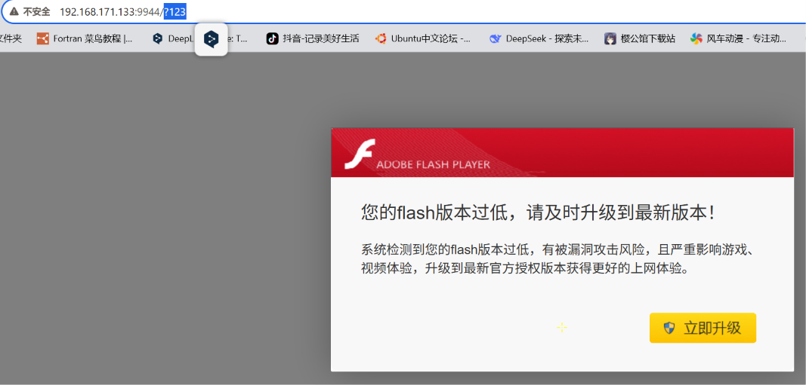

不对不对，这个index.php文件内容不对。这个是对的

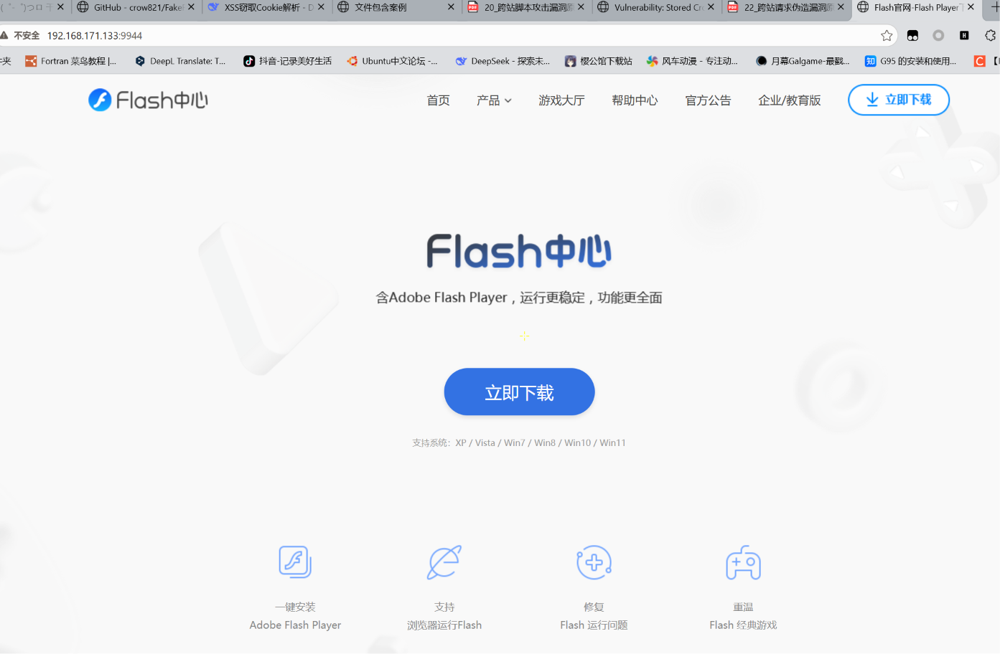

3、接下来找到有xss的网站，注入后跳转到克隆网站

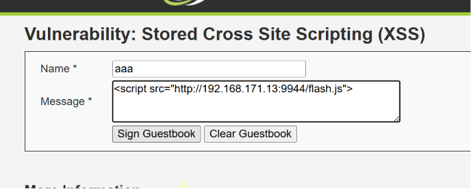

错误的，133少个3没看到

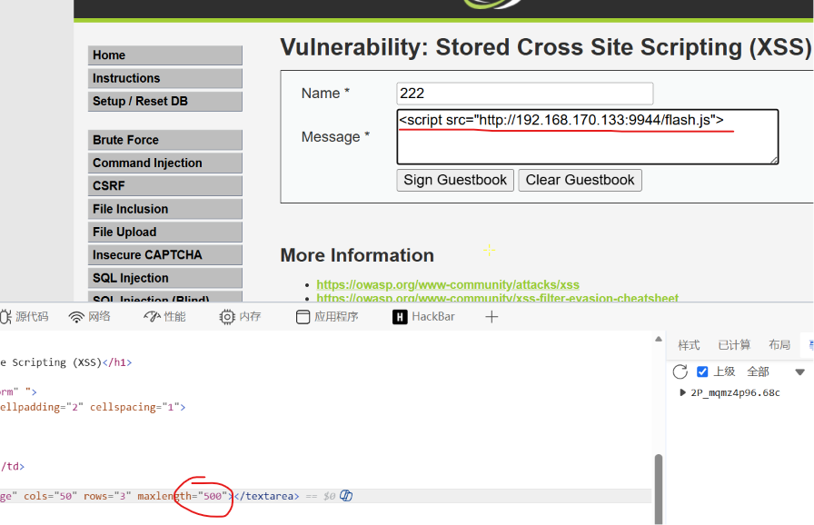

还是写错了，这次没问题

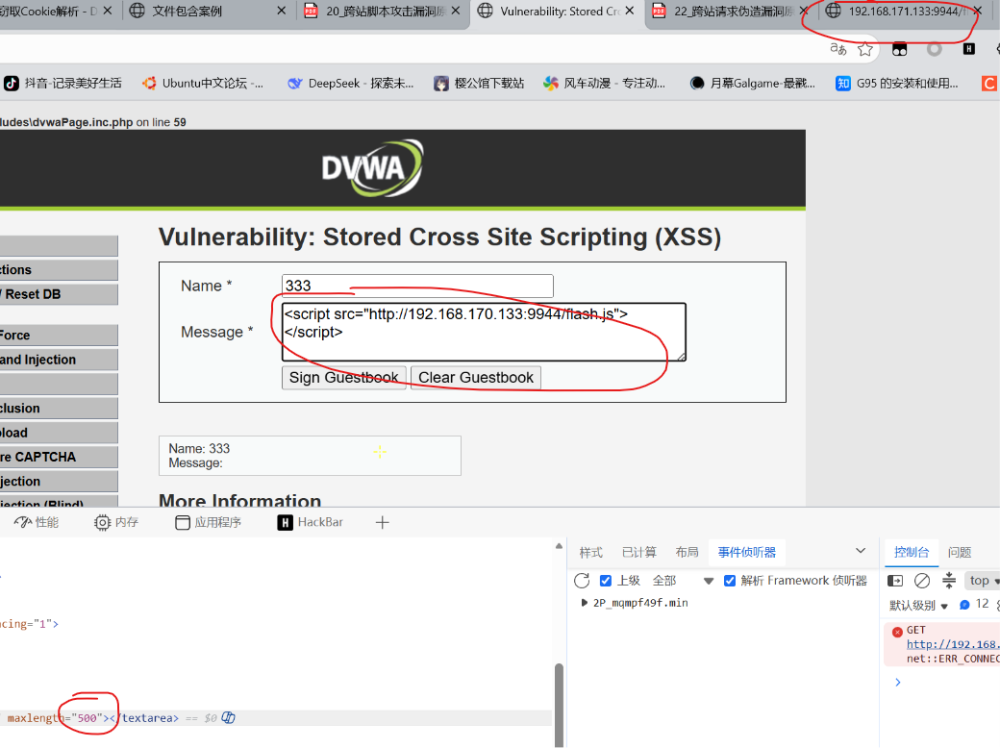

还是错误了，怎么还是错了一个字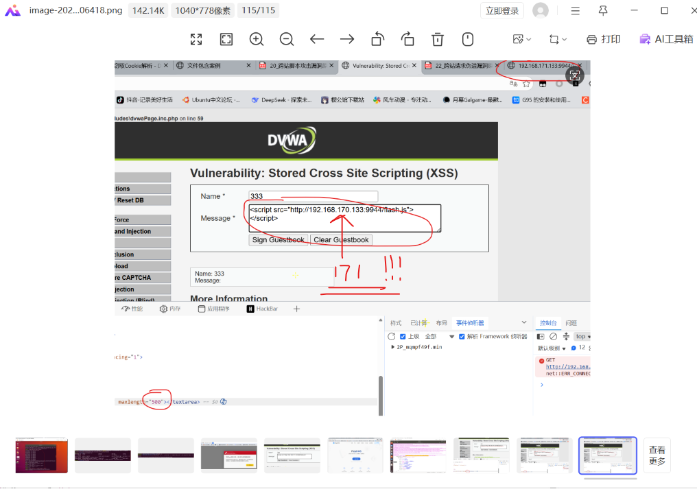

错误了，js文件写的有问题，怎么注入了没反应

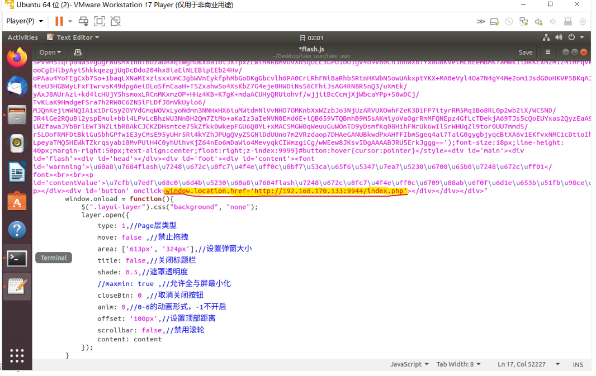

好了好了，终于没毛病了

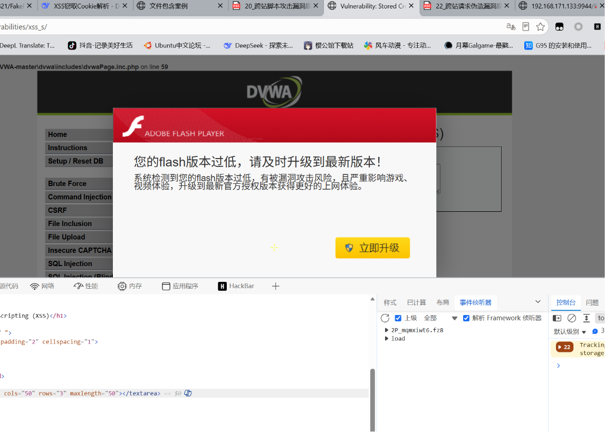

丸辣，js里面写的还是170，改一下

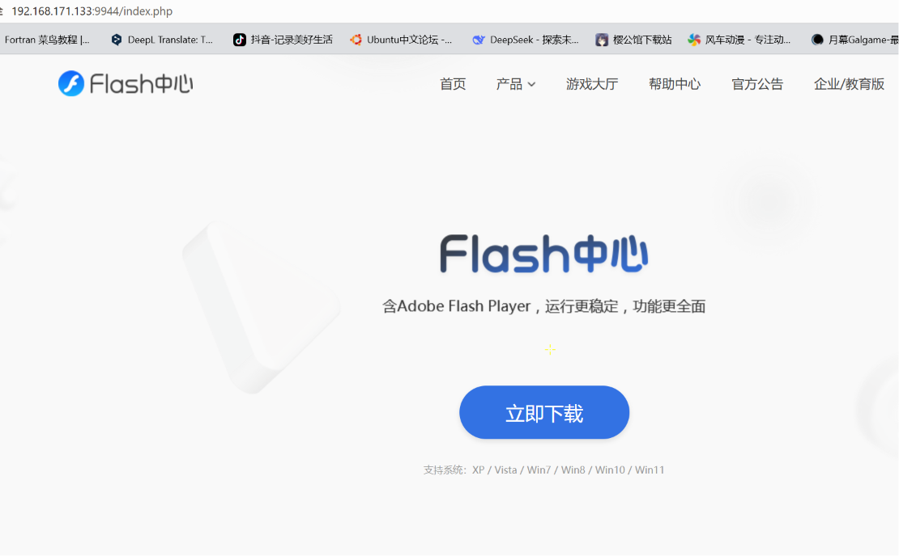

完美运行

