SQLI-LAB报告

## 漏洞概要

SQL注入是一类高危漏洞，存在于与数据库相关的环境中，本质上是在数据与代码没有严格分离的环境下，将用户输入的内容作为可执行语句从而实现注入行为。SQL注入漏洞常见于未使用参数化查询、以拼接字符串方式构造 SQL 的场景。攻击者可通过SQL注入实现对数据库内容的访问，极易导致用户个人信息的泄露，和密码哈希撞库其他网站的用户，甚至承担法律责任。

SQL注入点大致可分为两种：GET型和POST型。GET型SQL注入的特点是以URL作为注入点，通过修改URL参数的方式完成注入攻击；POST型注入的特点是payload不在URL显现，而是通过修改POST请求体的内容。

SQL注入手法可分为六种：联合查询注入、报错注入、布尔盲注、时间盲注、堆叠注入、带外注入。联合查询注入和报错注入的特点是需要回显位，注入快速而精确；布尔盲注和时间盲注的特点是以页面变化的方式作为判断基准，在联合查询注入和报错注入失效时尝试布尔盲注和时间盲注；**堆叠注入**的特点是可以执行查询之外的操作，用";"结束查询语句，然后添加自己想要执行的SQL语句；**带外注入（OOB）**的特点是靠DNS/HTTP访问服务器时携带数据库信息，然后通过查看服务器log的方式得到需要的内容。

## 漏洞检测

0、判断数据库类型

1、检测数字型还是字符型

2、检测闭合方式

3、检测有无回显--盲注

4、检测过滤方式

## 打靶练习

LESS-11

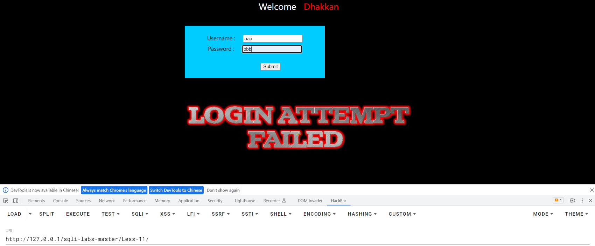

这一关有输入框，可以试试输入内容然后抓包看看

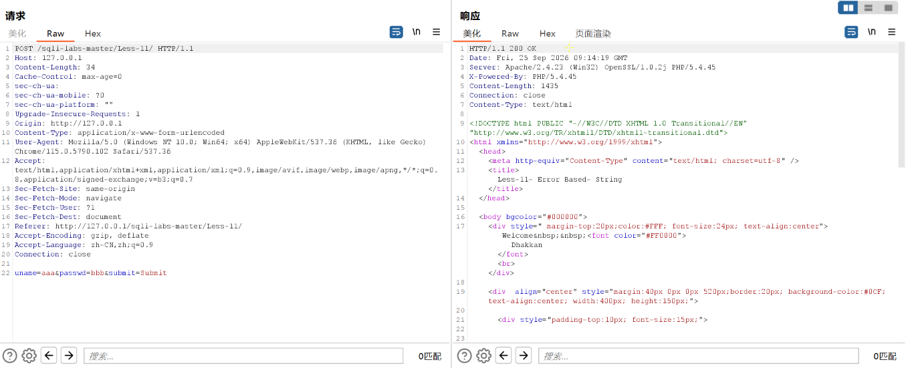

可以看到刚刚输入的内容在POST请求包里都能看到，修改在前面的那个

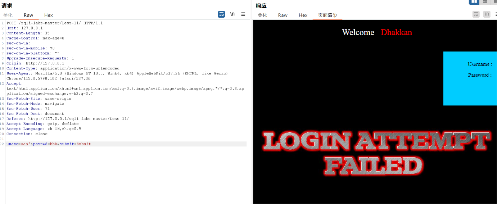

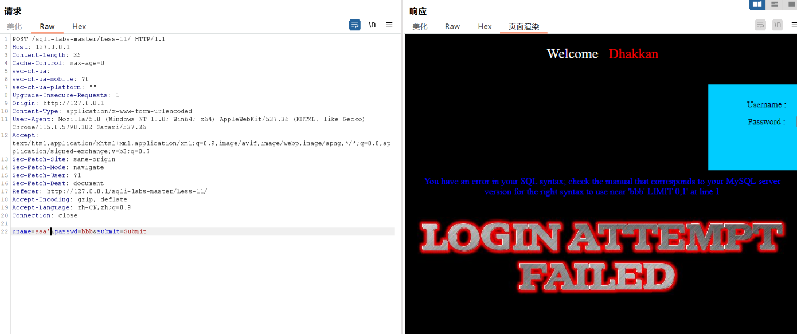

由上图判断，报错You have an error in your SQL syntax; check the manual that corresponds to your MySQL server version for the right syntax to use near 'bbb' LIMIT 0,1' at line 1说明闭合方式为'

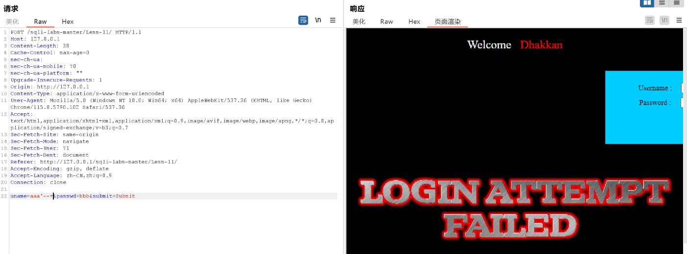

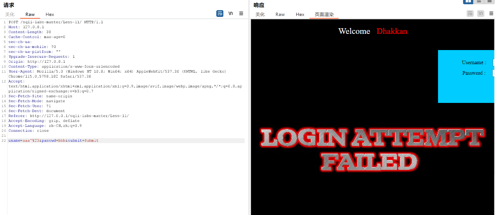

由上图可以看出--+和%23效果一样，#是MySQL数据库特有的注释符，故判断数据库类型为MySQL

已知：

1、数据库为MySQL

2、闭合方式为'

3、注入点在输入栏

求：

1、有无回显位

2、有无报错提示

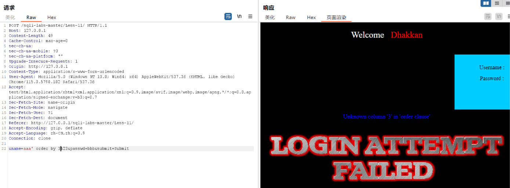

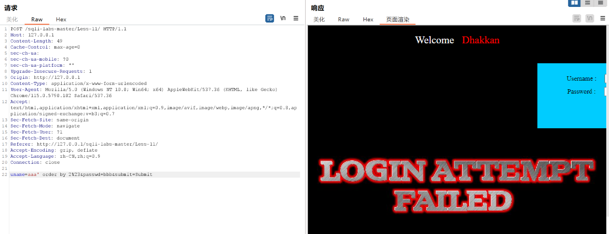

使用order by测试查询位数，发现查询位数为2

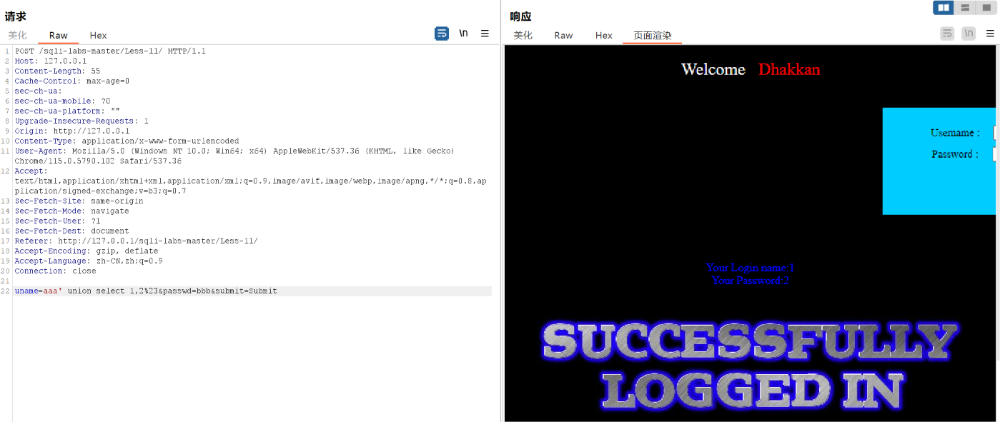

构造payload：uname=aaa' union select 1,2%23&passwd=bbb&submit=Submit试探回显位

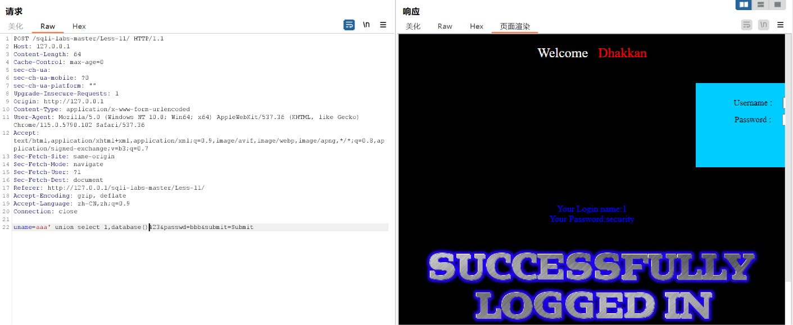

将2改成database()，爆出库名

同样的方法爆出表名、列名、数据

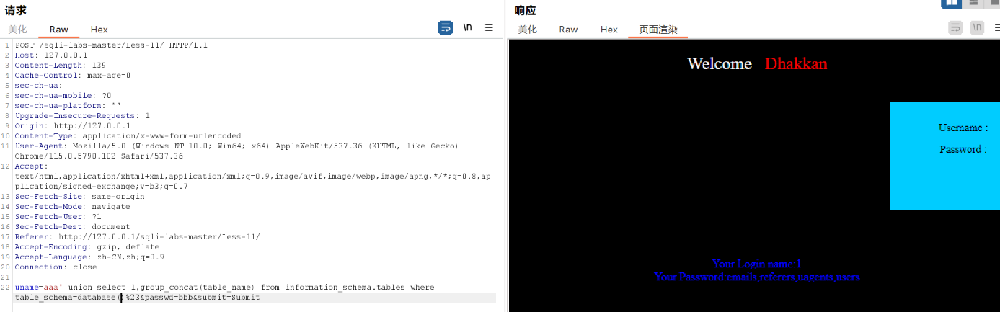

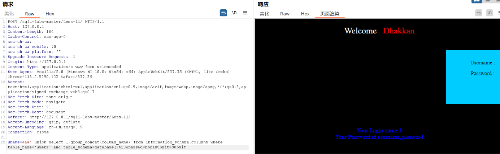

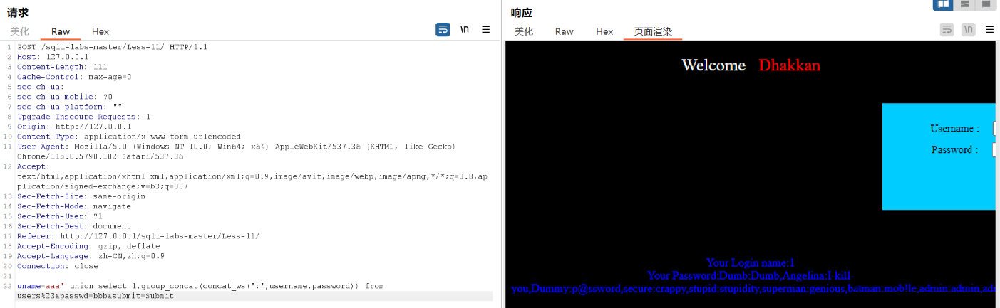

以上图为结果（联合查询注入）

因为有SQL报错内容，所以可以使用报错注入的方式

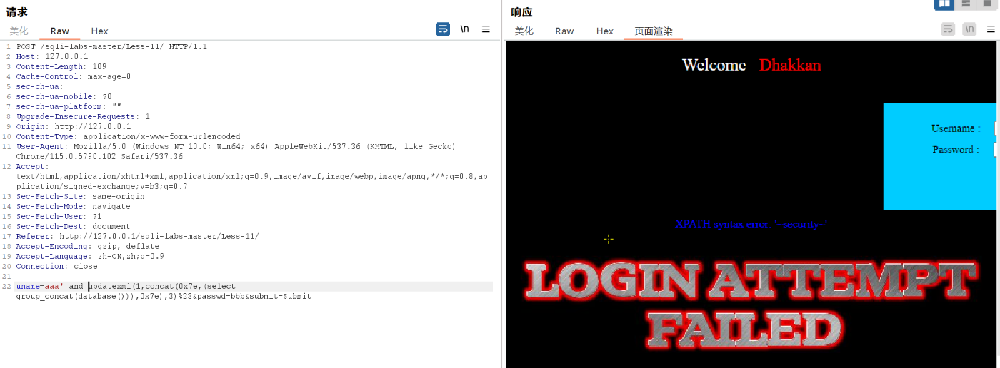

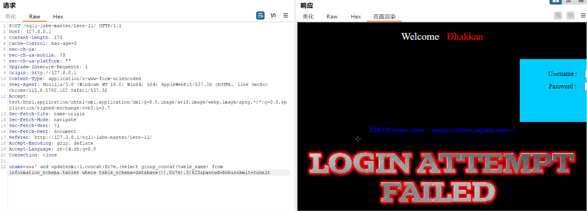

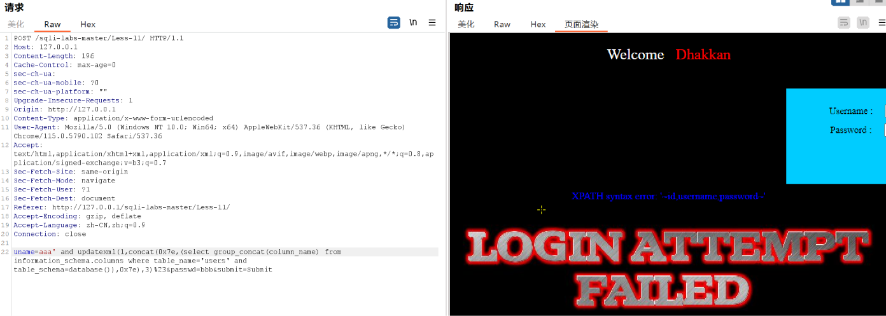

--------------------------------------------------------------

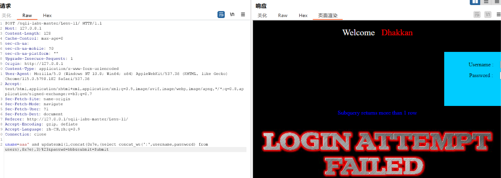

返回内容太长了，拆开显示

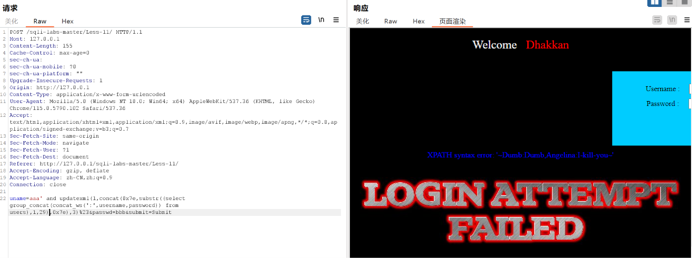

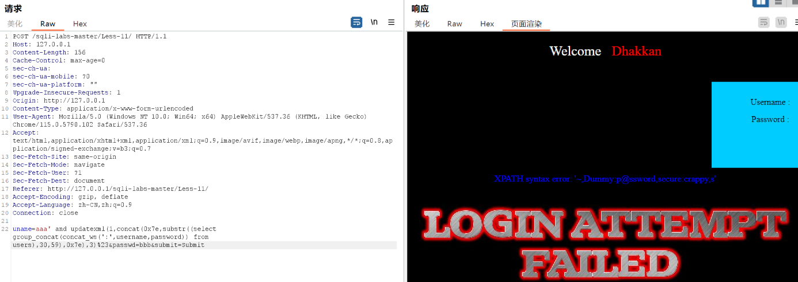

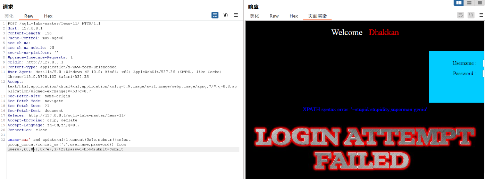


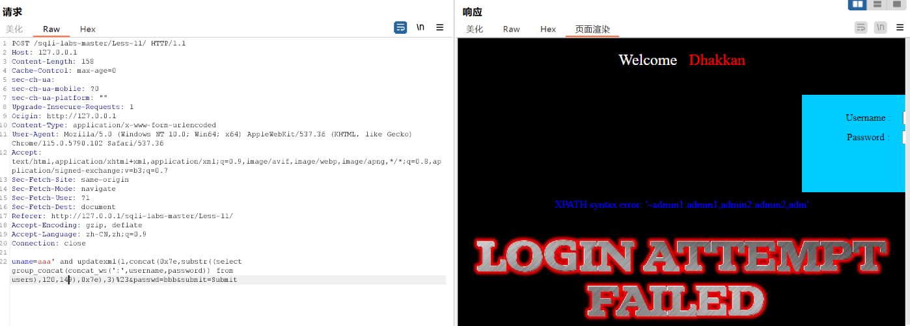

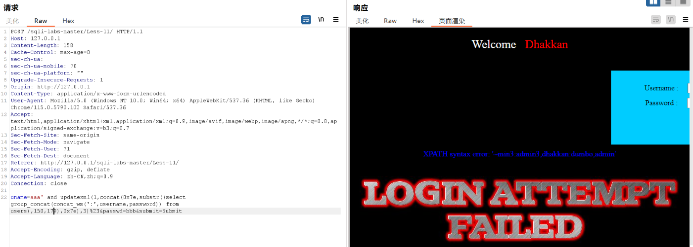

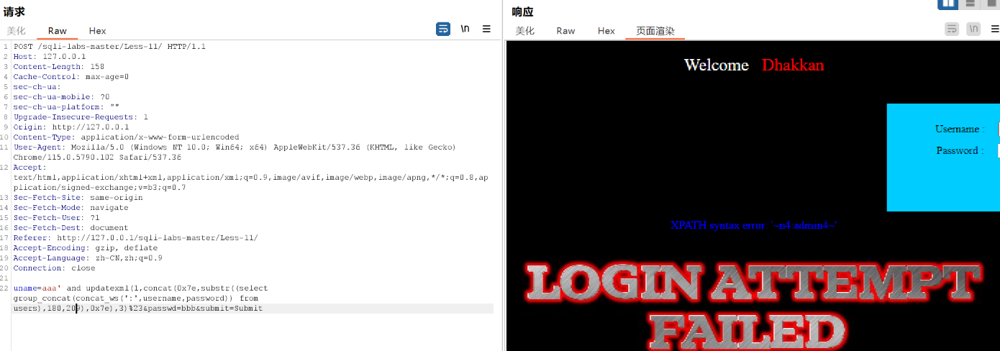

取完所有位，使用exp更加方便

（说明：本关数据的取出方式与 Less-5 一致 ——
 `updatexml` 的报错回显有约 32 字符上限，整表 13 组数据共 188 字符无法一次取完，
 因此改用 `substr` 分段切片：先把整表用 `group_concat` 压成一个长字符串，
 再用 `substr` 按固定长度逐段取出。

 写法：
 `... updatexml(1,concat(0x7e, substr((select group_concat(concat_ws(':',username,password)) from users), 起始位置, 30), 0x7e), 3)-- `

 每次把"起始位置"往后推 30（第 1 段取 1~30、第 2 段取 31~60……），
 每段校验报错内容末尾是否有 `~` —— 有则说明该段完整未被截断。

 前几关的 EXP-5.py 稍作修改即可复用（只需把 GET 请求改成 POST）。）

## 总结

### 一、影响与危害

攻击者无需任何账号凭据，仅需在登录表单中提交构造过的用户名，即可读取数据库中的任意数据。

本次已实际验证：通过联合查询与报错注入两种方式，均成功读出库名 `security`、表名 `emails,referers,uagents,users`、`users` 表的列名 `id,username,password`，以及表中全部 13 组用户名与密码。

**本关的危害比前几关更高，原因有两点：**

1. **攻击面是登录框**。这是系统对外最基础的入口，不像数据查询接口那样只在特定功能里出现。任何访客都能触达，无需事先找到某个带参数的页面。
2. **存在万能登录绕过**。`username = admin' or 1=1-- ` 可直接通过认证，无需知道任何密码。这意味着攻击者不仅能拖库，还能直接以管理员身份进入系统，后续可上传文件、篡改数据或进一步获取服务器权限。

其中包含 `admin:admin` 这类弱口令账号，密码无需破解即可直接使用；用户名密码一旦泄露，可用于撞库用户在其他平台的账号，影响范围超出本系统。账号信息属个人信息，若为生产环境可能触发《个人信息保护法》下的合规责任。

**利用门槛**：仅需浏览器与一次表单提交（或 Burp 修改一次请求体），无需任何专业工具。**相比盲注需要成千上万次请求，本关有回显与报错，几次请求即可拿到数据。**

### 二、修复建议

1、根本修复：
   对 `uname` 与 `passwd` 两个参数均使用预编译（参数化查询）。
   其原理是数据库先确定语句结构、再将参数作为纯数据传入，
   用户输入永远不会进入 SQL 语法层被解析。

   **注意：登录逻辑通常两个参数都进 SQL，本关两个参数都应检查**，
   只修一个仍会留下注入点。

2、为什么不能用转义/过滤替代：
   转义引号、过滤关键字属于黑名单思路，只要存在一个未覆盖的绕过方式
   即告失效。这是"堵"而不是"隔离"。

3、临时缓解（代码改不动时）：
   - 登录相关接口的数据库账号降权，仅保留必要的 SELECT 权限
   - 统一错误页面，不向用户返回任何数据库相关信息
   - WAF 拦截 union select、updatexml、information_schema 等特征
   - **对登录失败次数做限制与告警**：万能密码绕过、盲注的特征都是
     对同一登录接口提交大量构造过的用户名

4、同类问题排查：
   按"是否存在字符串拼接构造 SQL"对全部接口做一次检索，
   同时重点复查所有登录、注册、搜索类表单（这些是注入点最集中的位置）。

5、修复验证方法：
   用原 payload 复测：
     uname=aaa' and updatexml(1,concat(0x7e,database(),0x7e),3)-- &passwd=bbb&submit=Submit
   预期：不再返回 XPATH 报错，登录失败并提示统一错误信息。

   并需更换手法复测：
   - 联合查询：uname=aaa' union select 1,2-- &passwd=bbb
   - 万能绕过：uname=admin' or 1=1-- &passwd=bbb（应仍然登录失败）
   - 盲注：uname=aaa' and 1=1-- 与 uname=aaa' and 1=2-- 对比
   确认全部手法失效。仅拦截 UNION 一种不视为修复完成。

### 三、延伸思考

**卡在哪**：

1、**一开始不确定注入点在哪个字段、怎么改。**

   前九关的注入点都在 URL 的 `id` 参数上，直接改地址栏就行。
   本关是表单提交，地址栏里看不到任何参数，必须先抓包才能知道
   请求的真实样子（POST 体里字段名是 `uname`、`passwd`，不是页面上的
   "用户名/密码"）。

   **这一步是心态上的转折**：从"改 URL"变成"先看请求长什么样，再决定改哪里"。

2、**报错注入那一步照搬 Less-5 的 payload 会失败。**

   我最初写的是：
   `... (select concat_ws(':',username,password) from users) ...`
   结果没有任何数据回显。

   原因：`updatexml` 的第二个参数只能接收**一个值**，
   而这个子查询会返回 13 行，MySQL 先报了
   `Subquery returns more than 1 row` —— 这个错误里不含我们的数据，
   所以看不到 XPATH 回显。

   两种解法：
   - **`group_concat(...)` 把多行压成一行**，再用 `substr` 分段切片
     （本关采用这种，与 Less-5 的 EXP-5.py 是同一套写法）
   - `limit 0,1` 只取一行，逐条读取（代码更简单，但一条数据一个请求）

3、**`%23` 和 `-- ` 在 POST 体里都能用，但原因不同。**

   `#` 在 URL 里是锚点标记，后面的内容不会被发送，所以 GET 请求里
   必须写成 `%23`。但在 POST 请求体里 `#` 不是特殊字符，
   直接写 `%23` 也可以；而 `-- ` 里的空格不会被丢弃，
   所以两种写法都成立。

   （另外 POST 体里的 `+` 会被解析为空格，所以 `--+` 与 `-- ` 等价。）

**学到什么**：

1、**注入点的位置比手法更重要。**

   本关的手法（联合查询、报错注入）和前面几关完全一样，
   命令一行都没变，**变的只是 payload 放在哪**。
   但就是这个差别，决定了一个只会改 URL 的人在本关无从下手。

   **实战意义**：真实系统的输入绝大多数来自表单（登录、搜索、注册），
   以 POST 提交为主，字段名各不相同。所以标准动作应该是：
   **先抓包看清请求长什么样 → 找到所有可控字段 → 逐个测试**，
   而不是"先想一个 payload，再找地方塞"。

2、**登录框是注入点和认证绕过同时存在的地方。**

   `admin' or 1=1-- ` 之所以能直接登录，是因为登录查询本身就是
   `select * from users where username='$uname' and password='$passwd'`，
   注入之后整个条件恒为真，数据库就返回了第一条用户记录，
   程序以为验证通过。

   **这比拖库更危险**：拖库泄露数据，绕过是直接拿到权限。
   而且它不需要知道任何密码、也不需要猜解，一次请求就完成。

3、**四种手法的选择顺序在本关得到验证。**

   本关页面同时有回显位和报错信息，所以：
   ```
   联合查询  → 最快，1 个请求拿一行数据
   报错注入  → 次之，受 32 字符上限限制
   盲注      → 完全不需要（前两种都能用）
   ```
   对比 Less-8、Less-9 的盲注（库名要 56 个请求、时间盲注要 216 秒），
   **本关取完 13 组数据只需 13 个请求**。

   **这印证了手法的选择顺序不是规定，而是"每次能拿到多少信息"决定的效率排序。**
   遇到注入点先判断它给什么信号，比直接套用某种手法重要得多。

4、**同一个漏洞点可以同时用多种手法验证，这本身就是信息。**

   本关先用联合查询拿到了数据，又用报错注入再验证了一遍。
   在真实测试中，**多手法交叉验证能确认结论可靠** ——
   如果只有联合查询成功、报错注入失败，可能说明某处有过滤；
   两种都成功，才说明这个注入点确实完全可控。

5、**POST 与 GET 的编码差异，是本关必须单独记的一条。**

   | | GET（URL 参数） | POST（请求体） |
   |---|---|---|
   | `#` | **不发送**（锚点）→ 必须写 `%23` | 不特殊，`%23` 或 `-- ` 都行 |
   | 空格 | 会被丢弃 → 用 `--+` | `+` 解析为空格，`-- ` 也可 |
   | 单引号 | 建议编码为 `%27` | 建议编码为 `%27` |

   用脚本提交时（`requests.post(url, data={...})`），
   字典里的值会由 requests 自动做 URL 编码，**不需要手动拼 `%27`、`%20`**，
   比在 Burp 里手工编码省事。

