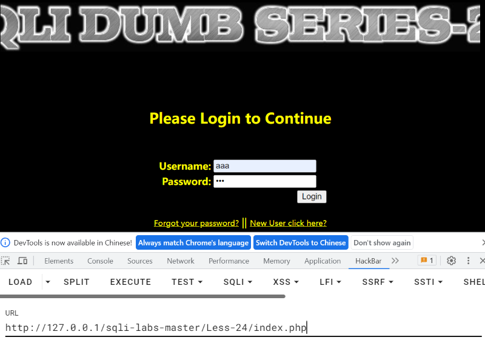
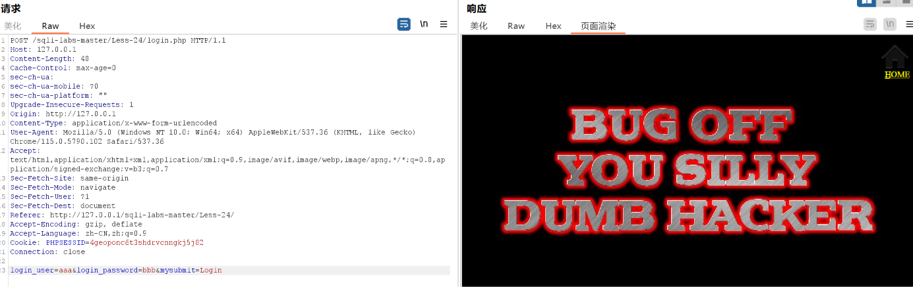
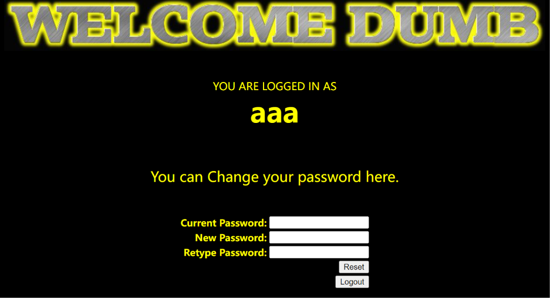
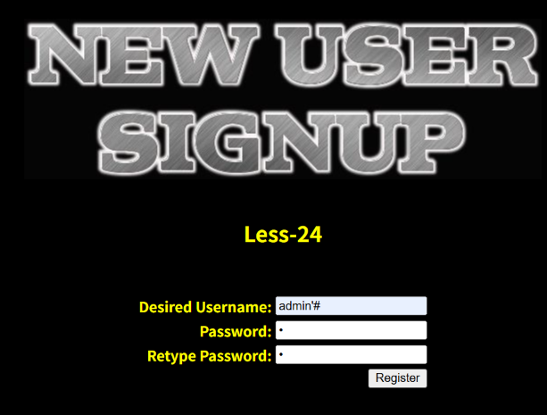
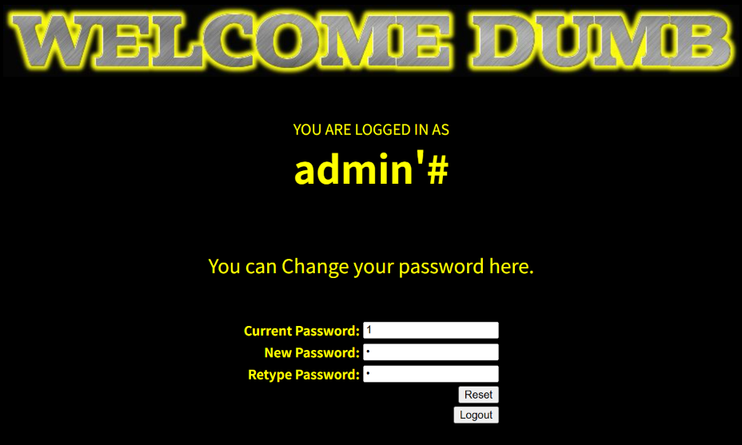
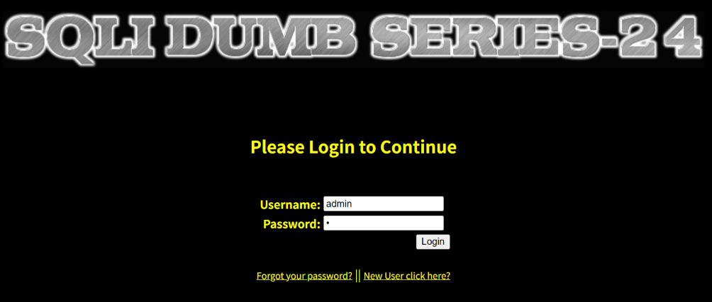
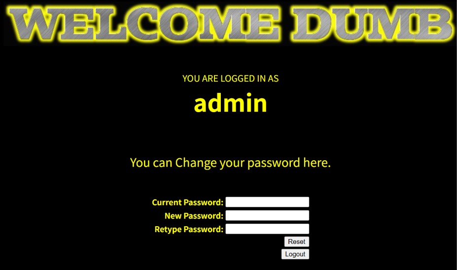

SQLI-LAB报告

## 漏洞概要

SQL注入是一类高危漏洞，存在于与数据库相关的环境中，本质上是在数据与代码没有严格分离的环境下，将用户输入的内容作为可执行语句从而实现注入行为。SQL注入漏洞常见于未使用参数化查询、以拼接字符串方式构造 SQL 的场景。攻击者可通过SQL注入实现对数据库内容的访问，极易导致用户个人信息的泄露，和密码哈希撞库其他网站的用户，甚至承担法律责任。

SQL注入点大致可分为两种：GET型和POST型。GET型SQL注入的特点是以URL作为注入点，通过修改URL参数的方式完成注入攻击；POST型注入的特点是payload不在URL显现，而是通过修改POST请求体的内容。

除上述两类"一次注入"外，还存在**二次注入（Second-Order Injection）**：payload 先被当作**数据**存入数据库，此时并不触发任何 SQL 解析；之后该数据在**另一个功能**里被读出并重新拼进 SQL 语句，才真正发生注入。它和一次注入的本质区别在于——**注入点不在输入处，而在数据流出处的"再次拼接"**。本关 Less-24 就是这类漏洞，题目标题即 "Second Degree Injections"。

这类漏洞比一次注入更隐蔽：输入端的转义、过滤全部到位，测试时在输入口怎么试都打不动，容易误判为"安全"。

SQL注入手法可分为六种：联合查询注入、报错注入、布尔盲注、时间盲注、堆叠注入、带外注入。联合查询注入和报错注入的特点是需要回显位，注入快速而精确；布尔盲注和时间盲注的特点是以页面变化的方式作为判断基准，在联合查询注入和报错注入失效时尝试布尔盲注和时间盲注；**堆叠注入**的特点是可以执行查询之外的操作，用";"结束查询语句，然后添加自己想要执行的SQL语句；**带外注入（OOB）**的特点是靠DNS/HTTP访问服务器时携带数据库信息，然后通过查看服务器log的方式得到需要的内容。

## 漏洞检测

0、判断数据库类型

沿用报错原文判断法失效——**本关页面不返回任何 SQL 报错**，只回显一句
`You tried to be smart, Try harder!!!! :(`。因此改从源码判断：

```php
include("../sql-connections/sql-connect.php");     // mysql_connect / mysql_query
$username = mysql_escape_string($_POST['username']);   // MySQL 专有函数
```

`mysql_*` 系列函数与 `mysql_escape_string()` 均为 MySQL 专有，且在本机
`error.log` 中能看到 `PHP Deprecated: mysql_escape_string(): This function is deprecated`
的告警。**结论：数据库为 MySQL 5.5.53。**

1、检测数字型还是字符型

本关没有 GET 型数字参数，注入入口是**注册接口的 POST 表单**，字段为
`username / password / re_password`，全部按字符串处理。

2、检测闭合方式

两种引号并存，这是本关的伏笔：

```php
// login_create.php —— 查询用单引号、插入用双引号
$sql = "select count(*) from users where username='$username'";
$sql = "insert into users ( username, password) values(\"$username\", \"$pass\")";
```

`$username` 经 `mysql_escape_string()` 转义，它转义 `'` 和 `\`，**但不转义 `#`**。
所以单引号在注册阶段能完整存活并写进数据库。

真正的闭合点在**改密接口**：

```php
// pass_change.php —— $_SESSION["username"] 完全没有转义
$username = $_SESSION["username"];
$sql = "UPDATE users SET PASSWORD='$pass' where username='$username' and password='$curr_pass' ";
```

3、检测有无回显--盲注

**没有任何 SQL 报错回显**，报错注入与联合查询都不可用；改密成功与否只以
`Password successfully updated` 或跳转 `failed.php` 体现。
本关也不需要盲注——数据流出处直接进了 `UPDATE` 语句，属于**写型注入**。

4、检测过滤方式

| 处理位置 | 函数 | 效果 |
|---|---|---|
| 注册 `username` | `mysql_escape_string()` | 转义 `'` `\`，**放行 `#`** |
| 登录 `login_user` | `mysql_real_escape_string()` | 转义到位，登录处无法直接注入 |
| 改密 `$_SESSION["username"]` | **无任何处理** | **漏洞所在** |

关键：过滤只做在**输入端**，而 `$_SESSION["username"]` 的值来自数据库读取结果，
绕过了所有输入过滤。

## 打靶练习

LESS-24



输入aaa和bbb测试



返回的内容没有数据和报错信息，只能知道发生了错误


打开注册界面，将用户名和密码设为aaa和bbb

可以执行



再使用注册的用户登录，显示aaa登陆成功




将用户名注册为admin'#，成功


登录admin'#



成功进入用户页面

此时 session 里保存的用户名是 `admin'#`——它是从数据库里**原样取出的值**，不是转义后的。
这是后面能闭合单引号的关键：登录处的转义只对那一条 SELECT 语句有效，
值一旦经过"存库→读回"，转义就失效了。

此时修改用户密码，在服务器里的操作却是对admin的，因为'闭合了admin作为对象，#注释了原本在后面的内容

注意：**Current Password 栏我故意填的是错误值**（如 xxx）。
它仍然能成功，是因为 `#` 把后面的 ` and password='当前密码' ` 整段注释掉了——
服务器根本没有校验当前密码。


页面返回 `Password successfully updated`，说明 UPDATE 命中了 1 行，
被改的正是 **admin 那一行**，而不是我自己那行。



使用刚刚修改的密码登录admin用户

用的是攻击时设置的**新密码**，而不是 admin 的原始密码。



登陆成功，可以看到admin的用户界面


再用 `admin` + **原密码 `admin`** 登录，失败——说明 admin 的密码确实被替换掉了，
合法管理员被锁在门外。

## 总结

### 一、影响与危害

**技术上能做什么**：应用把"用户注册后自己设定的用户名"存进数据库，之后又在改密接口
把它从 session 取出来重新拼进 SQL，且**全程未转义**。攻击者因此可以注册一个**名字里带
SQL 片段**的账号，借自己的登录态去改**别人的**密码。

**利用门槛**：极低。只需三步，且**注册功能默认开放**、不需要任何现有凭据：

1. 注册用户名 `admin'#`（密码自定）
2. 用 `admin'#` 登录 —— 自己掌握密码，登录必然成功
3. 进入"改密码"页提交 —— 当前密码栏**填错的也能成功**

本次已实际验证到的最深程度（**完整走通，不是推断**）：

| 验证内容 | 实测结果 |
|---|---|
| 攻击者账号 | 注册 `admin'#` 成功，数据库存 `hex = 61646D696E2723`（真井号） |
| 登录态 | 页面显示 `YOU ARE LOGGED IN AS admin'#` |
| 改密接口 | 当前密码填**错误值**，仍返回 `Password successfully updated` |
| **越权结果** | **`admin` 的密码被成功修改**，数据库实测 `password` 字段由 `admin` 变为攻击者设的值 |
| 反证 | 用 `admin` + 原密码 `admin` 登录失败；用 `admin` + 新密码登录成功 |

**为什么能改到 admin**：改密时实际执行的语句是

```sql
UPDATE users SET PASSWORD='攻击者设的新密码'
where username='admin'#' and password='当前密码'
              └─────┘  └──────────────────────┘
              单引号闭合        被 # 整段注释掉
```

`#` 注释掉的**不只是尾部多余内容，还包括 `and password='...'` 这道校验**。
所以攻击者连当前密码都不用知道。

**对业务意味着什么**：

1. **管理员账号被完全接管**。攻击者从"无凭据的游客"直接变成 admin，可进入后台。
   这是本次验证中最严重的一条——不是读数据，是**夺权**。
2. **密码被静默篡改，原主人被锁在外面**。合法管理员会突然无法登录，且他本人
   没有改过密码，运维排查方向容易跑偏。
3. **账密明文存储放大后果**。`users` 表密码字段为明文，一旦配合其他注入点拖库，
   这批账号可直接用于撞库。
4. **同类"存储后回捞"接口都可能中招**。凡是把用户可控数据存库、之后又拼进 SQL
   的地方（改密、改资料、下单、日志回显）都要按同一套路复查。

### 二、修复建议

1、根本修复：
   对该参数使用预编译（参数化查询）。其原理是数据库先确定语句结构、
   再将参数作为纯数据传入，用户输入永远不会进入 SQL 语法层被解析。

2、为什么不能用转义/过滤替代：
   转义引号、过滤关键字属于黑名单思路，只要存在一个未覆盖的绕过方式
   即告失效。这是"堵"而不是"隔离"。

3、临时缓解（代码改不动时）：
   - 该接口的数据库账号降权，仅保留必要的 SELECT 权限
   - 关闭详细报错回显（当前页面直接返回 SQL 报错，本身即信息泄露）
   - WAF 拦截 union select、information_schema 等特征

4、同类问题排查：
   按"是否存在字符串拼接构造 SQL"对全部接口做一次检索，注入点通常不止一处。

5、修复验证方法：
   先复现原攻击，确认它已经失效：

   步骤一：注册恶意用户名 `admin'#`，密码任意
   预期：注册**被拒绝**，或注册成功但用户名中的 `'` 已被转义存为 `admin\'#`
         （即数据库中该字段不再等于 `admin'#`）

   步骤二：用 `admin'#` 登录并进入改密页，当前密码填**错误值**
   预期：改密**失败**，页面不再出现 `Password successfully updated`，
         而是跳转 failed.php 或提示当前密码错误

   步骤三：反证 —— 用 `admin` + 原密码 `admin` 登录
   预期：**仍然可以登录**（说明 admin 密码未被篡改）

   步骤四：再确认用 `admin` + 攻击阶段设置的新密码无法登录
   预期：登录失败

   并需更换手法复测，确认同类"存储后回捞"的接口都已修复：

   - 换用户名再试：`admin'-- `、`admin'/*`、`x'or'1'='1`
     预期：全部无效。**只加 `#` 到黑名单不算修复**
   - 换注入位置：把同样的套路用在"修改资料""找回密码"等其它
     会读取 session / 数据库值再拼 SQL 的接口上
     预期：均无越权效果

   **本关的核心教训**：修复必须落在**数据流出处的再次拼接**上，
   只在输入端加转义是无效的——因为 `$_SESSION["username"]` 的值
   来自数据库，根本不经过输入过滤。

### 三、延伸思考

**卡在哪**：

1、**一开始在注册框里怎么试都打不动**。试过 `admin'#`、`1' union select 1,2,3`、`database()`
这类 payload，注册页面的反应始终一样，一度以为本关没有注入。
后来读了 `login_create.php` 才明白：注册处的 `mysql_escape_string()` 该转义都转义了，
**这关的注入根本不发生在输入处**。真正的洞在 `pass_change.php` 第 31 行——
`$username = $_SESSION["username"]` 这句完全没有转义。**我一开始找错了地方。**

2、**卡在 `#` 号上很久**。用户名填 `admin'%23` 注册，数据库里存成了
`hex = 61646D696E27253233`，也就是字面的 `admin'%23`，井号没生效，改密永远失败。
原因是**表单是 `application/x-www-form-urlencoded` 编码，它不会把 `%23` 解码成 `#`**——
`%23` 是 URL 编码，只在地址栏或抓包工具的 URL 编码语义下有效。
**后面改成在表单里直接打英文 `#` 才通。**

3、**被浏览器的自动填充坑了两次**。一次是登录框默认被填成 `admin`，
结果拿 admin 去登录；一次是注册时三个字段的内容串了位，把 `admin'#` 塞进了密码框，
于是注册出来的用户名变成了 `1`（hex = `31`），我自己却以为注册的是 `admin'#`。
**最后用无痕窗口（`Ctrl+Shift+N`）一次通过。**

4、**改密失败时看不到原因**。页面既不报错也不说为什么，只把你跳回首页。
后来直接去数据库查 `SELECT username,password FROM users` 才确认：
`admin` 的密码根本没被改动过，说明 **UPDATE 命中了 0 行**。
**页面没反馈时，用数据库状态反查是最快的定位手段。**

**学到什么**：

1、**注入点不一定在输入处，也可能在"数据流出处"。**
这是本关最重要的一条。判断一个应用有没有注入风险，不能只看"用户输入有没有转义"，
还要看**从数据库、session、缓存里读出来的值，有没有被重新拼进 SQL**。
本关输入端做得挺像回事（`mysql_escape_string` + `mysql_real_escape_string`），
但数据一存一取，转义就丢了。

2、**转义是"用一次就作废"的。**
`login.php` 里 `mysql_real_escape_string` 用得没错，但那个转义**只对那一条 SELECT 有效**。
转义后的值进了数据库、又被读出来放进 session 时，**已经恢复成原始字符了**。
所以"在入口转义"这种做法天然覆盖不全——入口有无数个，出口也有无数个。

3、**只要参数化查询没覆盖到"每一处拼接"，就不算修好。**
本关的修法是给 `pass_change.php` 的 UPDATE 也用预处理。
但不能只改这一处——同一套思路要扫一遍所有"读出来再拼"的接口。

4、**前端细节会伪装成"漏洞没打通"。**
`%23` 不解码、autofill 串位、`value=""` 被浏览器覆盖——这些问题看起来像
"payload 不对"，实际是**浏览器行为**。以后遇到"明明 payload 是对的但没反应"，
先排除：数据到底有没有原样发出去？**抓包看实际请求体**，或直接查数据库核对落库值。

5、**没有报错回显 ≠ 没有漏洞。**
本关全程不回显 SQL 报错，报错注入和联合查询都堵死了，但它反而更严重——
因为它是**写型注入**，直接改数据，比读数据危害更大。
**回显有无只决定手法，不决定危害等级。**
