SQLI-LAB报告

## 漏洞概要

SQL注入是一类高危漏洞，存在于与数据库相关的环境中，本质上是在数据与代码没有严格分离的环境下，将用户输入的内容作为可执行语句从而实现注入行为。SQL注入漏洞常见于未使用参数化查询、以拼接字符串方式构造 SQL 的场景。攻击者可通过SQL注入实现对数据库内容的访问，极易导致用户个人信息的泄露，和密码哈希撞库其他网站的用户，甚至承担法律责任。

SQL注入点大致可分为两种：GET型和POST型。GET型SQL注入的特点是以URL作为注入点，通过修改URL参数的方式完成注入攻击；POST型注入的特点是payload不在URL显现，而是通过修改POST请求体的内容。

SQL注入手法可分为六种：联合查询注入、报错注入、布尔盲注、时间盲注、堆叠注入、带外注入。联合查询注入和报错注入的特点是需要回显位，注入快速而精确；布尔盲注和时间盲注的特点是以页面变化的方式作为判断基准，在联合查询注入和报错注入失效时尝试布尔盲注和时间盲注；**堆叠注入**的特点是可以执行查询之外的操作，用";"结束查询语句，然后添加自己想要执行的SQL语句；**带外注入（OOB）**的特点是靠DNS/HTTP访问服务器时携带数据库信息，然后通过查看服务器log的方式得到需要的内容。

## 漏洞检测

0、判断数据库类型

1、检测数字型还是字符型

2、检测闭合方式

3、检测有无回显--盲注

4、检测过滤方式

## 打靶练习

LESS-1

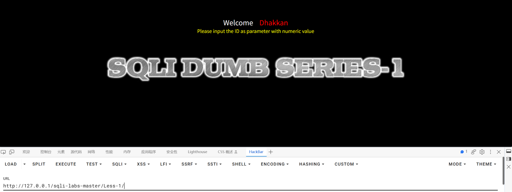

打开页面，发现没有可互动的地方。从URL开始尝试输入一些内容。

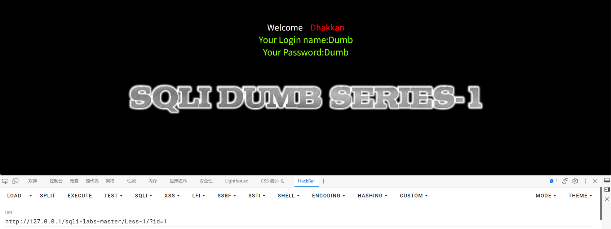

输入id=1，页面有回显，返回了name和passwd。

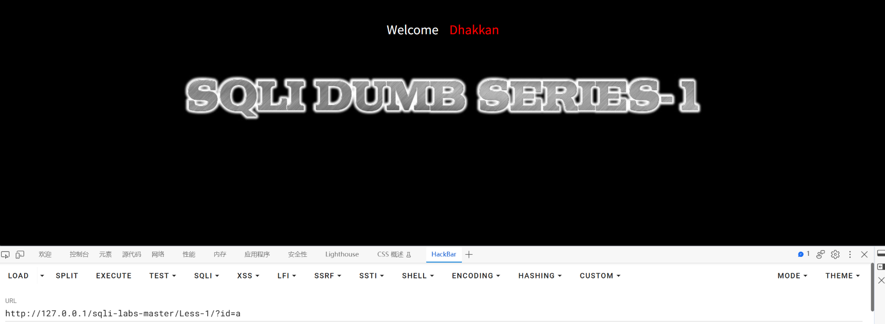

输入id=a，无回显，说明参数需要是数字。

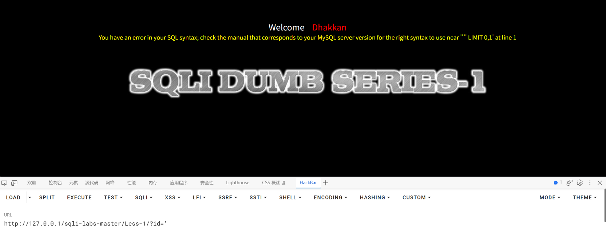

输入id='，出现了SQL语法错误，说明闭合方式是'

并且从报错 `You have an error in your SQL syntax; check the manual that corresponds to your MySQL server version for the right syntax to use near ''1'' LIMIT 0,1' at line 1` 中可以看出使用的数据库是MySQL

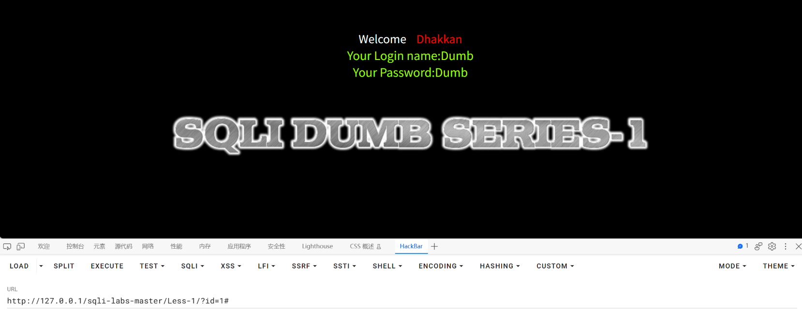

使用 1# 作为参数，数据库没报错，而#是MySQL特有的注释符，可以确定数据库类型为MySQL

目前已知：1、参数为数字型 2、闭合方式为'

接下来尝试爆出查询位数

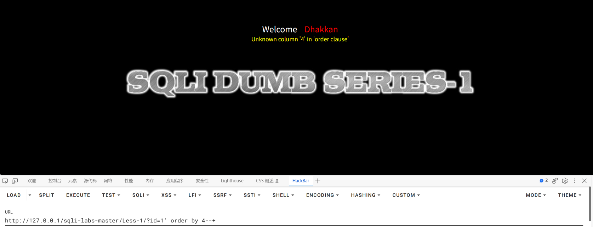

使用 1' order by 4--+ 试探位数，发现真实的查询位数不到4，减少位数继续尝试

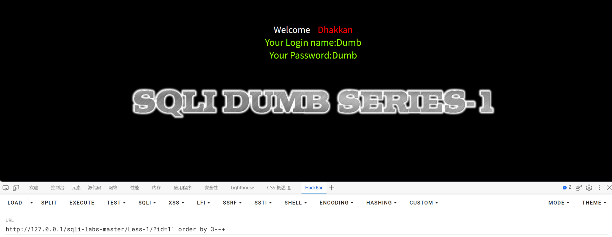

使用 1' order by 3--+ 页面正常显示，说明真实的查询位数为三位，下一步尝试使用联合查询注入的方式

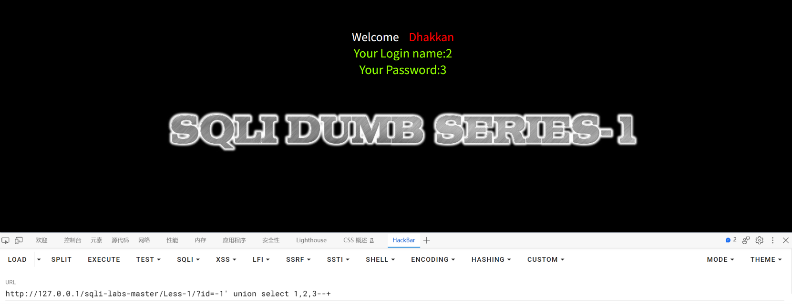

正式的注入开始之前先确认回显位，注意将合法查询的部分改成-1，这样回显置信度更高，使用1、2、3作为占位符，发现2、3是回显位

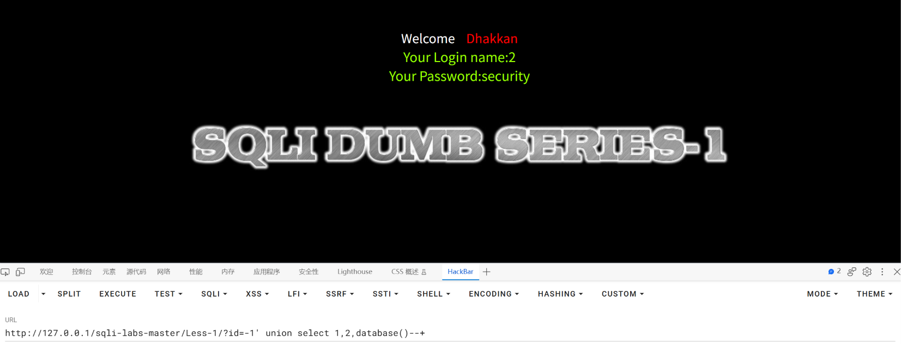

构造payload，将3换成database()，爆出数据库名为security

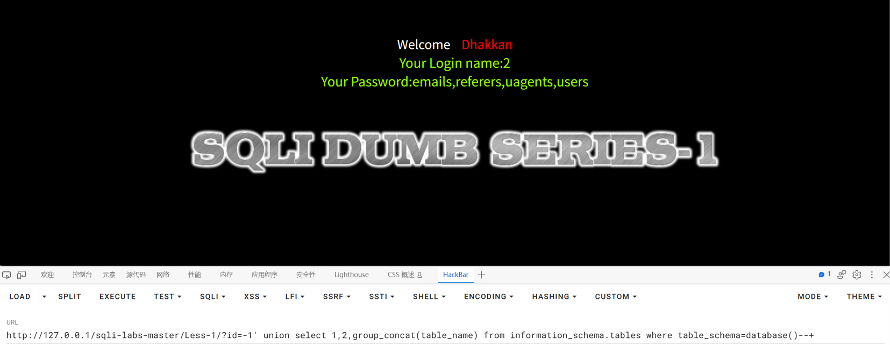

继续构造payload，将3换成group_concat(table_name)并且添加select条件from information_schema.tables where table_schema=database()最后是--+，database()可以换成字符串'security'。爆出四个表名。

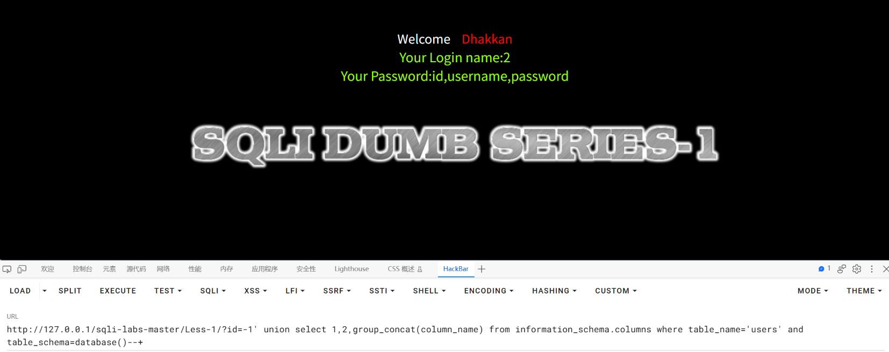

进一步获取列名，构造payload：?id=-1' union select 1,2,group_concat(column_name) from information_schema.columns where table_name='users' and table_schema=database()--+

得到三个列名。

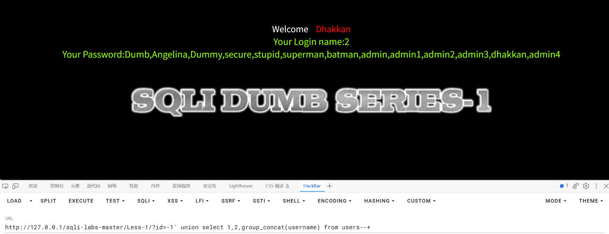

继续深入，爆出用户的 username 与 password。

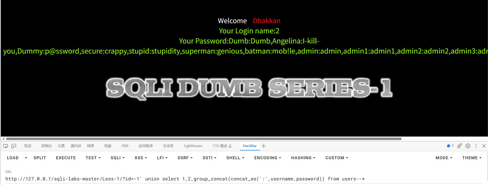

使用 concat_ws(':',username,password) 使得 username 和 password 对应。

## 总结

### 一、影响与危害

攻击者仅需对URL进行操作，无需任何验证，即可实现对数据库名、表名、username和password进行查询。本次已实际验证：读取到 users 表的 username 与 password 字段，库中另有 emails、referers、uagents 三张表同样可被读取。对用户的个人信息造成了泄露，攻击者可能利用username和password在其他网站进行撞库，影响范围超出了网站本身。

**利用门槛**：仅需浏览器与一次 URL 参数修改，无需任何专业工具或知识。

### 二、修复建议

1、根本修复：
   对该参数使用预编译（参数化查询）。其原理是数据库先确定语句结构、
   再将参数作为纯数据传入，用户输入永远不会进入 SQL 语法层被解析。

2、为什么不能用转义/过滤替代：
   转义引号、过滤关键字属于黑名单思路，只要存在一个未覆盖的绕过方式
   即告失效。这是"堵"而不是"隔离"。

3、临时缓解（代码改不动时）：
   - 该接口的数据库账号降权，仅保留必要的 SELECT 权限
   - 关闭详细报错回显（当前页面直接返回 SQL 报错，本身即信息泄露）
   - WAF 拦截 union select、information_schema 等特征

4、同类问题排查：
   按"是否存在字符串拼接构造 SQL"对全部接口做一次检索，注入点通常不止一处。

5、修复验证方法：
   用原 payload 复测：?id=-1' union select 1,2,database()--+
   预期：不再回显 security，返回参数错误或正常业务结果。
   并需更换手法复测（报错注入、布尔盲注），确认全部手法失效，
   仅拦截 UNION 一种不视为修复完成。

### 三、延伸思考

注入时最重要的是保持思路清晰，首先寻找注入点，然后通过注入点的操作判断数据库类型、爆出库名、爆出表名、爆出列名、爆出最终要的数据。

尝试查询位时我选择先用 order by 缩小范围，对于数位较大的时候，使用二分法可以最快的确定查询位的数量，而不是用 select 一个一个试。

在尝试找到回显位时，我将查询的参数改为 -1，这样前面的查询返回空数据，不会影响回显位的定位，可以提高这一步操作的置信度。

在为联合查询设定条件时，我选择用 database() 代替已经查询到的库名 'security'，因为 database() 可以针对当前库动态变化，不会出错。
