XSS报告

## 漏洞概要

XSS（跨站脚本）是一类高危漏洞，存在于浏览器渲染页面的环境中，本质上是在数据与代码没有严格分离的环境下，将用户输入的内容作为HTML标签或JavaScript代码被浏览器解析执行。XSS漏洞常见于将用户输入直接输出到页面、未做上下文编码的场景。攻击者可通过XSS窃取用户Cookie实现会话劫持、以受害者身份执行操作、挂马钓鱼，存储型XSS更可用来攻击后台管理员。

XSS与SQL注入同源，都是"代码与数据没有分离"：SQL注入是数据库分不清SQL语句和数据，XSS是浏览器分不清页面标记和用户数据。区别只在于失守的层次——一个在数据库解析器，一个在浏览器解析器。

XSS按数据经过哪里分为三种：**反射型**的特点是数据经服务端响应立即回显，不落库，需要诱导受害者点击特制链接；**存储型**的特点是数据先落库，之后每次被访问都会触发，不需要诱导点击，危害最大，可用来打后台管理员；**DOM型**的特点是全程在前端完成，服务端不参与，数据被JavaScript从URL取出后写进危险函数（sink），如innerHTML、document.write、eval。

## 漏洞检测

0、寻找输入点

先枚举"用户输入会进入页面"的位置，分三类：URL 参数、表单字段、请求头。本关三个模块各有一个输入点：

- **DOM 型**：URL 参数 `default`（由下拉框提交产生，`?default=English`）
- **反射型**：表单字段 `name`（GET 参数）
- **存储型**：表单字段两个 —— `txtName`（单行，前端 `maxlength="10"`）与 `mtxMessage`（多行 textarea，`maxlength="50"`）

**注意存储型的两个字段防护强度不同**（下面第 4 项会展开），这是本关最关键的一点。

1、判断输出点（数据回到了哪里）

**DOM 型**——数据不回服务端，由前端 JS 写入 DOM。判据是读页面的 JS：

```javascript
var lang = document.location.href.substring(document.location.href.indexOf("default=") + 8);
document.write("<option value='" + lang + "'>" + decodeURI(lang) + "</option>");
```

`sink` 是 `document.write`。**所以本模块不看响应源码**（响应里没有 payload），要看的是 JS 与执行后的 DOM。

**反射型**——数据由服务端拼进 HTML，回显位置是：

```html
<pre>Hello 【数据】</pre>
```

落在 `<pre>` 标签的 **HTML 正文**位置，前后无引号、无属性包裹。

**存储型**——有**两条输出路径**，防护不同：

| 输出路径 | 位置 | 中等难度的处理 |
|---|---|---|
| ① 提交后立即回显 | `{$html}` | 经过 `strip_tags` + `htmlspecialchars` |
| ② **下方留言列表** | `dvwaGuestbook()` | **原样输出，不编码**（源码里只有 impossible 档才调用 `htmlspecialchars`） |

②是"每次访问都重新输出"的位置，也是存储型真正的危险点。

2、检测闭合方式

三处的落点都是 HTML 正文，**无需跳出，可直接构造完整标签**：

```
DOM 型 ：document.write 里 payload 落在 <option> 的正文与 value 属性内
反射型 ：落在 <pre> 正文
存储型 ：落在 <div id="guestbook_comments"> 正文
```

**但 DOM 型有个额外限制**：`document.write` 拼接时用的是 `lang`（**URL 编码态**），只有显示那一处用了 `decodeURI(lang)`。所以 URL 里的 `"` `'` 是 `%22` `%27`，**用引号破属性的路走不通**。

3、检测能否执行

提交 `<script>alert(1)</script>`：

| 模块 | 中等难度的现象 | 结论 |
|---|---|---|
| **DOM 型** | 页面自动跳回 `?default=English`，不弹窗 | 请求被**拒绝**（302），不是被改写 |
| **反射型** | 返回 `Hello alert(1)` | `<script>` 标签被删，`alert(1)` 作为文本留下 |
| **存储型** | 留言列表里变成 `Message: alert(1)` | 同上，标签被删、内容留下 |

**这三条现象把三种处理方式区分开了**：

```
DOM 型 ：302 跳转      → 【拒绝】：payload 根本没进响应
反射型 ：标签没了、内容还在 → 【删标签】
存储型 ：同上           → 【删标签】
```

**"有回显"和"能执行"是两件事**——`Hello alert(1)` 有回显，但它是文本，不执行。

4、检测过滤方式

**这一步要先看状态码，再决定看什么**：302 时响应体里没有 payload，看内容是无意义的；200 时才能比较"传入 vs 回显"。

### DOM 型（服务端过滤 + 前端 sink）

源码 `xss_d/source/medium.php`：

```php
if (stripos ($default, "<script") !== false) {      // 不区分大小写，找【子串】"<script"
    header ("location: ?default=English");          // 命中就 302 跳走
    exit;
}
```

实测反推出的规则与源码一致：

| 尝试 | 现象 | 推出什么 |
|---|---|---|
| `<script>` | 302 | 有过滤 |
| `<SCRIPT>` | 302 | **不区分大小写**（排除"小写字面量比对"） |
| `<sCript>` | 302 | 同上，大小写组合都被覆盖 |
| `<script >`（script 后加空格） | 302 | 匹配的是**子串 `<script`**，不是字面量 `<script>` |
| `<scr<script>ipt>` / `<scri<script>pt>` / `<script<script>>` | 302 | **不是"删词后继续执行"，而是"输入里含该子串就拒绝"** |
| **``** | **弹窗** | ★ **它只拦 `script` 这个词，不在管"标签"这个类别** |

**"含子串就拒绝"和"删词"的区别，是靠双写那三条判出来的**：若是删词式，双写会剩下残缺标签（不弹但不跳转）；实际是跳转，说明**检测在删之前、且检测的是子串包含**。

**`` 那一条是拐点**：服务端连 `<` `>` 都没管，唯一被管的就是那个字面量 `script`。

结论：**黑名单**，规则 = 输入含 `<script`（不区分大小写）即拒绝。因此任何**不含该子串**的等价标签都能过：

```

<svg onload=alert(1)>
<details open ontoggle=alert(1)>
<iframe src=javascript:alert(1)>
<marquee onstart=alert(1)>
```

### 反射型（字符串替换）

源码 `xss_r/source/medium.php`：

```php
$name = str_replace( '<script>', '', $_GET[ 'name' ] );
```

`str_replace` 是**区分大小写的精确字符串替换**，两个特性都可以利用：

| 特性 | 绕过方式 | 原理 |
|---|---|---|
| **区分大小写** | `<sCript>alert(1)</script>` | 大写不匹配 → 一个字符都没删 → 浏览器不区分大小写，照常解析 |
| **只替换一次** | `<scr<script>ipt>alert(1)</script>` | 删掉中间那个完整的 `<script>` 后，剩下的碎片重组成 `<script>` |

**这也解释了实测中"只有前面的 `<script>` 被过滤"**——`str_replace` 命中的是**第一个完整小写的 `<script>`**，后面的 `</script>` 不含该子串，所以留下了。

### 存储型（两个字段防护不同）

源码 `xss_s/source/medium.php`：

```php
$name    = str_replace( '<script>', '', $name );        // name 字段：只删小写 <script>
$message = strip_tags( addslashes( $message ) );        // message 字段：先删掉所有标签
$message = htmlspecialchars( $message );                //               再把特殊字符编码
```

**message 字段为什么绕不过**：`strip_tags` 是**按 HTML 语法结构识别标签并删除**，不是按词匹配——`<SCRIPT>`、`` 都算标签，一律删掉。之后再 `htmlspecialchars` 编码，双重处理。

**这跟反射型的 `str_replace` 是两种不同性质的过滤**：

| | `str_replace('<script>')`（反射型） | `strip_tags()`（存储型 message） |
|---|---|---|
| 匹配方式 | **字符串精确比对** | **按 HTML 语法解析** |
| 大小写 | 区分 → 可绕 | 不区分 → 绕不过 |
| 换标签 | 不在它的范围 → 可绕 | 所有标签都删 → 绕不过 |
| 性质 | 黑名单（脆弱） | 解析型过滤（强） |

**name 字段为什么能绕过**：它**只有 `str_replace`，没有 `strip_tags`**，所以反射型那两条绕过在这里同样成立（实测 `<sCript>alert(1)</script>` 弹窗）。

**这引出一个重要观察**：同一个页面、同一个难度下，**两个输入框的防护强度不一样**——开发者在多行文本框（message）上用对了 `strip_tags`，在用户名（name）上只随手删了个 `<script>`。

5、检测XSS类型

| 判断依据 | 结论 |
|---|---|
| 只在该次响应里回显，换个页面就没了 | 反射型 |
| 提交后内容留在页面上，**换个浏览器访问也触发** | 存储型 |
| 服务端无回显，JS 从 URL 取值写进 sink | DOM 型 |

本关三个模块的对应关系与判据：

- **DOM 型**：`default` 参数**不参与服务端查询**，只被前端 JS 读走 → 服务器日志里看不到 payload
- **反射型**：`name` 参数当次响应立即回显、不落库
- **存储型**：`txtName` / `mtxMessage` 写入 `guestbook` 表，**下方列表每次访问都重新输出**

**验证存储型的严格判据是"换个浏览器（或隐私窗口）访问也触发"**——只在自己浏览器刷新看到，只证明数据落库了，不证明"别人也会中招"。

## 打靶练习

### 【DOM中等难度】


从URL结构可以看出default是参数，将参数改为输入<script>alert(1)</script>测试xss漏洞


提交表单后页面自动回到了参数修改前的URL


查看devtools的network可以看到，刚刚的URL返回页面状态为302重定向，所以没有生效<script>alert(1)</script>


查看devtools的network，响应内容是

HTTP/1.1 302 Found Date: Thu, 01 Oct 2026 17:48:44 GMT Server: Apache/2.4.23 (Win32) OpenSSL/1.0.2j PHP/5.4.45 X-Powered-By: PHP/5.4.45 Expires: Thu, 19 Nov 1981 08:52:00 GMT Cache-Control: no-store, no-cache, must-revalidate, post-check=0, pre-check=0 Pragma: no-cache **location: ?default=English** Content-Length: 146 Keep-Alive: timeout=5, max=100 Connection: Keep-Alive Content-Type: text/html

可以看到被重定向的参数为?default=English

写成URL的形式[Vulnerability: DOM Based Cross Site Scripting (XSS) :: Damn Vulnerable Web Application (DVWA) v1.10 *Development*](http://127.0.0.1/DVWA-master/vulnerabilities/xss_d/?default=English)

这就是刚刚看到的页面


<SCRIPT>alert(1)</SCRIPT>尝试大写script，返回页面重定向


<sCript>alert(1)</sCript>尝试其他大小写组合，返回页面重定向


<script >alert(1)</script >尝试加入空格绕过，返回页面重定向


考虑到可能是通过匹配删除的方式过滤，尝试

`<scr<script>ipt>alert(1)</script>`

`<scri<script>pt>alert(1)</script>`

`<script<script>>alert(1)</script>`

全部返回页面重定向


初步判断script被多种条件过滤，换用写入default

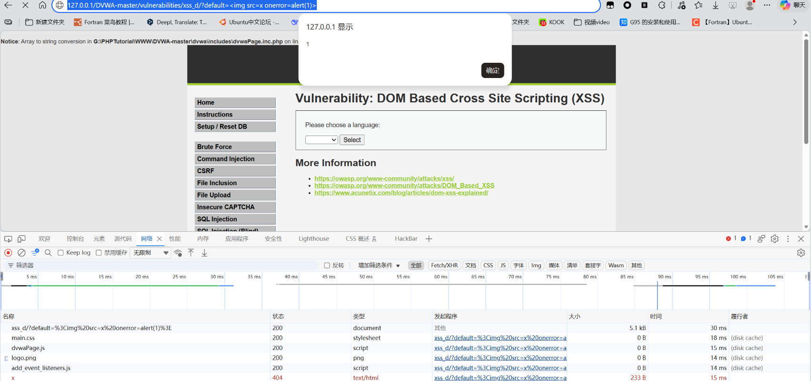

页面返回弹窗，漏洞验证成功。

同理，

```js
<svg onload=alert(1)>
<details open ontoggle=alert(1)>
<iframe src=javascript:alert(1)>	
<marquee onstart=alert(1)>	
```

也可以作为payload，测试后验证实际有效。

### 【反射型中等难度】


页面上存在文本框，输入<script>alert(1)</script>测试漏洞

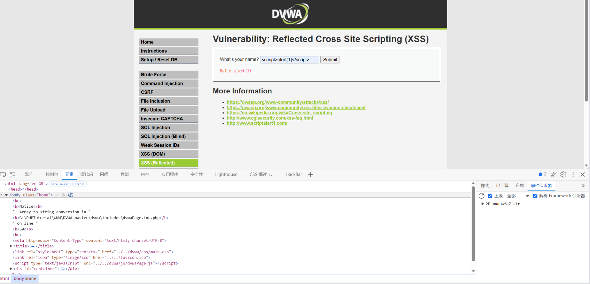

返回Hello alert(1)，说明

1、<script></script>被过滤了

2、alert没有被过滤

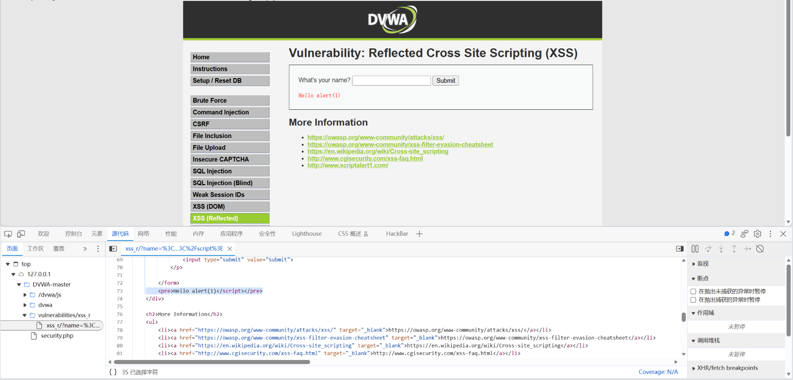

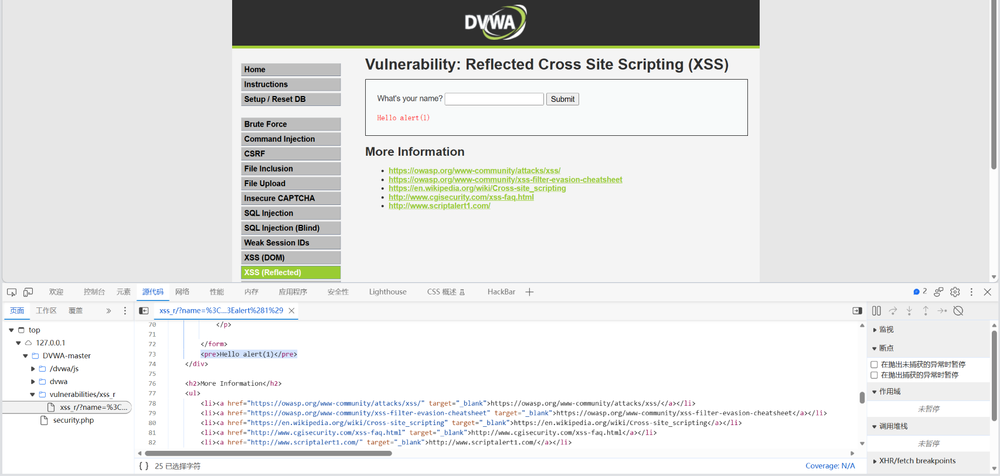

<script>alert(1)</script>与<script>alert(1)相比较，发现只有前面的<script>被过滤

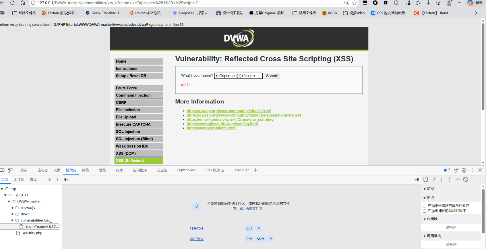

修改前面的为大小写组合<sCript>alert(1)</script>

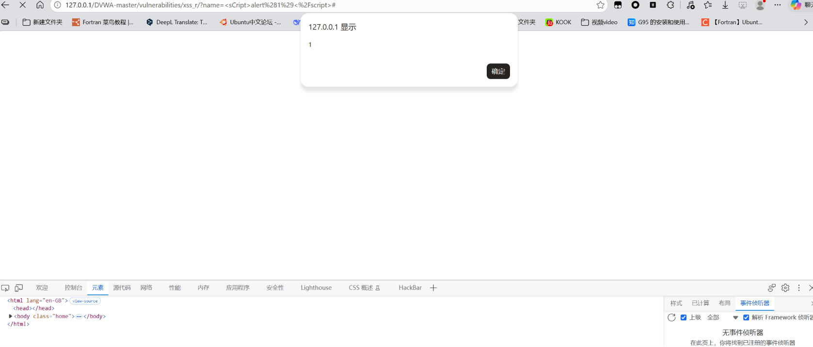

返回弹窗，大小写有效绕过，漏洞验证成功。

查看源码发现使用的是匹配删除的过滤，因为匹配方式简单所以可以轻松绕过，也可以通过双写的方式绕过。

### 【存储型中等难度】

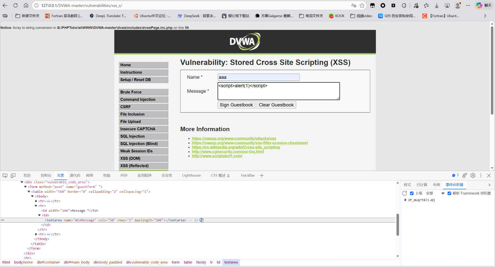

增加文本框的输入限制，输入<script>alert(1)</script>

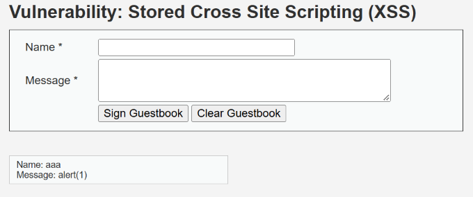

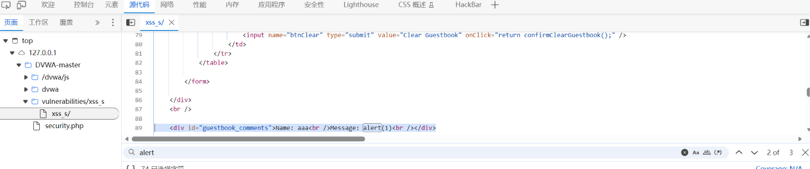

<script></script>被过滤，源码显示：

	<div id="guestbook_comments">Name: aaa<br />Message: alert(1)<br /></div>

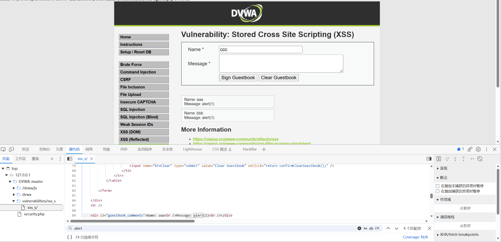

大小写组合无效，无法绕过

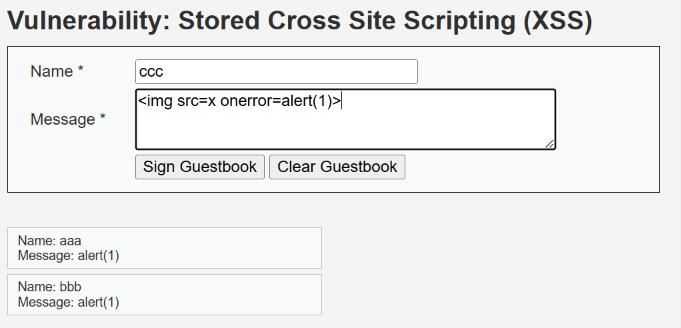

尝试绕过

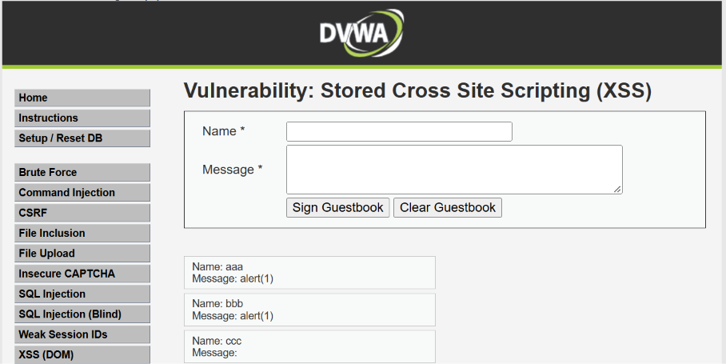

绕过失败

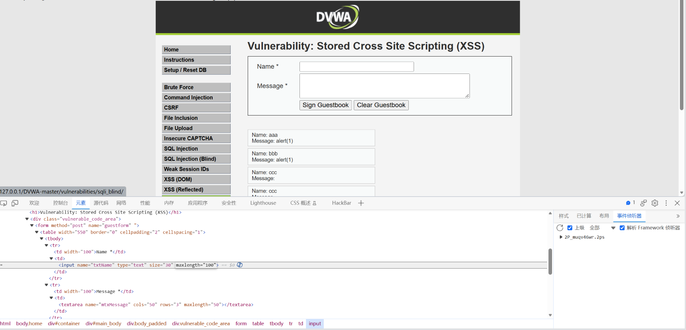

尝试name字段，修改字符数限制为100

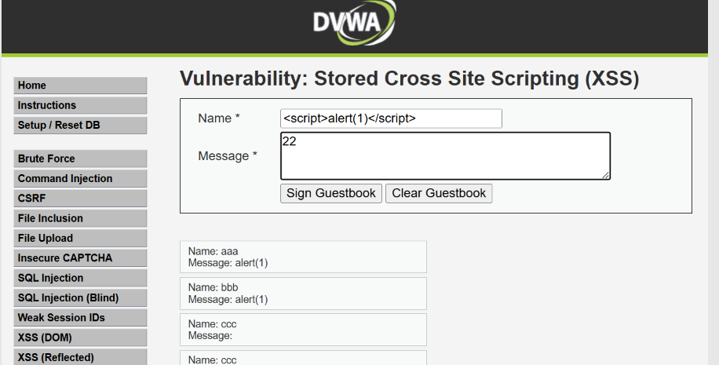

name字段输入<script>alert(1)</script>

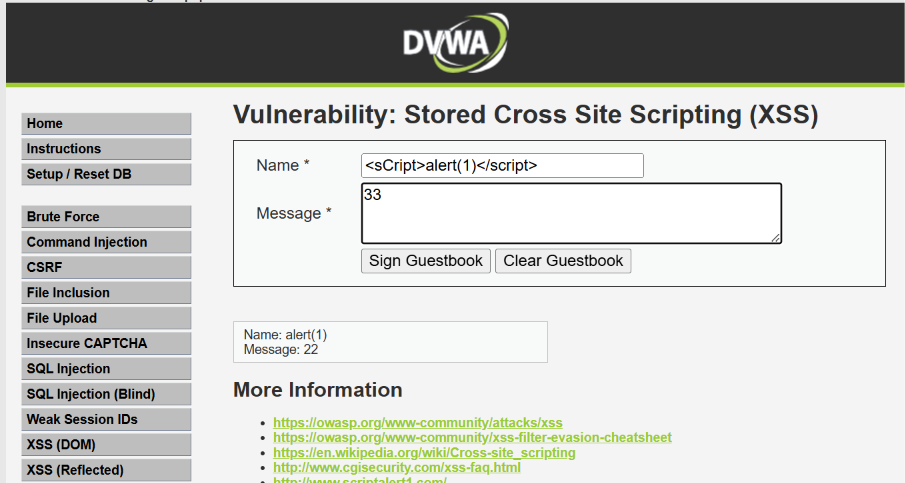

页面返回正常数据，尝试<sCript>alert(1)</script>大小写组合

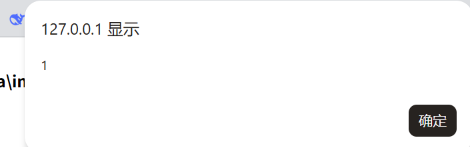

页面返回弹窗，漏洞验证存在。

## 总结

### 一、影响与危害

技术上能做**四类**事：窃取 Cookie 实现会话劫持（前提是 Cookie 未设 HttpOnly）、以受害者身份执行操作、挂马与钓鱼、页面篡改。**存储型还能打后台管理员**——管理员一打开留言管理页面就执行攻击者的脚本，等于间接拿下后台。

**本次已实际验证**（三个模块在中等难度下均被绕过）：

| 模块 | 服务端防护 | 绕过方式 | 结果 |
|---|---|---|---|
| **DOM 型** | `stripos` 查子串 `<script`，命中即 302 | `` | 弹窗 |
| **反射型** | `str_replace('<script>','')`，区分大小写 | `<sCript>alert(1)</script>` | 弹窗 |
| **存储型** | `name` 字段只有 `str_replace` | `<sCript>alert(1)</script>` | 弹窗，且落库 |
| **存储型** | `message` 字段 `strip_tags` + `htmlspecialchars` | 未找到绕过 | 未突破 |

**本关最关键的发现是"防护强度不对等"**：

```
同一个页面（xss_s）、同一个难度（medium）下：

  message 字段 → strip_tags（解析型，删掉所有标签）+ htmlspecialchars
  name    字段 → str_replace('<script>','')（字符串比对，只删小写那一种写法）

结果：开发者认为"做了防护"，但 name 字段的防护等价于没有。
```

**对业务意味着什么**：

1. **中等难度的三档防护全部可绕**。开发者把该想到的地方都想到了，仍然能被绕过——说明"加过滤"这种做法在本关被证明无效。
2. **存储型落库后可打管理员**。留言写进 `guestbook` 表后，**任何访问该页面的人都会执行**，包括管理员。
3. **防护强度取决于"开发者有没有想到"，而不是规则有多严**。`maxlength="10"` 看起来像防护，实际改 DOM 或抓包就能绕——**前端校验在这个场景下等于零**。

**利用门槛**：

- **DOM 型 / 反射型**：需要诱导受害者点击一条特制链接（`?default=` 或 `?name=`），链接可伪装成短链或二维码
- **存储型**：**不需要任何诱导动作**——payload 落库后，只要有人访问留言页面就触发。这是它危害更大的根本原因

### 二、修复建议

1、根本修复：
   按输出上下文编码，而不是"统一转义一遍"。原理是让用户数据以**文本**身份
   进入解析器，而不是以**标记**身份。不同位置的编码方式不同：

   - HTML正文  → HTML实体编码（`<` → `&lt;`）
   - HTML属性  → 属性值加引号 + HTML实体编码（含 `"` 和 `'`）
   - JS字符串  → JS转义（不能只做HTML实体编码）
   - URL参数   → URL编码

   PHP里对应 `htmlspecialchars($x, ENT_QUOTES, 'UTF-8')`，
   注意必须带 `ENT_QUOTES`——只转义双引号不转义单引号，
   属性用单引号包裹时仍可越出。

2、为什么不能用转义/过滤替代：
   禁了 `<script>` 还有 ``、`<svg onload>`、`<details open ontoggle>`，
   黑名单永远列不全。与SQL注入的结论完全一致：这是"堵"而不是"隔离"。

3、临时缓解（代码改不动时）：
   - Cookie加 `HttpOnly`，让JS读不到Cookie，即便XSS成立也偷不走会话
   - 配CSP限制脚本来源、禁止内联脚本
   - 敏感操作加二次验证
   - 限制输入长度（只能挡住长payload，挡不住 `<svg onload=alert(1)>`，只能算辅助）

4、同类问题排查：
   按"用户输入在哪里被输出"对全部页面做一次检索，重点检查：
   - 所有搜索/留言/资料类的回显点
   - 后台管理页面（存储型XSS最常打的地方）
   - 请求头被记录并回显的位置（User-Agent、Referer 记进库后在后台展示）
   - 前端JS里的DOM sink

5、修复验证方法：
   用原 payload 复测：三个模块分别用各自的绕过写法。
   预期：源码里 `<` 变成 `&lt;`，页面显示为文本，不执行。

   并需更换上下文复测（只改一处编码不算修好）：
   - 属性上下文：`" onmouseover=alert(1) x="`，预期引号被编码成 `&quot;`
   - 单引号属性：`' onmouseover=alert(1) x='`，预期 `'` 被编码成 `&#39;`
     （这一条专门验证 `ENT_QUOTES` 是否生效）
   - JS字符串内：`';alert(1);//`，预期引号被转义

   并需更换标签复测，确认黑名单不是唯一防线：
   ``、`<svg onload=alert(1)>`
   预期：全部被编码输出，无一执行。

   **本关三档防护各自该复测什么**（针对性验证，比通用清单更有效）：

   | 档位 | 复测 payload | 预期 |
   |---|---|---|
   | DOM 型 | ``（本关的绕过写法） | 弹窗消失，且不再 302 跳转 |
   | 反射型 | `<sCript>alert(1)</script>` 与 `<scr<script>ipt>alert(1)</script>` | 大小写、双写两种写法均失效 |
   | 存储型 | `<sCript>alert(1)</script>` 打 **name** 字段 | 失效 |
   | 存储型 | 任意 payload 打 **message** 字段，然后**退出登录、换浏览器访问** | 显示为文本，不执行 |

   **存储型的验证必须换浏览器**：`dvwaGuestbook()` 是"从数据库读出来再输出"，
   只在自己浏览器刷新看不出"别人是否也会中招"，必须换个会话验证。

### 三、延伸思考

**卡在哪**：

1、**DOM 型一开始以为"URL 改了又被改回来"是浏览器的问题。**
把 payload 放进 `?default=`，提交后页面自动跳回 `?default=English`，当时不确定是"被拦了"还是"参数没生效"。
直到打开 DevTools 的 **Network** 面板、并勾上 **Preserve log**，才看到真实的响应头：

```
HTTP/1.1 302 Found
location: ?default=English
```

**这一步的转折是**：不再盯着地址栏猜，而是去看请求/响应的原始记录。
**302 这个信号一出现，就说明"请求被服务器拒绝了"，而不是"payload 写错了"。**

2、**双写那三条一直失败，一度怀疑是"删词式过滤没删干净"。**
试了 `<scr<script>ipt>`、`<scri<script>pt>`、`<script<script>>`，全部 302。
后来才想通：**如果是"删词后继续执行"，结果应该是"不跳转但不弹窗"**；
实际是**跳转**，说明**检测发生在删除之前，而且检测的是"输入里含不含 `<script` 这个子串"**。
**"跳转"和"不弹窗"是两个不同的信号，这个区别是判据的关键。**

3、**反射型一开始没注意"只有前面的 `<script>` 被过滤"。**
传 `<script>alert(1)</script>` 返回 `Hello alert(1)`，第一反应是"过滤了 script"。
后来把 `<script>alert(1)</script>` 和 `<script>alert(1)` 并排对比回显，才发现**只有开头那个 `<script>` 消失了，后面的 `</script>` 还在**。
这才推出 `str_replace` 只替换第一个完整匹配——**而"只替换一次"这个特性本身就是绕过点**。

4、**存储型卡在 message 字段很久，是找错了字段。**
大小写、换 `` 全部失败，一度以为这关没有 XSS。
后来给 `message` 的失败找到了原因（`strip_tags` 是解析型的，认标签不认写法），
才意识到应该去看 **name 字段的源码**——结果那里只有 `str_replace`，没有 `strip_tags`。

**这一步的教训是**：一个功能有多个输入字段时，**要把每个字段的源码分别看一遍**，
不能因为一个字段打不动就判断"这个功能安全了"。

**学到什么**：

1、**"过滤"有多种不同性质，能不能绕完全取决于哪一种。**

   | 性质 | 例子 | 能否绕 | 判断依据 |
   |---|---|---|---|
   | **字符串比对** | `str_replace('<script>')` | **能**（改大小写 / 双写） | 它只认某一种精确写法 |
   | **子串检测** | `stripos($x, "<script")` | **能**（换不含该子串的等价写法） | 它只认一个词，不管标签 |
   | **解析型** | `strip_tags()` | 常规写法**不能** | 它按 HTML 语法识别标签 |
   | **输出编码** | `htmlspecialchars()` | **不能** | 它改变数据的身份，不是列举坏东西 |

   **这一条比"记住几种绕过 payload"重要得多**——它决定了遇到新的过滤时该往哪个方向试。

2、**状态码是最先要看、也最容易被忽略的信号。**

   ```
   302 / 403  → 请求被【拒绝】→ 响应体里没有 payload，只能做变体倒推规则
   200        → 请求被【正常处理】→ 才去看响应体 / DOM，比较"传入 vs 回显"
   ```

   本关 DOM 型是 302，反射型和存储型是 200，**两类情况要用完全不同的下一步动作**。
   如果 302 时还去翻响应体找 payload，就是白找。

3、**"删词"和"拒绝"必须分开**，判据是看结果落在哪个分支。

   ```
   删词式过滤：请求正常返回（200），但 payload 变了形 → 能看到"它删了什么"
   子串检测+拒绝：请求被拒（302）→ 看不到处理过程，只能靠变体推
   ```

4、**前端限制（`maxlength`）不构成防护。**
   本关存储型两个输入框都有 `maxlength`，改 DOM 或抓包就绕过。
   这和 SQLi 里"前端校验等于没有校验"是同一个结论。

5、**同一功能的不同字段要分别测。**
   本关最有价值的一条：`name` 和 `message` 在同一页面、同一难度下防护强度不同。
   **真实测试里"从最弱的口子进"是标准做法**——不要在最强的那个字段上死磕。
