XSS报告

## 漏洞概要

XSS（跨站脚本）是一类高危漏洞，存在于浏览器渲染页面的环境中，本质上是在数据与代码没有严格分离的环境下，将用户输入的内容作为HTML标签或JavaScript代码被浏览器解析执行。XSS漏洞常见于将用户输入直接输出到页面、未做上下文编码的场景。攻击者可通过XSS窃取用户Cookie实现会话劫持、以受害者身份执行操作、挂马钓鱼，存储型XSS更可用来攻击后台管理员。

XSS与SQL注入同源，都是"代码与数据没有分离"：SQL注入是数据库分不清SQL语句和数据，XSS是浏览器分不清页面标记和用户数据。区别只在于失守的层次——一个在数据库解析器，一个在浏览器解析器。

XSS按数据经过哪里分为三种：**反射型**的特点是数据经服务端响应立即回显，不落库，需要诱导受害者点击特制链接；**存储型**的特点是数据先落库，之后每次被访问都会触发，不需要诱导点击，危害最大，可用来打后台管理员；**DOM型**的特点是全程在前端完成，服务端不参与，数据被JavaScript从URL取出后写进危险函数（sink），如innerHTML、document.write、eval。

## 漏洞检测

0、寻找输入点

先枚举"用户输入会进入页面"的位置，分三类：URL 参数、表单字段、请求头。本关三个模块各有一个输入点：

- **DOM 型**：URL 参数 `default`（由下拉框提交产生，点击 Select 后 URL 变成 `?default=English`）
- **反射型**：表单字段 `name`（GET 参数，页面有文本框可提交）
- **存储型**：表单字段两个 —— `txtName`（单行，前端 `maxlength="10"`）与 `mtxMessage`（多行 textarea，`maxlength="50"`）

**判断方法**：先随便点几下页面上可交互的元素，看 URL 有没有出现参数；再对页面里每个输入框逐个提交，观察哪一处的内容会出现在页面上。

1、判断输出点（数据回到了哪里）

数据落在哪里，决定后面 payload 怎么写。三个模块分两种情况：

**前端写入（DOM 型）**——数据不回服务端，由页面 JS 写进 DOM：

```javascript
var lang = document.location.href.substring(document.location.href.indexOf("default=") + 8);
document.write("<option value='" + lang + "'>" + decodeURI(lang) + "</option>");
```

sink 是 `document.write`。**所以这个模块不看响应源码**——服务端返回的 HTML 里本来就没有 payload，要看的是页面里这段 JS 和执行后的 DOM。

**服务端拼接（反射型、存储型）**——数据被拼进 HTML 后返回，回显位置分别是：

```html
反射型：<pre>Hello 【数据】</pre>
存储型：<div id="guestbook_comments">Name: 【数据】<br />Message: 【数据】<br /></div>
```

两处都落在 **HTML 正文**位置，前后没有引号、没有属性包裹。

**存储型另有一条要留意的路径**：同一份数据有**两个输出位置**——① 提交后立即回显，② 下方留言列表（每次访问都从数据库读出来重新输出）。**②才是存储型真正的危险点**，因为它不限当次请求。

2、检测闭合方式

按落点位置确定要不要先跳出：**三处落点都在 HTML 正文、无任何包裹，因此无需跳出，可以直接构造完整标签。**

```
DOM 型 ：payload 落在 <option> 的正文与 value 属性内
反射型 ：落在 <pre> 正文
存储型 ：落在 <div> 正文
```

**但 DOM 型有个额外限制**：`document.write` 拼接时用的是 `lang`（**URL 编码态**），只有显示那一处用了 `decodeURI(lang)`。所以 URL 里的 `"` `'` 是 `%22` `%27`，**用引号破属性的路走不通**。

3、检测能否执行

提交 `<script>alert(1)</script>`：

| 模块 | 现象 | 结论 |
|---|---|---|
| **DOM 型** | 页面弹窗 | 元素（F12 → Elements）里可以看到 `<script>alert(1)</script>` 被写进了 `<select>` 内 |
| **反射型** | 页面弹窗 | 源代码里可以看到 `<pre>Hello <script>alert(1)</script></pre>` |
| **存储型** | 页面弹窗，**刷新后仍然生效** | 源代码里能看到原样的 `<script>` 标签 |

**三条都是"弹窗 + 源码里标签原样保留"**，说明标签被浏览器当标记解析执行，不是被当文本显示。

**"有回显"和"能执行"要分开看**：`<script>alert(1)</script>` 作为文本显示（转义后）也会有回显，但不会执行；只有当源码里是**真正的标签**时才执行。

4、检测过滤方式

**逐个提交单个字符，观察源码里的变化**（要区分"编码"和"黑名单"）：

| 提交 | 源码里的变化 | 结论 |
|---|---|---|
| `<` | **原样保留** | 无处理 |
| `>` | 原样保留 | 无处理 |
| `"` | 原样保留 | 无处理 |
| `'` | 原样保留 | 无处理 |

源码 `xss_d/source/low.php`、`xss_r/source/low.php`、`xss_s/source/low.php` 一致：

```php
// 反射型 / 存储型的 low.php 关键行
$html .= '<pre>Hello ' . $_GET[ 'name' ] . '</pre>';      // 直接拼接，无任何处理

// DOM 型的 low.php 整个文件只有一句注释
<?php
# No protections, anything goes
?>
```

**结论：简单难度下三个模块都没有做任何过滤或编码。**

**这一条要和"中等难度"对照着看**，才有意义：

| 处理方式 | 现象 | 安全性 |
|---|---|---|
| **无处理**（本关） | 原样输出 | 完全可执行 |
| **黑名单删除**（中等难度） | 标签消失、内容留下 | 不安全，可绕 |
| **HTML 实体编码**（impossible） | `<` → `&lt;` | 安全，绕不过 |

5、检测XSS类型

| 判断依据 | 结论 |
|---|---|
| 只在该次响应里回显，换个页面就没了 | 反射型 |
| 提交后内容留在页面上，**换个浏览器访问也触发** | 存储型 |
| 服务端无回显，JS 从 URL 取值写进 sink | DOM 型 |

本关三个模块的判据与对应现象：

- **DOM 型**：`default` 参数**不参与服务端查询**，只被前端 JS 读走 → **服务端日志里看不到 payload**；页面的 JS 里有 `document.write`
- **反射型**：`name` 参数当次响应立即回显、不落库 → 换个页面（不带参数）访问就没有了
- **存储型**：`txtName` / `mtxMessage` 写入 `guestbook` 表 → **刷新后仍然生效**，下方留言列表每次访问都重新输出

**验证存储型的严格判据是"换个浏览器（或隐私窗口）访问也触发"**——只在自己浏览器里刷新看到，只证明数据落库了，不证明"别人也会中招"。

## 打靶练习

【DOM简单难度】

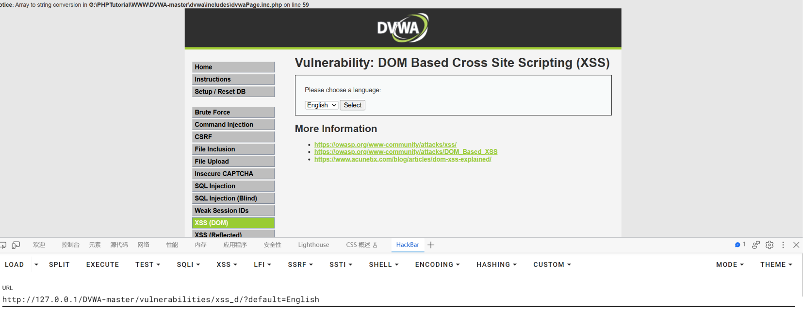

第一步，寻找注入点。在页面上有可互动的操作，点击select，发现页面URL变成了http://127.0.0.1/DVWA-master/vulnerabilities/xss_d/?default=English，从结构上来看default是参数，可能是注入点。

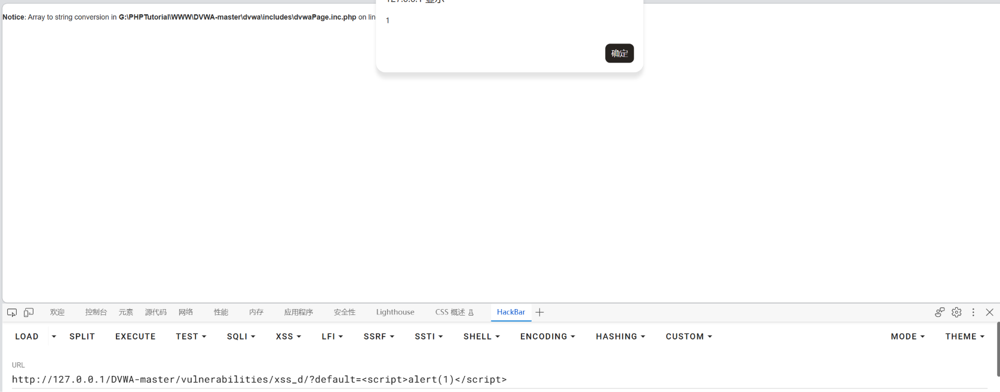

修改参数，URL为http://127.0.0.1/DVWA-master/vulnerabilities/xss_d/?default=<script>alert(1)</script>，页面返回弹窗，alert(1)生效，漏洞验证成功。

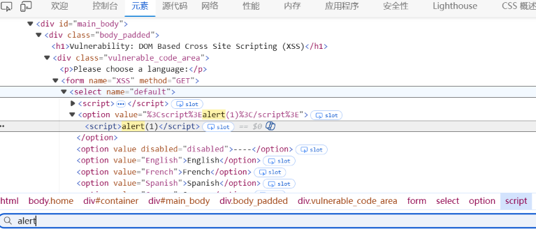

在元素里可以看到<script>alert(1)</script>

【反射型简单难度】

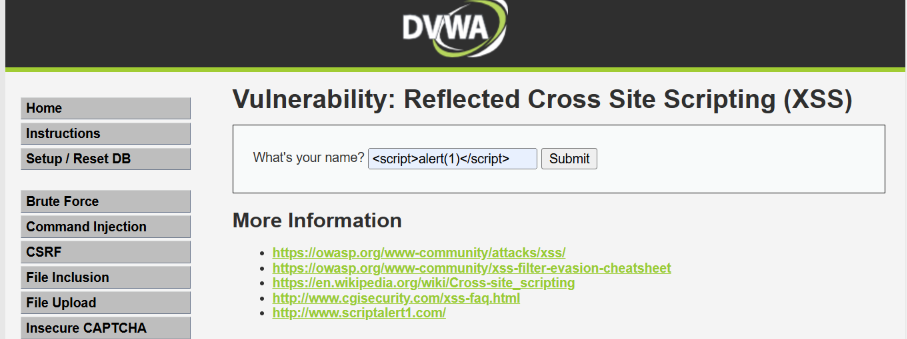

页面有可提交到后台的文本框，测试<script>alert(1)</script>

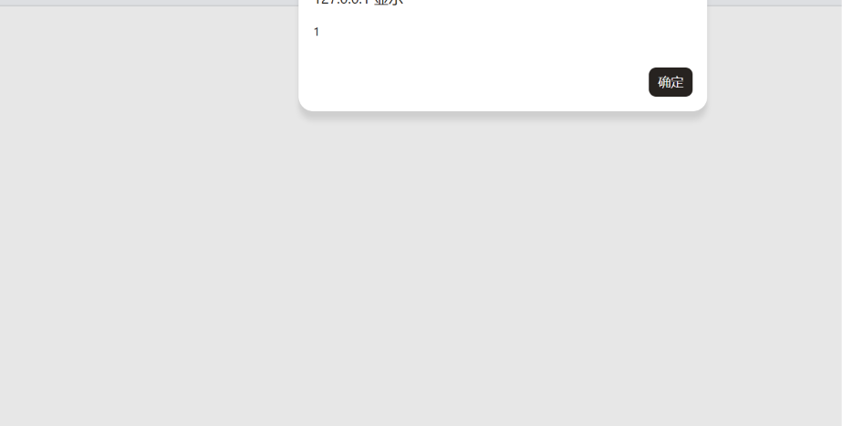

页面返回弹窗，<script>alert(1)</script>生效，漏洞验证存在。

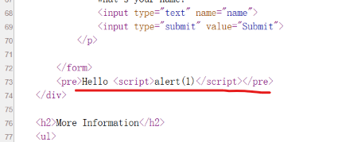

在源代码里可以看到输入的<script>alert(1)</script>

【存储型简单难度】

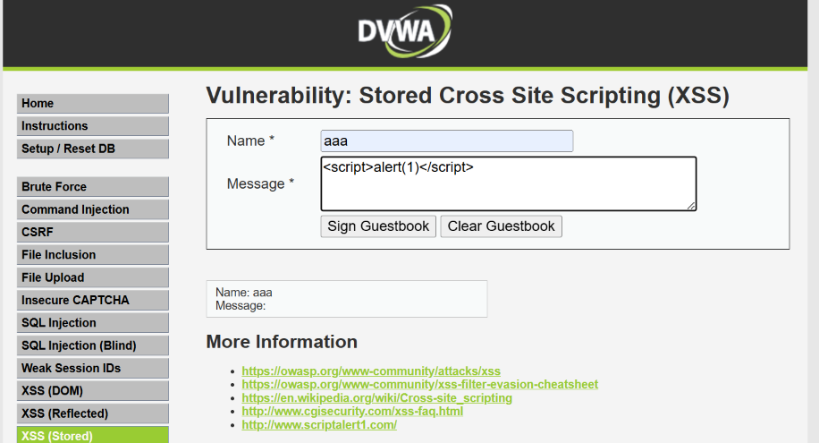

页面上存在文本框，在下面的文本框里测试<script>alert(1)</script>

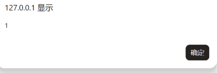

页面返回弹窗，<script>alert(1)</script>生效，且刷新页面后依旧生效，说明存储型xss生效。

-----------------------------------------------------------------

如果是将html代码放在上面的文本框，测试如下

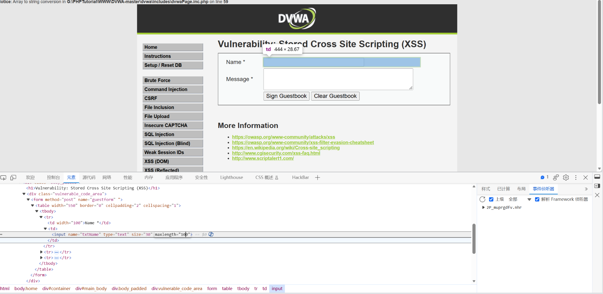

上面的文本框限制10个字符位，修改字符位限制为100

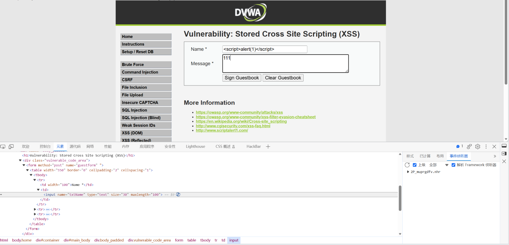

输入<script>alert(1)</script>

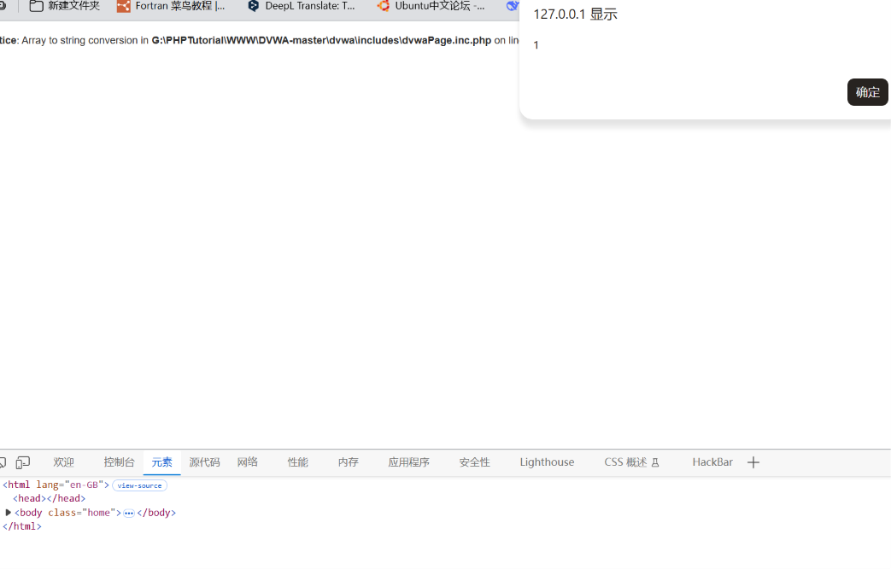

页面返回弹窗，说明上面的文本框同样可以触发漏洞。

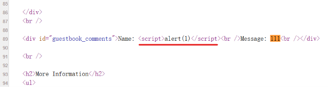

源代码里可以看到<script>alert(1)</script>

## 总结

### 一、影响与危害

技术上能做**四类**事：窃取 Cookie 实现会话劫持（前提是 Cookie 未设 HttpOnly）、以受害者身份执行操作、挂马与钓鱼、页面篡改。**存储型还能打后台管理员**——管理员一打开留言管理页面就执行攻击者的脚本，等于间接拿下后台。

**本次已实际验证**：DVWA 的三个 XSS 模块在简单难度下**全部可被利用**，均用 `<script>alert(1)</script>` 直接触发：

| 模块 | 输入点 | 源码处理 | 结果 |
|---|---|---|---|
| **DOM 型** | URL 参数 `default` | 无（`low.php` 只有一句注释） | 弹窗，Elements 里可见写入的 `<script>` |
| **反射型** | 表单字段 `name` | 无，直接拼接进 `'<pre>Hello ' . $_GET['name'] . '</pre>'` | 弹窗，源码里标签原样保留 |
| **存储型** | `name` 与 `message` 两个字段 | 无 | 弹窗，**刷新后仍生效**（已落库） |

**本次实测中还有两条环境层面的观察**：

1. **存储型的两个输入框都有前端长度限制**（`maxlength="10"` / `maxlength="50"`），把限制改大之后提交成功——**说明前端限制不构成防护**。
2. **同一次提交里，`name` 字段和 `message` 字段都能触发**，说明两者在这一档都没有任何处理。

**对业务意味着什么**：

1. **简单难度下三档防护为零**。攻击者不需要任何技巧，最朴素的 `<script>alert(1)</script>` 即可成功——说明"防护"不是强度问题，而是**有没有做**的问题。
2. **存储型落库后可打管理员**。留言写进 `guestbook` 表后，**任何访问该页面的人都会执行**，包括管理员。若后台有查看留言的功能，等于间接控制后台。
3. **DOM 型的 payload 不出现在服务端日志里**。因为参数只被前端 JS 读取、不参与服务端查询，**服务端侧的日志和防护都看不到它**。

**利用门槛**：

- **DOM 型 / 反射型**：需要诱导受害者点击一条特制链接（`?default=` 或 `?name=`），链接可伪装成短链或二维码
- **存储型**：**不需要任何诱导动作**——payload 落库后，只要有人访问留言页面就触发。这是它危害更大的根本原因

### 二、修复建议

1、根本修复：
   按输出上下文编码，而不是"统一转义一遍"。原理是让用户数据以**文本**身份
   进入解析器，而不是以**标记**身份。不同位置的编码方式不同：

   - HTML正文  → HTML实体编码（`<` → `&lt;`）
   - HTML属性  → 属性值加引号 + HTML实体编码（含 `"` 和 `'`）
   - JS字符串  → JS转义（不能只做HTML实体编码）
   - URL参数   → URL编码

   PHP里对应 `htmlspecialchars($x, ENT_QUOTES, 'UTF-8')`，
   注意必须带 `ENT_QUOTES`——只转义双引号不转义单引号，
   属性用单引号包裹时仍可越出。

2、为什么不能用转义/过滤替代：
   禁了 `<script>` 还有 ``、`<svg onload>`、`<details open ontoggle>`，
   黑名单永远列不全。与SQL注入的结论完全一致：这是"堵"而不是"隔离"。

3、临时缓解（代码改不动时）：
   - Cookie加 `HttpOnly`，让JS读不到Cookie，即便XSS成立也偷不走会话
   - 配CSP限制脚本来源、禁止内联脚本
   - 敏感操作加二次验证
   - 限制输入长度（只能挡住长payload，挡不住 `<svg onload=alert(1)>`，只能算辅助）

4、同类问题排查：
   按"用户输入在哪里被输出"对全部页面做一次检索，重点检查：
   - 所有搜索/留言/资料类的回显点
   - 后台管理页面（存储型XSS最常打的地方）
   - 请求头被记录并回显的位置（User-Agent、Referer 记进库后在后台展示）
   - 前端JS里的DOM sink

5、修复验证方法：
   用原 payload 复测：`<script>alert(1)</script>`
   预期：源码里 `<` 变成 `&lt;`，页面显示为文本，不执行。

   **本关三个模块各自该复测什么**：

   | 模块 | 复测方式 | 预期 |
   |---|---|---|
   | DOM 型 | `?default=<script>alert(1)</script>`，并在 Elements 里看 `<select>` 内 | 不再出现可执行的标签，`<` 被编码 |
   | 反射型 | `?name=<script>alert(1)</script>`，看源码 `<pre>` 内 | 显示为 `&lt;script&gt;` 文本 |
   | 存储型 | 提交 payload 后**退出登录、换浏览器访问留言页** | 显示为文本，不执行 |

   并需更换上下文复测（只改一处编码不算修好）：
   - 属性上下文：`" onmouseover=alert(1) x="`，预期引号被编码成 `&quot;`
   - 单引号属性：`' onmouseover=alert(1) x='`，预期 `'` 被编码成 `&#39;`
     （这一条专门验证 `ENT_QUOTES` 是否生效）
   - JS字符串内：`';alert(1);//`，预期引号被转义

   并需更换标签复测，确认黑名单不是唯一防线：
   ``、`<svg onload=alert(1)>`
   预期：全部被编码输出，无一执行。

### 三、延伸思考

**卡在哪**：

1、**DOM 型一开始不知道 payload 该写在哪，也不知道去哪看结果。**

   页面上没有输入框，只有一个语言下拉框。点了两下才注意到点击 Select 之后 URL 变成了
   `?default=English`——**参数是在这一步暴露出来的**，于是把参数值改成 payload 试。

   弹窗之后想在页面源码里找到刚写的 payload，**找不到**。
   后来打开 **F12 → Elements** 才发现：那段 `<script>alert(1)</script>` 确实在页面上，
   但它是由 JS 动态写入的，**服务端返回的原始 HTML 里根本没有**。

   **这一步的转折是**：DOM 型要看两个地方——页面里那段 JS（数据从哪来、写进哪），
   和执行后的 DOM（Elements）；**唯独不看服务端返回的源码**，因为服务端没参与。

2、**存储型的两个输入框，一开始以为只有下面那个能用。**

   上面的 name 框有 `maxlength="10"`，payload 根本填不进去（`<script>alert(1)</script>` 有 25 个字符），
   所以先用了下面的 message 框。

   后来把长度限制改大再试 name 框，发现**一样能触发**。
   **这说明前端限制只是"输入框不让填太多字"，跟服务端有没有防护是两件事。**

3、**一开始分不清"有回显"和"能执行"。**

   传 payload 后页面显示 `Hello alert(1)`（中等难度）和直接弹窗（简单难度），
   两种现象都叫"有回显"，但只有后者真正执行了。
   区别要看源码：**源码里是 `&lt;script&gt;` 就是文本，是 `<script>` 才是标签**。

**学到什么**：

1、**XSS 检测的第一步不是构造 payload，而是判断"数据落在哪里"。**

   这和 SQL 注入里"先判断闭合方式"是同一个道理：不知道数据落在哪个上下文，payload 就是瞎试。
   三处落点都在 HTML 正文、无包裹，所以同一个 payload 三处都能用；
   **但如果落点换成属性值里（如 `<input value="...">`），同一个 payload 就不会执行**。

2、**DOM 型和另外两种的判断方式完全不同。**

   ```
   反射型 / 存储型：看服务端返回的 HTML 源码（Ctrl+U）
   DOM 型         ：看页面的 JS（数据从哪来、写进哪个 sink）+ 执行后的 DOM（F12 → Elements）
   ```

   **DOM 型的 payload 不出现在服务端响应里**，所以服务端日志、WAF 都看不到它——
   这是它的判据，也是它比反射型更难防的原因。

3、**存储型比另外两种多一层：数据会落库。**

   判据是"刷新后是否仍生效"，`<script>` 被存进 `guestbook` 表后，
   **每次有人访问该页面都会重新输出一遍**——这就是它能用来打管理员的原因。

4、**前端限制（`maxlength`）不构成任何防护。**

   本关两个输入框都有限制，改 DOM 或抓包即可绕过。
   这和 SQL 注入里"前端校验等于没有校验"是同一个结论。

5、**简单难度"三个模块都能用同一个 payload 成功"，这件事本身就是信息。**

   说明这一档**根本没有做过滤**——所以这时报告的价值不在"绕过了什么"，
   而在**确认了"零处理"这个事实，并用源码和现象两边都验证到**。
   只有把这一档记清楚，后面中等难度"加了过滤之后为什么还能绕"才有对照。
